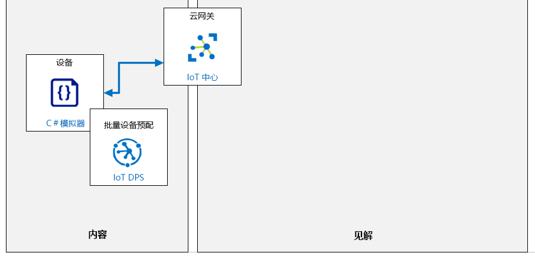

---
lab:
    title: '实验室 05：在 DPS 中单独注册设备'
    module: '模块 3：大规模设备预配'
---

# 在 DPS 中单独注册设备

## 实验室场景

Contoso 管理层正在推动更新其资产监视和跟踪解决方案，该解决方案将使用 IoT 设备来减少当前系统下所需的手动数据输入工作，并在传送过程中提供更高级的监视。该解决方案依赖于预配和取消预配 IoT 设备的能力。管理预配要求的最佳选择为 DSP。

建议的系统将使用具有集成传感器的 IoT 设备来跟踪运输过程中运输容器的位置、温度、压力。这些设备将放置在 Contoso 用于运输奶酪的现有运输容器中，并将使用车辆提供的 WiFi 连接到 Azure IoT 中心。新系统将提供对产品环境的连续监视，并在检测到问题时启用各种通知方案。

在 Contoso 的奶酪包装设施中，当一个空容器进入系统时，它将配备新的 IoT 设备，然后装载包装好的奶酪产品。需要使用设备预配服务将 IoT 设备自动预配到 IoT 中心。当集装箱到达目的地时，将检索 IoT 设备，然后通过 DPS“解除授权”。该设备将重新用于以后的运输。

你的任务是使用 DPS 验证设备预配和取消预配过程。在流程的初始阶段，将使用“单个注册”方法。

将创建以下资源：



## 本实验室概览

在本实验室中，你将完成以下活动：

* 验证是否满足实验室先决条件（具有必需的 Azure 资源）
* 在 DPS 中创建新的单个注册
* 配置模拟设备
* 测试模拟设备
* 停用设备

## 实验室说明

### 练习 1：验证实验室先决条件

本实验室假定以下 Azure 资源可用：

| 资源类型 | 资源名称 |
| :-- | :-- |
| 资源组 | AZ-220-RG |
| IoT 中心 | AZ-220-HUB-_{YOUR-ID}_ |
| 设备预配服务 | AZ-220-DPS-_{YOUR-ID}_ |

如果这些资源不可用，则在继续练习 2 之前需要按以下说明运行 **lab05-setup.azcli** 脚本。脚本文件包含在本地克隆作为开发环境配置（实验室 3）的 GitHub 存储库中。

写入 **lab05-setup.azcli** 脚本并在 **bash** shell 环境中运行 - 执行此操作的最简单方法是在 Azure Cloud Shell 中。

1. 使用浏览器，打开 [Azure Cloud Shell](https://shell.azure.com/)，并使用本课程使用的 Azure 订阅登录。

    如果系统提示设置 Cloud Shell 的存储，请接受默认设置。

1. 验证 Azure Cloud Shell 是否正在使用 **Bash**。

    Azure Cloud Shell 页面左上角的下拉菜单用于选择环境。验证所选的下拉值是 **Bash**。

1. 在 Azure Shell 工具栏上，单击**上传/下载文件** （从右数第四个按钮）。

1. 在下拉菜单中，单击 **“上传”**。

1. 在“文件选择”对话框中，导航到配置开发环境时下载的 GitHub 实验室文件的文件夹位置。

    在_实验室 3 中：设置开发环境_，你可以通过下载 ZIP 文件并从本地提取内容来克隆包含实验室资源的 GitHub 存储库。提取的文件夹结构包括以下文件夹路径：

    * Allfiles
      * 实验室
          * 05 - DPS 中设备的单个注册
            * 设置

    lab05-setup.azcli 脚本文件位于实验室 5 的安装文件夹中。

1. 选择 **“lab05-setup.azcli”** 文件，然后单击 **“打开”**。

    文件上传完成后，将显示一条通知。

1. 要验证是否上传了正确的文件，请输入以下命令：

    ```bash
    ls
    ```

    使用 `ls` 命令列出当前目录的内容。你会看到列出的 lab05-setup.azcli 文件。

1. 若要为此实验室创建一个包含安装脚本的目录，然后移至该目录，请输入以下 Bash 命令：

    ```bash
    mkdir lab5
    mv lab05-setup.azcli lab4
    cd lab5
    ```

    这些命令将为此实验室创建一个目录，将 **lab05-setup.azcli** 文件放入该目录，然后更改目录，使新目录成为当前工作目录。

1. 为了确保 **lab05-setup.azcli** 脚本具有执行权限，请输入以下命令：

    ```bash
    chmod +x lab05-setup.azcli
    ```

1. 在 Cloud Shell 工具栏上，要编辑 lab06-setup.azcli 文件，请单击 **“打开编辑器”**（右侧第二个按钮 - **{ }**）。

1. 在 **“文件”** 列表中，要展开 lab6 文件夹并打开脚本文件，请先单击 **“lab5”**，再单击 **“lab05-setup.azcli”**。

    编辑器当前将显示 **lab05-setup.azcli** 文件的内容。

1. 在编辑器中，更新 `{YOUR-ID}` 和 `{YOUR-LOCATION}` 变量的值。

    以下面的示例为例，需要将 `{YOUR-ID}` 设置为在本课程开始时创建的唯一 ID，即 **CAH191211**，然后将 `{YOUR-LOCATION}` 设置为对你的资源有意义的位置。

    ```bash
    #!/bin/bash

    RGName="AZ-220-RG"
    IoTHubName="AZ-220-HUB-{YOUR-ID}"

    Location="{YOUR-LOCATION}"
    ```

    > **注释**：  `{YOUR-LOCATION}` 变量应设置为该区域的短名称。输入以下命令，可以看到可用区域及其短名称的列表（**名称**列）：
    >
    > ```bash
    > az account list-locations -o Table
    >
    > DisplayName           Latitude    Longitude    Name
    > --------------------  ----------  -----------  ------------------
    > East Asia             22.267      114.188      eastasia
    > Southeast Asia        1.283       103.833      southeastasia
    > Central US            41.5908     -93.6208     centralus
    > East US               37.3719     -79.8164     eastus
    > East US 2             36.6681     -78.3889     eastus2
    > ```

1. 要保存对文件所做的更改并关闭编辑器，请单击编辑器窗口右上角的 **“...”**，然后单击 **“关闭编辑器”**。

    如果提示保存，请单击 **“保存”**，然后编辑器将关闭。

    > **注释**：  可以使用 **CTRL+S** 随时保存，使用 **CTRL+Q** 关闭编辑器。

1. 要创建此实验室所需的资源，请输入以下命令：

    ```bash
    ./lab05-setup.azcli
    ```

    运行将花费几分钟时间。每个步骤完成时，都会看到 JSON 输出。

    脚本完成后，就可以继续实验室的内容。

### 练习 2：在 DPS 中创建新的单个注册（对称密钥）

在本练习中，将使用_对称密钥证明_在设备预配服务 (DPS) 中为设备创建新的单个注册。

#### 任务 1：创建注册

1. 如有必要，请使用 Azure 帐户凭据登录到 Azure 门户。

    如果有多个 Azure 帐户，请确保使用与该课程将使用的订阅绑定的帐户登录。

1. 请注意已加载在上一个任务中创建的 **AZ-220** 仪表板。

    你会同时看到 IoT 中心和列出的 DPS 资源。

1. 在“资源组”磁贴上，单击 **“AZ-220-DPS-_{YOUR-ID}_”**。

1. 在左侧的 **“设备预配服务设置”** 窗格上，单击 **“管理注册”**。

1. 在该窗格顶部，单击 **“+ 添加单个注册”**。

1. 在 **“添加注册”** 边栏选项卡的 **“机制”** 下拉菜单中，单击 **“对称密钥”**。

    这会将证明方法设置为使用对称密钥身份验证。

1. 在“机制”设置下方，请注意已选中 **“自动生成密钥”** 选项。

    这会将 DPS 设置为自动生成创建设备注册时设备注册的 **“主键”值** 和 **“次关键字”** 值。或者，取消选中此选项将允许手动输入自定义键。

1. 在 **“注册 ID”** 字段中，若要指定用于 DPS 中的设备注册的注册 ID，请输入 **“DPSSimulatedDevice1”**

    默认情况下，从注册中预配设备时，注册 ID 将用作 IoT 中心设备 ID。如果这些值需要不同，则在该字段中输入所需的 IoT 中心设备 ID。

1. **“IoT 中心设备 ID”** 字段留空。

    将该字段留白可确保 IoT 中心将注册 ID 用作设备 ID。如果在无法选择的字段中看到默认文本值，请不要担心 - 这是占位符文本，不会被视为输入值。

1. 将 **“IoT Edge 设备”** 字段设置为 **“假”**。

   新设备将不会是边缘设备。本课程稍后将讨论如何使用 IoT Edge 设备。

1. 将 **“选择要将设备分配给中心的方式”** 字段继续设置为 **“均衡加权分布”**。

   由于你只有一个与注册关联的 IoT 中心，因此此设置不是很重要。  在拥有多个分布式中心的较大环境中，此设置用来控制如何选择接收此设备注册的 IoT 中心。支持四种分配策略：

    * **最低延迟**：基于对设备延迟最低的中心将设备预配到 IoT 中心。
    * **均衡加权分布（默认）**：链接 IoT 中心同样有可能为其预配设备。这是默认设置。如果仅将设备预配到一个 IoT 中心，则可以保留此设置。 
    * **通过注册列表进行静态配置**：在注册列表中指定所需的 IoT 中心优先于设备预配服务级别的分配策略。
    * **自定义（使用 Azure 函数）**：设备预配服务调用你的 Azure 函数代码，以提供有关设备和注册的所有相关信息。执行函数代码并返回用于预配设备的 IoT 中心信息。

1. 请注意，**“选择可供此设备分配的 IoT 中心”** 下拉菜单指定了你创建的 **AZ-220-HUB-_{YOUR-ID}_** IoT 中心。

   此字段用于指定可供 _DPSSimulatedDevice1_ 设备分配的 IoT 中心。

1. 将 **“选择重新预配设备请求时如何处理设备数据”** 字段保留为 **“重新预配并迁移数据”** 的默认值。

    通过此字段，可以对重新预配行为进行高级控制。所谓重新预配，是指同一设备（由同一注册 ID 指示）在成功预配至少一次之后再次提交配置请求的行为。有三个选项可供使用：

    * **重新预配和迁移数据**：此策略是新注册条目的默认策略。当与注册项关联的设备提交新的预配请求时，此策略将执行操作。根据注册项配置，可将设备重新分配给其他 IoT 中心。如果设备正在更改 IoT 中心，则将删除初始 IoT 中心内的设备注册。该初始 IoT 中心的所有设备状态信息都将迁移到新的 IoT 中心。
    * **重新预配并重设为初始配置**：此策略通常用于出厂重设，无需更改 IoT 中心。当与注册项关联的设备提交新的预配请求时，此策略将执行操作。根据注册项配置，可将设备重新分配给其他 IoT 中心。如果设备正在更改 IoT 中心，则将删除初始 IoT 中心内的设备注册。在预配设备时预配服务实例收到的初始配置数据将提供给新的 IoT 中心。
    * **从不重新预配**：设备从不重新分配到其他中心。此策略用于管理后向兼容性。

1. 在 **“初始设备孪生状态”** 字段中，修改 `properties.desired` JSON 对象以指定一个名为 `telemetryDelay` 的属性，其值为`"2"`。

    最终的 JSON 如下所示：

    ```json
    {
        "tags": {},
        "properties": {
            "desired": {
                "telemetryDelay": "2"
            }
        }
    }
    ```

    此字段包含表示设备所需属性的初始配置的 JSON 数据。设备将使用输入的数据来设置读取传感器遥测数据并将事件发送到 IoT 中心的时间延迟。

1. 将 **“启用项”** 字段保留为 **“启用”**。

    通常需要启用新的注册项并保持启用状态。

1. 在 **“添加注册”** 边栏选项卡顶部，单击 **“保存”**。

#### 任务 2：验证注册

1. 在 **“管理注册”** 边栏选项卡上，单击 **“单个注册”** 以查看单个设备注册列表。

1. 在“单个注册”下，单击 **“DPSSimulatedDevice1”**。

    这样即可查看刚创建的单个注册的注册详细信息。

1. 找到 **“身份验证类型”** 部分，并注意 **“机制”** 设置为 **“对称密钥”**。

1. 为此设备注册复制 **“主键”值** 和 **“次关键字”** 值（为此，每个文本框的右侧都有一个按钮），并保存它们以便稍后引用。

    这些是设备对服务进行身份验证的身份验证密钥。

1. 找到 **“初始设备孪生状态”**，注意设备孪生所需状态的 JSON 中包含属性值设为 `"2"` 的 `telemetryDelay`。

1. 关闭 **“DPSSimulatedDevice1”** 视图，返回 **“AZ-220-DPS-_{YOUR-ID}_”** 边栏选项卡。

### 练习 3：配置模拟设备

在本练习中，你将配置用 C＃写入的模拟设备，并使用在上一个单元中创建的单独注册连接到 Azure IoT。还要将代码添加到模拟设备中，才能基于 Azure IoT 中心内的设备孪生来读取和更新设备配置。

在本练习中创建的模拟设备代表将要放置于装运箱/包装盒中，并用于监视运输过程中 Contoso 产品情况的 IoT 设备。从设备发送到 Azure IoT 中心的传感器遥测数据包括容器的温度、湿度、压力和纬度/经度坐标。该设备是整体资产跟踪解决方案的一部分。

这与之前模拟设备连接到 Azure 的实验室不同，因为在该实验室中，你使用共享访问密钥进行身份验证，这种方式尽管无需进行设备预配，但也没有预配管理的优势（例如设备孪生），而且还要对共享密钥进行大范围分配和管理。  在本实验室中，你将通过设备预配服务来预配唯一的设备。

#### 任务 1：创建模拟设备

1. 从 **“AZ-220-DPS-_{YOUR-ID}_”** 边栏选项卡，导航到 **“概述”** 窗格。

1. 在边栏选项卡的右上区域，将鼠标指针悬停在分配到 ID 范围的值上，然后单击 **“复制到剪贴板” **。

    你很快将使用该值，因此，如果无法使用剪贴板，请记下该值。务必区分大写字母“O”和数字“0”。

    **ID 范围**类似于此值：`0ne0004E52G`

1. 使用 **Visual Studio Code** 打开实验室 5 的“初学者”文件夹：

    同样，这是指在实验室 3 中设置开发环境时下载的实验室资源文件。文件夹路径为：

    * Allfiles
      * 实验室
          * 05 - DPS 中设备的单个注册
            * Starter

1. 在 **“视图”** 菜单中，单击 **“终端”**。

    验证所选的终端 shell 是 Windows 命令提示符。

1. 要通过命令行还原所有应用程序 NuGet 包，请在终端视图的命令提示符处，输入以下命令：

    ```cmd/sh
    dotnet restore
    ```

1. 在“Visual Studio Code 资源管理器”窗格中，单击 **“Program.cs”**。

1. 在代码编辑器中，在 Program 类顶部附近，找到 `dpsIdScope` 变量，然后使用从 Azure 门户中的设备预配服务中复制的 ID 范围值来更新分配的值。

    > **注释**：如果没有可用的 ID 范围值，可以在 DPS 服务的“概述”边栏选项卡中（在 Azure 门户中）找到。

1. 找到 `registrationId` 变量，并将其替换为 **“DPSSimulatedDevice1”**

    此变量代表你在设备预配服务中创建的单个注册的 **注册 ID** 值。

1. 找到 `individualEnrollmentPrimaryKey` 和 `individualEnrollmentSecondaryKey` 变量，然后将它们的值替换为在配置模拟设备的个人注册时保存的 **“主键”** 值 **和“次关键字”** 值。

    > **注释**：如果没有可用的这些键值，则可以按以下说明从 Azure 门户复制 -
    >
    > 打开 **“管理注册”**边栏选项卡，单击 **“单个注册”**，然后单击 **“DPSSimulatedDevice1”**。复制值，然后按如上所述粘贴。

1. 查看模拟设备的源代码，并留意以下各项：

    * `ProvisioningDeviceLogic` 类包含用于从模拟设备传感器进行读取的逻辑。
    * `ProvisioningDeviceLogic.SendDeviceToCloudMessagesAsync` 方法包含用于生成温度、湿度、压力、纬度和经度的模拟传感器读数的逻辑。此方法还将遥测数据作为设备到云的消息发送到 Azure IoT 中心。

1. 在 `ProvisioningDeviceLogic.SendDeviceToCloudMessagesAsync` 方法的底部，留意 `Task.Delay` 调用。

    在创建和发送下一个遥测消息之前，`Task.Delay` 用于“暂停” `while` 循环一段时间。`_telemetryDelay` 变量用于定义在发送下一个遥测消息之前要等待的秒数。

1. 在 `ProvisioningDeviceLogic` 类顶部附近，找到 `_telemetryDelay` 变量声明。

    注意，延迟的默认值设置为 `1` 秒。下一步是集成使用设备孪生值控制延迟时间的代码。

#### 任务 2：集成设备孪生属性

要使用设备上的设备孪生属性（来自 Azure IoT 中心），需要创建访问和应用设备孪生属性的代码。在这种情况下，可能要更新模拟设备代码以读取设备孪生所需属性，然后将该值分配给 `_telemetryDelay` 变量。可能还要更新设备孪生报告的属性，以指示当前在设备上实现的延迟值。

1. 在 Visual Studio Code 编辑器中，找到 `RunAsync` 方法。

1. 查看代码，然后查找 `// TODO 1：设置 OnDesiredPropertyChanged Event Handling` 评论。

    要开始集成设备孪生属性，需要在设备孪生属性更新时能够通知模拟设备的代码。

    为实现此目的，可以使用 `DeviceClient.SetDesiredPropertyUpdateCallbackAsync` 方法，并通过创建 `OnDesiredPropertyChanged` 事件来设置事件处理程序。

1. 要为 OnDesiredPropertyChanged 事件设置 DeviceClient，请使用以下代码替换 `// TODO 1:` 注释：

    ```csharp
    Console.WriteLine("Connecting SetDesiredPropertyUpdateCallbackAsync event handler...");
    await iotClient.SetDesiredPropertyUpdateCallbackAsync(OnDesiredPropertyChanged, null).ConfigureAwait(false);
    ```

    如果你想知道，我们已在 ProvisioningDeviceLogic 类的基础上创建了 DeviceClient 的 `iotClient` 实例。

    接下来，我们需要将 `OnDesiredPropertyChanged` 方法添加到 `ProvisioningDeviceLogic` 类中。

1. 若要完成事件处理程序的设置，请将以下方法代码添加到 ProvisioningDeviceLogic 类：

    > **注释**：可以将此代码放在 `RunAsync` 方法下（这样，它就会在要更新的其他代码附近）。

    ```csharp
    private async Task OnDesiredPropertyChanged(TwinCollection desiredProperties, object userContext)
    {
        Console.WriteLine("Desired Twin Property Changed:");
        Console.WriteLine($"{desiredProperties.ToJson()}");

        //读取所需孪生属性
        if (desiredProperties.Contains("telemetryDelay"))
        {
            string desiredTelemetryDelay = desiredProperties["telemetryDelay"];
            if (desiredTelemetryDelay != null)
            {
                this._telemetryDelay = int.Parse(desiredTelemetryDelay);
            }
            //如果所需 TelemetryDelay 为 null 或未指定，请勿更改
        }


        //报告孪生属性
        var reportedProperties = new TwinCollection();
        reportedProperties["telemetryDelay"] = this._telemetryDelay.ToString();
        await iotClient.UpdateReportedPropertiesAsync(reportedProperties).ConfigureAwait(false);
        Console.WriteLine("Reported Twin Properties:");
        Console.WriteLine($"{reportedProperties.ToJson()}");
    }
    ```

    请注意，`OnDesiredPropertyChanged` 方法包含读取设备孪生所需属性的代码，使用该方法配置 `_telemetryDelay` 变量，然后将报告的属性反馈给设备孪生，以告知 Azure IoT 中心模拟设备当前的配置状态。

1. 在 `RunAsync` 方法中，找到 `//TODO 2：加载设备孪生属性`注释。

1. 要读取设备孪生所需属性，并配置设备使其在设备启动时匹配，请使用以下代码替换 `// TODO 2:` 注释：

    ```csharp
    Console.WriteLine("Loading device twin Properties...");
    var twin = await iotClient.GetTwinAsync().ConfigureAwait(false);
    await OnDesiredPropertyChanged(twin.Properties.Desired, null);
    ```

    此代码调用 `DeviceTwin.GetTwinAsync` 方法来为模拟设备检索设备孪生。然后，它访问 `Properties.Desired` 属性对象以检索设备的当前所需状态，并将其传递给用于配置模拟设备的 `_telemetryDelay` 变量的 `OnDesiredPropertyChanged` 方法。

    请注意，此代码会重复使用已创建用于处理 _OnDesiredPropertyChanged_ 事件的 `OnDesiredPropertyChanged` 方法。这有助于将读取设备孪生所需状态属性和在启动时配置该设备的代码保存在单一位置中。生成的代码更简单，更易于维护。

1. 在 Visual Studio Code 顶部菜单上，单击 **“文件”**，然后单击 **“保存”**。

    模拟设备当前将使用 Azure IoT 中心的设备孪生属性来设置遥测消息之间的延迟。

### 练习 4：测试模拟设备

在本练习中，你将运行模拟设备并验证其是否在向 Azure IoT 中心发送传感器遥测。你还将通过更新 Azure IoT 中心内部模拟设备的设备孪生来更新将遥测发送到 Azure IoT 中心的延迟。

#### 任务 1：生成并运行设备

1. 确保在 Visual Studio Code 中打开了代码项目。

1. 在顶部菜单上，单击 **“视图”**，然后单击 **“终端”**。

1. 在“终端”窗格中，确保命令提示符会显示 `Program.cs` 文件的目录路径。

1. 在命令提示符处，要生成并运行模拟设备应用程序，请输入以下命令：

    ```cmd/sh
    dotnet run
    ```

    > **注释**：模拟设备应用程序运行时，会首先将自身的详细状态信息写入控制台（终端窗格）。

1. 请注意，`Desired Twin Property Changed:` 行之后的 JSON 输出包含设备的 `telemetryDelay` 所需的值。

    可以在终端窗格中向上滚动查看输出。输出应类似于以下内容：

    ```text
    RegistrationID = DPSSimulatedDevice1
    ProvisioningClient RegisterAsync . . . Device Registration Status: Assigned
    ProvisioningClient AssignedHub: AZ-220-HUB-CP1019.azure-devices.net; DeviceID: DPSSimulatedDevice1
    Creating Symmetric Key DeviceClient authentication
    Simulated Device. Ctrl-C to exit.
    DeviceClient OpenAsync.
    Connecting SetDesiredPropertyUpdateCallbackAsync event handler...
    Loading device twin Properties...
    Desired Twin Property Changed:
    {"telemetryDelay":"2","$version":1}
    Reported Twin Properties:
    {"telemetryDelay":2}
    Start reading and sending device telemetry...
    ```

1. 请注意，模拟设备应用程序开始向 Azure IoT 中心发送遥测事件。

    遥测事件包括 `temperature`、`humidity`、`pressure`、`latitude` 和 `longitude` 值，并且应当类似于：

    ```text
    11/6/2019 6:38:55 PM > Sending message: {"temperature":25.59094770373355,"humidity":71.17629229611545,"pressure":1019.9274696347665,"latitude":39.82133964767944,"longitude":-98.18181981142438}
    11/6/2019 6:38:57 PM > Sending message: {"temperature":24.68789062681044,"humidity":71.52098010830628,"pressure":1022.6521258267584,"latitude":40.05846882452387,"longitude":-98.08765031156229}
    11/6/2019 6:38:59 PM > Sending message: {"temperature":28.087463226675737,"humidity":74.76071353757787,"pressure":1017.614206096327,"latitude":40.269273772972454,"longitude":-98.28354453319591}
    11/6/2019 6:39:01 PM > Sending message: {"temperature":23.575667940813894,"humidity":77.66409506912534,"pressure":1017.0118147748344,"latitude":40.21020096551372,"longitude":-98.48636739129239}
    ```

    注意遥测读数之间的时间戳差异。通过设备孪生配置的遥测消息之间的延迟应为 `2` 秒，而不是源代码中默认的 `1` 秒。

1. 保持模拟设备应用运行。

    你将在下一个活动中验证设备代码是否符合预期。

#### 任务 2：验证发送到 Azure IoT 中心的遥测数据流

在此任务中，你将使用 Azure CLI 验证 Azure IoT 中心正在接收由模拟设备发送的遥测。

1. 使用浏览器，打开 [Azure Cloud Shell](https://shell.azure.com/)，并使用本课程使用的 Azure 订阅登录。

1. 在 Azure Cloud Shell 中，输入以下命令：

    ```cmd/sh
    az iot hub monitor-events --hub-name {IoTHubName} --device-id DPSSimulatedDevice1
    ```

    _务必将 **IoTHubName** 占位符替换为 Azure IoT 中心的名称。_

1. 请注意，IoT 中心将从 DPSSimulatedDevice1 设备接收遥测消息。

    继续让模拟设备应用程序运行以执行下一个任务。

#### 任务 3：通过孪生更改设备配置

在运行模拟设备的情况下，可以通过在 Azure IoT 中心内编辑设备孪生所需状态来更新 `telemetryDelay` 配置。这可以通过在 Azure 门户的 Azure IoT 中心中配置设备来完成。

1. 打开 **Azure 门户**（如果尚未打开），然后导航到 **Azure IoT 中心**服务。

1. 在“IoT 中心”边栏选项卡左侧的 **“资源管理器”** 部分，单击 **“IoT 设备”**。

1. 在 IoT 设备列表中，单击 **“DPSSimulatedDevice1”**。

    > **重要事项**：确保为此实验室选择正在使用的设备。

1. 在设备边栏选项卡上，在边栏选项卡顶部，单击 **“设备孪生”**。

    **“设备孪生”** 边栏选项卡为编辑器提供了设备孪生的完整 JSON。这使你能够直接在 Azure 门户中查看和/或编辑设备孪生状态。

1. 找到 `properties.desired` 对象的 JSON。

    这包含设备所需的状态。请注意，`telemetryDelay` 属性已经存在并设为 `"2"`，因为在基于 DPS 中的单个注册来预配设备时已配置该属性。

1. 要更新分配给 `telemetryDelay` 所需属性的值，请将该值更改为 `"5"`

    该值包括引号 ("")。

1. 在边栏选项卡顶部，单击 **“保存”**。

    `OnDesiredPropertyChanged` 事件将在模拟设备的代码内自动触发，并且设备将更新其配置来体现设备孪生所需状态的更改。

1. 切换到用于运行模拟设备应用程序的 Visual Studio Code 窗口。

1. 在 Visual Studio Code 中，滚动到“终端”窗格的底部。

1. 请注意，设备可以识别设备孪生属性的更改。

    输出将显示一条消息：`Desired Twin Property Changed` 以及新 `telemetryDelay` 所需属性值的 JSON。设备选取设备孪生所需状态的新配置后，将自动更新，开始按当前配置每 5 秒钟发送一次传感器遥测。

    ```text
    Desired Twin Property Changed:
    {"telemetryDelay":"5","$version":2}
    Reported Twin Properties:
    {"telemetryDelay":5}
    11/6/2019 7:29:55 PM > Sending message: {"temperature":33.01780830277959,"humidity":68.52464504936927,"pressure":1023.0929576073974,"latitude":39.97641877038439,"longitude":-98.49544472071804}
    11/6/2019 7:30:00 PM > Sending message: {"temperature":33.95490410689027,"humidity":71.57070464062072,"pressure":1013.3468084112261,"latitude":40.01604868659767,"longitude":-98.51051877869526}
    11/6/2019 7:30:05 PM > Sending message: {"temperature":22.055266337494956,"humidity":67.50505594886144,"pressure":1018.1765662249767,"latitude":40.22292566031555,"longitude":-98.4367936214764}
    ```

1. 切换到在 Azure Cloud Shell 中运行 Azure CLI 命令的浏览器页面。

    确保你仍在运行 `az iot hub monitor-events` 命令。如果该命令未在运行，请重新启动它。

1. 请注意，发送到 Azure IoT 中心的遥测事件正以 5 秒的新间隔接收。

1. 使用 **Ctrl-C** 停止 `az` 命令和“模拟设备”应用程序。

1. 在 Azure 门户中，关闭 **“设备孪生”** 边栏选项卡。

1. 仍在 Azure 门户中，在“模拟设备”边栏选项卡上，单击 **“设备孪生”**。

1. 这次，找到 `properties.reported` 对象的 JSON。

    这包含设备报告的状态。注意，`telemetryDelay` 属性也存在于此，并且也设置为 `5`。  还有一个 `$metadata` 值，显示所报告数据的上次更新时间以及所报告特定值的上次更新时间。

1. 再次关闭 **“设备孪生”** 边栏选项卡。

1. 关闭“模拟设备”边栏选项卡，然后关闭“IoT 中心”边栏选项卡。

### 练习 5：停用设备

在本单元中，你将执行从设备预配服务 (DPS) 和 Azure IoT 中心停用设备所需的任务。要从 Azure IoT 解决方案中完全停用 IoT 设备，必须将其从这两项服务中删除。当运输箱到达其最终目的地时，传感器将从运输箱中取出，并且需要“解除授权”。彻底停用设备是 IoT 解决方案中 IoT 设备生命周期中的重要一步。

#### 任务 1：从 DPS 停用设备

1. 如有必要，请使用 Azure 帐户凭据登录到 Azure 门户。

    如果有多个 Azure 帐户，请确保使用与该课程将使用的订阅绑定的帐户登录。

1. 请注意已加载在上一个任务中创建的 **AZ-220** 仪表板。

    你会同时看到 IoT 中心和列出的 DPS 资源。

1. 在“资源组”磁贴上，单击 **“AZ-220-DPS-_{YOUR-ID}_”**，即可导航到设备预配服务。

1. 在“设备预配服务”边栏选项卡的左侧菜单上，单击 **“管理注册”**。

1. 在“管理注册”边栏选项卡上，单击 **“单个注册”**，即可查看单个设备注册的列表。

1. 要选择 DPSSimulatedDevice1 单个设备注册，请先选择名称左侧的复选框。

    请注意，无需打开设备注册，只需选择它即可。

1. 在边栏选项卡顶部，单击 **“删除”**。

    > **注释**：删除 DPS 中的单个注册将永久删除该注册。要暂时禁用注册，可以在单个注册的 **“注册详细信息”** 中将 **“启用项”** 设置为 **“禁用”**。

1. 在 **“删除注册”**提示符处，单击 **“是”**。

    单个注册当前已从设备预配服务 (DPS) 中删除。要完成设备停用，还必须在**Azure IoT 中心**服务中删除模拟设备的**设备 ID**。

#### 任务 2：从 IoT 中心停用设备

1. 在 Azure 门户中，导航回仪表板。

1. 在“资源组”磁贴上，单击 **“AZ-220-HUB-_{YOUR-ID}_”** 导航到 Azure IoT 中心。

1. 在“IoT 中心”边栏选项卡左侧的 **“资源管理器”** 部分，单击 **“IoT 设备”**。

1. 在 IoT 设备列表中，选择“DPSSimulatedDevice1 设备 ID” 左侧的复选框。

    > **重要事项**：确保所选设备能够代表用于本实验室的模拟设备。

1. 在边栏选项卡顶部，单击 **“删除”**。

1. 在 **“确定要删除选定设备吗”** 提示符处，单击 **“是”**。

    > **注释**：  从 IoT 中心删除设备 ID 将永久删除设备注册。要暂时禁止设备连接到 IoT 中心，可以在设备属性中将 **“启用与 IoT 中心的连接”**设为 **“禁用”**。

既然设备注册已从设备预配服务中删除，与之匹配的设备 ID 也已从 Azure IoT 中心中删除，模拟设备在解决方案中就完全停用了。
