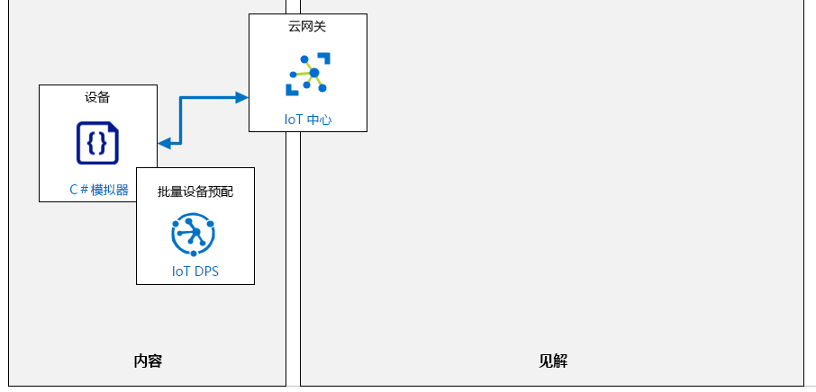

---
lab:
    title: '实验室 06：使用 DPS 安全、大规模地自动预配 IoT 设备'
    module: '模块 3：大规模设备预配'
---

# 使用 DPS 安全且大规模地自动预配 IoT 设备

## 实验室场景

你目前在 Contoso 的资产监视和跟踪解决方案上所做的工作使你能够使用个人注册验证设备预配和取消预配流程。管理团队现在要求你开始大规模实实现该流程。

要使项目继续进行，你需要证明设备预配服务可用于使用 X.509 证书身份验证自动安全地注册更多设备。

将创建以下资源：



## 本实验室概览

在本实验室中，你将完成以下活动：

* 验证是否满足实验室先决条件（具有必需的 Azure 资源）
* 使用 OpenSSL 生成和配置 X.509 CA 证书
* 在 DPS 中创建组注册
* 使用 X.509 证书配置模拟设备
* 处理设备孪生必需属性的更改
* 模拟设备的自动注册
* 停用模拟设备的组注册

## 实验室说明

### 练习 1：验证实验室先决条件

本实验室假定以下 Azure 资源可用：

| 资源类型 | 资源名称 |
| :-- | :-- |
| 资源组 | AZ-220-RG |
| IoT 中心 | AZ-220-HUB-_{YOUR-ID}_ |
| 设备预配服务 | AZ-220-DPS-_{YOUR-ID}_ |

如果这些资源不可用，则需要先按照以下说明运行 **lab06-setup.azcli** 脚本，然后再继续完成练习 2。脚本文件包含在本地克隆作为开发环境配置（实验室 3）的 GitHub 存储库中。

**lab06-setup.azcli** 脚本编写为在 **bash** shell 环境中运行（最简单的方法是在 Azure Cloud Shell 中执行此操作）。

1. 使用浏览器，打开 [Azure Cloud Shell](https://shell.azure.com/)，并使用本课程使用的 Azure 订阅登录。

    如果系统提示设置 Cloud Shell 的存储，请接受默认设置。

1. 验证 Azure Cloud Shell 是否正在使用 **Bash**。

    Azure Cloud Shell 页面左上角的下拉菜单用于选择环境。验证所选的下拉值是否为 **Bash**。

1. 在 Azure Shell 工具栏上，单击**上传/下载文件** （从右数第四个按钮）。

1. 在下拉菜单中，单击 **“上传”**。

1. 在“文件选择”对话框中，导航到配置开发环境时下载的 GitHub 实验室文件的文件夹位置。

    在_实验室 3 中：设置开发环境_，你可以通过下载 ZIP 文件并从本地提取内容来克隆包含实验室资源的 GitHub 存储库。提取的文件夹结构包括以下文件夹路径：

    * Allfiles
      * 实验室
          * 06 - 在 DPS 中自动注册设备
            * 设置

    lab06-setup.azcli 脚本文件位于实验室 6 的 Setup 文件夹中。

1. 选择 **lab06-setup.azcli** 文件，然后单击 **“打开”**。

    文件上传完成后，将显示一条通知。

1. 若要验证在 Azure Cloud Shell 中已上传了正确文件，请输入以下命令：

    ```bash
    ls
    ```

    使用 `ls` 命令列出当前目录的内容。你应该会看到列出了 lab06-setup.azcli 文件。

1. 若要为此实验室创建一个包含安装脚本的目录，然后移至该目录，请输入以下 Bash 命令：

    ```bash
    mkdir lab6
    mv lab06-setup.azcli lab6
    cd lab6
    ```

1. 为了确保 **lab06-setup.azcli** 脚本具有执行权限，请输入以下命令：

    ```bash
    chmod +x lab06-setup.azcli
    ```

1. 在 Cloud Shell 工具栏上，要编辑 lab06-setup.azcli 文件，请单击 **“打开编辑器”**（右侧第二个按钮 - **{ }**）。

1. 在 **“文件”** 列表中，要展开“lab6”文件夹并打开脚本文件，请单击 **“lab6”**，再单击 **“lab06-setup.azcli”**。

    编辑器现在将显示 **lab06-setup.azcli** 文件的内容。

1. 在编辑器中，更新 `{YOUR-ID}` 和 `{YOUR-LOCATION}` 变量的值。

    以下面的示例为例，需要将 `{YOUR-ID}` 设置为在本课程开始时创建的唯一 ID，即 **CAH191211**，然后将 `{YOUR-LOCATION}` 设置为对你的资源有意义的位置。

    ```bash
    #!/bin/bash

    RGName="AZ-220-RG"
    IoTHubName="AZ-220-HUB-{YOUR-ID}"

    Location="{YOUR-LOCATION}"
    ```

    > **注释**：  `{YOUR-LOCATION}` 变量应设置为该区域的短名称。输入以下命令，可以看到可用区域及其短名称的列表（**名称**列）：
    >
    > ```bash
    > az account list-locations -o Table
    >
    > DisplayName           Latitude    Longitude    Name
    > --------------------  ----------  -----------  ------------------
    > East Asia             22.267      114.188      eastasia
    > Southeast Asia        1.283       103.833      southeastasia
    > Central US            41.5908     -93.6208     centralus
    > East US               37.3719     -79.8164     eastus
    > East US 2             36.6681     -78.3889     eastus2
    > ```

1. 要保存对文件所做的更改并关闭编辑器，请单击编辑器窗口右上角的 **“...”**，然后单击 **“关闭编辑器”**。

    如果提示保存，请单击 **“保存”**，编辑器将会关闭。

    > **注释**：  可以使用 **CTRL+S** 随时保存，使用 **CTRL+Q** 关闭编辑器。

1. 要创建本实验室所需的资源，请输入以下命令：

    ```bash
    ./lab06-setup.azcli
    ```

    运行将花费几分钟时间。每个步骤完成时，你将会看到 JSON 输出。

    脚本完成后，就可以继续实验室的内容。

### 练习 2：使用 OpenSSL 生成和配置 X.509 CA 证书

在本练习中，你将在 Azure Cloud Shell 中使用 OpenSSL 生成 X.509 CA 证书。此证书将用于在设备预配服务 (DPS) 中配置组注册。

#### 任务 1：生成证书

1. 如有必要，使用你在本课程中使用的 Azure 帐户凭据登录到 [Azure 门户](https://portal.azure.com)。

    如果有多个 Azure 帐户，请确保使用与该课程将使用的订阅绑定的帐户登录。

1. 在门户窗口的右上角，请单击 **“Cloud Shell”** 打开 Azure Cloud Shell。

    Cloud Shell 按钮有一个代表命令提示符 **`>_`** 的图标。

    Cloud Shell 窗口将在靠近显示屏底部的位置打开。

1. 在 Cloud Shell 窗口的左上角，确保将 **Bash** 选为环境选项。

    > **注释**：  Azure Cloud Shell 的 *Bash* 和 *PowerShell* 界面都支持使用 **OpenSSL**。在本练习中，你将使用专为 *Bash* shell 编写的一些帮助程序脚本。

1. 在 Cloud Shell 命令提示符下，要下载将要使用的 Azure IoT 帮助程序脚本，请输入以下命令：

    ```sh
    #创建证书目录
    mkdir certificates
    #导航到证书目录
    cd certificates

    #下载帮助程序脚本文件
    curl https://raw.githubusercontent.com/Azure/azure-iot-sdk-c/master/tools/CACertificates/certGen.sh --output certGen.sh
    curl https://raw.githubusercontent.com/Azure/azure-iot-sdk-c/master/tools/CACertificates/openssl_device_intermediate_ca.cnf --output openssl_device_intermediate_ca.cnf
    curl https://raw.githubusercontent.com/Azure/azure-iot-sdk-c/master/tools/CACertificates/openssl_root_ca.cnf --output openssl_root_ca.cnf

    #更新脚本权限，以便用户可以读取、写入和执行它
    chmod 700 certGen.sh
    ```

    帮助程序脚本和支持文件是从托管在 Github 上的 `Azure/azure-iot-sdk-c` 开放源代码项目中下载的。这是一个开放源代码项目，是 Azure IoT SDK 的一部分。`certGen.sh` 帮助程序脚本将帮助演示 CA 证书的用途，而无需深入研究本实验室范围之外的 OpenSSL 配置的细节。

    有关使用此帮助程序脚本的其他说明，以及有关如何使用 PowerShell 代替 Bash 的说明，请参见以下链接：[https://github.com/Azure/azure-iot-sdk-c/blob/master/tools/CACertificates/CACertificateOverview.md](https://github.com/Azure/azure-iot-sdk-c/blob/master/tools/CACertificates/CACertificateOverview.md)

    > **警告**：由此帮助程序脚本创建的证书**禁止**用于生产。它们包含硬编码的密码（“*1234*”），将在 30 天后过期，并且最重要的是，它们用于演示目的，以帮助你快速了解 CA 证书。基于 CA 证书构建产品时，需要按照自己的安全最佳做法来创建证书和管理生命周期。

    如果感兴趣，你可以使用 Cloud Shell 内置的编辑器来快速扫描你下载的脚本文件的内容。

    * 在 Cloud Shell 中，要打开编辑器，请单击 **“`{}`”**。
    * 在“文件”列表中，单击 **“证书”**，然后单击 **“certGen.sh”**

    > **注释**：如果你熟悉 Bash 环境中的其他文本文件查看工具，例如 `more` 或 `vi` 命令，你也可以使用这些工具。

    下一步将使用该脚本来创建根证书和中间证书。

1. 要生成根证书和中间证书，请输入以下命令：

    ```sh
    ./certGen.sh create_root_and_intermediate
    ```

    注意，你使用 `create_root_and_intermediate` 选项运行了该脚本。此命令假设你正在从 `~/certificates` 目录运行脚本。

    此命令生成了名为 `azure-iot-test-only.root.ca.cert.pem` 的根 CA 证书，并将该证书放在了 `./certs` 目录中，该目录位于你创建的证书目录下。

1. 要将根证书下载到本地计算机（以便上传到 DPS），请输入以下命令

    ```sh
    download ~/certificates/certs/azure-iot-test-only.root.ca.cert.pem
    ```

    系统将提示你将文件保存到本地计算机。记下文件的保存位置，在下一个任务中将需要用到它。

#### 任务 2：配置 DPS 以信任根证书

1. 在 Azure 门户中，打开“设备预配服务”。

    这是设备预配服务名称 `AZ-220-DPS-{YOUR-ID}`。

1. 在 **“设备预配服务”** 边栏选项卡左侧的 **“设置”** 部分，单击 **“证书”**。

1. 在 **“证书”** 窗格的顶部，单击 **“添加”**。  

    单击 **“添加”** 会启动将 X.509 CA 证书上传到 DPS 服务的过程。

1. 在 **“添加证书”** 窗格的 **“证书名称”** 下，输入 **root-ca-cert**。

    重要的是要提供一个使你能够区分各个证书的名称，例如根证书、中间证书或链中层次结构级别的多个证书。

    > **注释**：你输入的根证书名称可以与证书文件的名称相同，也可以不同。你提供的名称是逻辑名称，与内容 X.509 CA 证书中嵌入的公用名称__不相关。

1. 在 **“证书 .pem 或 .cer 文件”** 下的“选择文件”__文本框右侧，单击 **“打开”**。

    单击文本字段右侧的 **“打开”** 按钮将打开一个 OPen 文件对话框，在该对话框中，你可以导航到先前下载的 `azure-iot-test-only.root.ca.cert.pem` CA 证书。

1. 在窗格底部，单击 **“保存”**。

    上传 X.509 CA 证书后， _“证书”_ 窗格将显示该证书，并且 _“状态”_ 为 _“未验证”_。在使用此 CA 证书对 DPS 的设备进行身份验证之前，你需要验证证书的 **“所有权证明”** 。

1. 要启动验证证书的 **“拥有证明”** 过程，请单击 **root-ca-cert**。

1. 在 **“证书详细信息”** 窗格中，单击 **“生成验证码”**。

    你可能需要向下滚动才能看到 **“生成验证码”** 按钮。

    单击该按钮时，它会将生成的代码置于“验证码”字段中。

1. 在 **“验证码”** 的右侧，单击 **“复制到剪贴板”**。

    通过上传使用刚刚在 DPS 中生成的验证码从 CA 证书生成的证书，向 DPS 提供 CA 证书的“拥有证明”__。这是如何证明你实际拥有 CA 证书的方法。

    > **重要事项**：生成验证证书时，需要保持打开 **“证书详细信息”** 窗格。如果关闭窗格，将导致验证码无效，并且需要生成一个新的验证码。

1. 如果仍然无法在之前的基础上打开，则打开 **Azure Cloud Shell**，并导航到 `~/certificates` 目录。

1. 要创建验证证书，请输入以下命令：

    ```sh
    ./certGen.sh create_verification_certificate <verification-code>
    ```

    请务必将 `<verification-code>` 占位符替换为由 Azure 门户生成的 **验证码**。

    例如，你运行的命令将如下所示：

    ```sh
    ./certGen.sh create_verification_certificate 49C900C30C78D916C46AE9D9C124E9CFFD5FCE124696FAEA
    ```

    这会生成一个链接到 CA _证书的验证证书_。证书的主题是验证码。生成的名为 `verification-code.cert.pem` 的验证证书位于 Azure Cloud Shell 的 `./certs` 目录中。

    下一步是将验证证书下载到本地计算机（类似于我们之前对根证书执行的操作），以便稍后将其上传到 DPS。

1. 要将验证证书下载到本地计算机，请输入以下命令：

    ```sh
    download ~/certificates/certs/verification-code.cert.pem
    ```

    > **注释**：根据 Web 浏览器的不同，此时系统可能会显示一条提示，让你确定是否允许多次下载。如果系统对你的下载命令无响应，请确保屏幕上的其他地方没有显示要求你提供允许下载权限的提示。

1. 返回 **“证书详细信息”** 窗格。

    我们曾提到过，在 DPS 中处理 CA 证书时，需要在 Azure 门户中保持打开此窗格。

1. 在底部 **“证书详细信息”** 窗格的 **“验证证书 .pem 或 .cer 文件”** 右侧，单击 **“打开”**。

1. 在“打开文件”对话框中，导航到 downloads 文件夹，单击 **“verification-code.cert.pem”**，然后单击 **“打开”**。

1. 在底部的 **“证书详细信息”** 窗格中，单击 **“验证”**。

1. 在 **“证书”** 窗格中，验证证书的 **“状态”** 现在是否显示为_“已验证”_。

    你可能需要使用窗格顶部的 **“刷新”按钮**（位于 **“添加”** 按钮右侧）来查看此更改。

### 练习 3：在 DPS 中创建组注册（X.509 证书）

在本练习中，你将在设备预配服务 (DPS) 中使用_“证书证明”_新建注册组。

#### 任务 1：创建注册

1. 如有必要，请使用 Azure 帐户凭据登录到 Azure 门户。

    如果有多个 Azure 帐户，请确保使用与该课程将使用的订阅绑定的帐户登录。

1. 在资源组磁贴上，单击 **AZ-220-DPS-_{YOUR-ID}_**。

1. 在“设备预配服务”边栏选项卡左侧的 **“设置”** 下，单击 **“管理注册”**。

1. 在边栏选项卡顶部，单击 **“添加注册组”**。

    回想一下，注册组基本上是可以通过自动预配进行注册的设备记录。

1. 在 **“添加注册组”** 边栏选项卡上的 **“组名”** 字段中，输入 **“simulated-devices”**

1. 确保将 **“认证类型”** 设置为 **“证书”**。

1. 确保将 **“证书类型”** 字段设置为 **“CA 证书”**。

1. 在**“初级证书”**下拉菜单中，选择之前上传到 DPS 的 CA 证书，如 **root-ca-cert**。

1. 将 **“二级证书”** 下拉菜单保留设置为 **“未选择证书”**。

    二级证书通常用于证书轮换，以容纳到期的证书或已泄露的证书。你可以在此处找到有关证书轮换的更多信息：[https://docs.microsoft.com/zh-cn/azure/iot-dps/how-to-roll-certificates](https://docs.microsoft.com/zh-cn/azure/iot-dps/how-to-roll-certificates)

1. 将 **“选择如何将设备分配到中心”** 保留设置为 **“均匀加权分配”**。

   在具有多个分布式中心的大型环境中，此设置将控制如何选择应接收此设备注册的 IoT 中心。你将具备一个与本实验室中的注册相关的  IoT 中心，因此如何将设备分配给 IoT 中心在本实验室方案中并不真正适用。 

1. 注意，在**“选择此设备可分配到的 IoT 中心：”** 下拉菜单中选择了 **AZ-220-HUB-_{YOUR-ID}_ IoT 中心**。

   此字段指定此设备可分配到的 IoT 中心。

1. 将 **“选择在重新预配时如何处理设备数据”** 保留设置为默认值 **“重新预配并迁移数据”**。

    通过此字段，可以对重新预配行为进行高级控制。所谓重新预配，是指同一设备（由同一注册 ID 指示）在成功预配至少一次之后再次提交配置请求的行为。

1. 注意，在 **“选择此组可分配到的 IoT 中心”** 下拉菜单中选择了 **AZ-220-HUB-*{YOUR-ID}*** IoT 中心。

    这将确保在预配设备时将其添加到此 IoT 中心。

1. 在 **“初始设备孪生状态”** 字段中，按如下所示修改 JSON 对象：

    ```json
    {
        "tags": {},
        "properties": {
            "desired": {
                "telemetryDelay": "1"
            }
        }
    }
    ```

    此 JSON 数据表示此注册组中所包含任何设备的设备孪生必需属性的初始配置。

    设备将使用 `properties.desired.telemetryDelay` 属性来设置读取遥测数据并将其发送到 IoT 中心的时间延迟。

1. 将 **“启用输入”** 保留设置为 **“启用”**。

    通常需要启用新的注册项并保持启用状态。

1. 在 **“添加注册”** 边栏选项卡顶部，单击 **“保存”**。

#### 任务 2：验证注册

1. 验证是否显示 **“注册组”** 选项卡，并且列出了新注册组。

    如果未列出你的注册组，请单击边栏选项卡顶部的 **“刷新”**。

1. 在“组名称”列表中，单击 **simulated-devices**。

1. 在 **“注册组详细信息”** 边栏选项卡中，验证以下内容：

    * **“证书类型”** 设置为 **“CA 证书”**
    * **“初级证书”** 设置为 **root-ca-cert**
    * **“二级证书”** 设置为 **“未选择证书”**
    * **“选择如何将设备分配到中心”** 设置为 **“均匀加权分配”**
    * **“选择此组可分配到的 IoT 中心：”** 设置为 **AZ-220-HUB-{YOUR-ID}.azure-devices.net**
    * **“初始设备孪生状态”** 包含设置为 `1` 值的 `telemetryDelay` 属性。

1. 验证注册组设置后，请关闭 **“注册组详细信息”** 边栏选项卡。

### 练习 4：使用 X.509 证书配置模拟设备

在本练习中，你将配置用 C# 编写的模拟设备，以使用 X.509 证书通过设备预配服务 (DPS) 连接到 Azure IoT 中心。在本练习中，你还将了解**模拟设备**源代码中的工作流，以及如何向 DPS 进行身份验证并将消息发送到 IoT 中心。

1. 如有必要，请使用 Azure 帐户凭据登录到 Azure 门户。

    如果有多个 Azure 帐户，请确保使用与该课程将使用的订阅绑定的帐户登录。

1. 在“Azure 门户”窗口顶部的工具栏中，单击 **“Cloud Shell”**。

    验证在 Cloud Shell 的左上角是否选择了 **“Bash shell”** 选项。

1. 在 **Cloud Shell** 中，通过运行以下命令导航到 `~/certificates` 目录：

    ```sh
    cd ~/certificates
    ```

    `~/certificates` 目录是 `certGen.sh` 帮助程序脚本的下载目录。你之前使用它们来生成了 DPS 的 CA 证书。此帮助程序脚本还将用于在 CA 证书链中生成设备证书。

1. 要在 CA 证书链中生成 _X.509 设备证书_，请输入以下命令：

    ```sh
    ./certGen.sh create_device_certificate simulated-device1
    ```

    此命令将创建一个新的 X.509 证书，该证书由先前生成的 CA 证书签名。注意，设备 ID (`simulated-device1`) 已传递到 `certGen.sh` 脚本的 `create_device_certificate` 命令。该设备 ID 将在设备证书的_公用名称_（即 `CN=`）值中设置。此证书将为你的模拟设备生成一个叶设备 X.509 证书，并且设备将使用此证书向设备预配服务 (DPS) 进行身份验证。

    完成 `create_device_certificate` 命令后，生成的 X.509 设备证书将命名为 `new-device.cert.pfx`，并将存放在 `/certs` 子目录中。

    > **注释**：此命令将覆盖 `/certs` 子目录中的所有现有设备证书。如果要为多个设备创建证书，请确保每次运行命令时都保存 `new-device.cert.pfx` 的副本。

1. 要将生成的 X.509 设备证书从 Cloud Shell 下载到本地计算机，请输入以下命令：

    ```sh
    download ~/certificates/certs/new-device.cert.pfx
    ```

    将模拟设备配置为使用此 X.509 设备证书向设备预配服务进行身份验证。

1. 在 Azure 门户中，导航到 **“设备预配服务”** 边栏选项卡和 **“概述”** 窗格。

1. 在 **“概述”** 窗格中，复制设备预配服务的 **“ID 范围”**，并保存供以后参考。

    将鼠标悬停在值上方时，该值的右侧将显示一个“复制”按钮。

    **ID 范围**类似于此值：`0ne0004E52G`

1. 打开 Windows 文件资源管理器，然后导航到 `new-device.cert.pfx` 的下载文件夹。

1. 使用文件资源管理器创建 `new-device.cert.pfx` 文件的副本。

1. 在文件资源管理器中，导航到实验室 6（在 DPS 中自动注册设备）的 Starter 文件夹。

    在_实验室 3 中：设置开发环境_，你可以通过下载 ZIP 文件并从本地提取内容来克隆包含实验室资源的 GitHub 存储库。提取的文件夹结构包括以下文件夹路径：

    * Allfiles
      * 实验室
          * 06 - 在 DPS 中自动注册设备
            * Starter

1. 将 `new-device.cert.pfx` 文件粘贴到 Starter 文件夹中。

    实验室 6 Starter 文件夹的根目录中包含 `Program.cs` 文件。向设备预配服务进行身份验证时，**模拟设备**项目将需要访问此证书文件。

1. 打开 **Visual Studio Code**。

1. 在 **“文件”** 菜单上，单击 **“打开文件夹”**

1. 在“打开文件夹”对话框中，导航到 **06-Automatic Enrollment of Devices in DPS** 文件夹。

1. 单击 **Starter**，然后单击 **“选择文件夹”**。

    你应该会在 Visual Studio Code 的资源管理器窗格中看到以下文件：

    * new-device.cert.pfx
    * Program.cs
    * SimulatedDevice.csproj

1. 打开 `SimulatedDevice.csproj` 文件。

1. 在 `SimulatedDevice.csproj` 文件中，确保 `<ItemGroup>` 标记包含以下内容： 

    ```xml
        <None Update="new-device.cert.pfx" CopyToOutputDirectory="PreserveNewest" />
    ```

    如果不包含，请添加。完成后，`<ItemGroup>` 标记应如下所示：

    ```xml
            <ItemGroup>
                <None Update="new-device.cert.pfx" CopyToOutputDirectory="PreserveNewest" />
                <PackageReference Include="Microsoft.Azure.Devices.Client" Version="1.21.1" />
                <PackageReference Include="Microsoft.Azure.Devices.Provisioning.Transport.Mqtt" Version="1.1.8" />
                <PackageReference Include="Microsoft.Azure.Devices.Provisioning.Transport.Amqp" Version="1.1.9" />
                <PackageReference Include="Microsoft.Azure.Devices.Provisioning.Transport.Http" Version="1.1.6" />
            </ItemGroup>
        </Project>
    ```

    这种配置可确保在编译 C# 代码时将 `new-device.cert.pfx` 证书文件复制到版本文件夹，并在程序执行时供其访问。

    > **注释**：确切的 `PackageReference` 条目可能有所不同，具体取决于你使用的实验室代码的确切版本。

1. 在 Visual Studio Code 的 **“文件”** 菜单上，单击 **“保存”**。

1. 打开 `Program.cs` 文件。

1. 找到 `GlobalDeviceEndpoint` 变量，并注意其值设置为 Azure 设备预配服务的全局设备终结点 (`global.azure-devices-provisioning.net`)。 

    在公共 Azure 云中，`global.azure-devices-provisioning.net` 是设备预配服务 (DPS) 的全局设备终结点。连接到 Azure DPS 的所有设备都将使用此全局设备终结点 DNS 名称进行配置。你应该会看到如下所示代码：

    ```csharp
    private const string GlobalDeviceEndpoint = "global.azure-devices-provisioning.net";
    ```

1. 找到 `dpsIdScope` 变量，并用你从设备预配服务的“概述”窗格中复制的 **“ID 范围”** 替换已分配的值。

    当你更新完代码后，它应该类似于：

    ```csharp
    private static string dpsIdScope = "0ne000CBD6C";
    ```

1. 找到 `s_certificateFileName` 变量，并注意其值设置为你生成的设备证书文件 (`new-device.cert.pfx`)。

    `new-device.cert.pfx` 文件是你在 Cloud Shell 中使用 `certGen.sh` 帮助程序脚本生成的 X.509 设备证书文件。此变量告知设备代码哪个文件包含 X.509 设备证书，设备将使用该证书向设备预配服务进行身份验证。

1. 找到 `s_certificatePassword` 变量，注意此变量的值已设置为 `certGen.sh` 脚本的默认密码。

    `s_certificatePassword` 变量包含 X.509 设备证书的密码。它设置为 `1234`，因为这是 `certGen.sh` 帮助程序脚本用于生成 X.509 证书的默认密码。

    > **注释**：在本实验室中，密码是硬编码的。在 _生产_ 方案中，需要以更安全的方式存储密码，例如存储在 Azure 密钥保管库中。此外，证书文件 (PFX) 应该使用硬件安全模块 (HSM) 安全地存储在生产设备上。
    >
    > HSM（硬件安全模块）用于安全的、基于硬件的设备机密存储，是最安全的机密存储形式。X.509 证书和 SAS 令牌都可以存储在 HSM 中。HSM 可以与预配服务支持的所有证明机制一起使用。

1. 找到 `public static int Main` 方法，然后花一分钟时间查看代码。 

    Main 方法是模拟设备应用的入口点。注意，它要做的第一件事是调用 `LoadProvisioningCertificate` 方法，该方法返回一个 `X509Certificate2` 对象。

1. 向下滚动并找到 `LoadProvisioningCertificate` 方法，然后花一分钟时间查看用于生成 `X509Certificate2` 对象的代码。

    注意，`LoadProvisioningCertificate` 使用 `s_certificateFileName` 来加载 X.509 设备证书（来自 `new-device.cert.pfx` 文件）。

1. 向上滚动到 `public static int Main` 方法，然后花一点时间查看嵌套的 `using` 语句中的代码。

    注意，此代码为 X.509 设备证书启动了一个 `security` `SecurityProviderX509Certificate` 对象，并创建了一个 `transport` `ProvisioningTransportHandlerAmqp` 对象，该对象定义了模拟设备使用 AMQP 作为通信协议连接到 Azure IoT 中心。

    注意，`security` 和 `transport` 对象以及 DPS ID 范围和 DPS 全局设备终结点都已传递到 `ProvisioningDeviceClient.Create` 方法。ProvisioningDeviceClient 对象 `provClient` 将用于向设备预配服务注册设备。

    注意，`ProvisioningDeviceLogic` 是通过向其传递 `provClient` 和 `security` 对象来实例化的。`ProvisioningDeviceLogic` 类用于定义设备（模拟设备）的逻辑。它包含一些代码，这些代码通过从模拟设备传感器读取设备到云的消息并将这些消息发送到 Azure IoT 中心来模拟正在运行的设备。稍后还会将其修改为包含以下代码：根据从云发送到设备的设备孪生必需属性的更改来更新设备。

1. 向下滚动到 `ProvisioningDeviceLogic` 类，然后找到 `RunAsync` 方法。

    我们将花一些时间来回顾 `RunAsync` 方法，并指出一些关键点。

1. 在 `RunAsync` 方法中，注意包含 ProvisioningDeviceClient.RegisterAsync 方法的代码（如下所示）。

    ```csharp
    DeviceRegistrationResult result = await _provClient.RegisterAsync().ConfigureAwait(false);
    ```

    RegisterAsync 方法用于向设备预配服务注册设备，并将其分配给 Azure IoT 中心。

1. 注意实例化新 `DeviceAuthenticationWithX509Certificate` 对象的代码（如下所示）。 

    ```csharp
    var auth = new DeviceAuthenticationWithX509Certificate(result.DeviceId, (_security as SecurityProviderX509).GetAuthenticationCertificate());
    ```

    这是一个设备身份验证对象，用于模拟设备通过使用 X.509 设备证书向 Azure IoT 中心进行身份验证。正在向构造函数传递在 DPS 中注册的设备的设备 ID，以及设备用于进行身份验证的 X.509 设备证书。

1. 注意调用 `DeviceClient.Create` 方法的代码。

    ```csharp
    using (iotClient = DeviceClient.Create(result.AssignedHub, auth, TransportType.Amqp))
    {
    ```

    `DeviceClient.Create` 方法用于创建新的 IoT `DeviceClient` 对象，该对象将用于与 Azure IoT 中心服务进行通信。注意，此代码传递 `TransportType.Amqp` 的值，以告知 `DeviceClient` 使用 AMQP 协议与 Azure IoT 中心进行通信。也可以使用 MQTT 或 HTTP 协议连接到 Azure IoT 中心并与之通信，具体取决于网络体系结构、设备要求等。

1. 注意对 `SendDeviceToCloudMessagesAsync` 方法的调用。 

    ```csharp
    await SendDeviceToCloudMessagesAsync(iotClient);
    ```

    `SendDeviceToCloudMessagesAsync` 方法是一个单独的方法，在代码中进一步定义。此方法包含用于从模拟传感器读取设备到云的消息并将这些消息发送到 Azure IoT 中心的代码。此方法还包含一个循环，该循环在模拟设备运行时继续执行。

1. 同样在 RunAsync 方法中，注意对 `DeviceClient.CloseAsync` 方法的调用。

    ```csharp
    await iotClient.CloseAsync().ConfigureAwait(false);
    ```

    此方法关闭 `DeviceClient` 对象，从而关闭与 Azure IoT 中心的连接。这是模拟设备关闭时执行的最后一行代码。

1. 向下滚动到 `SendDeviceToCloudMessagesAsync` 方法。

    同样，我们会指出一些关键细节。

1. 注意生成模拟传感器读取操作的代码（如下所示）。

    ```csharp
    double currentTemperature = minTemperature + rand.NextDouble() * 15;
    double currentHumidity = minHumidity + rand.NextDouble() * 20;
    double currentPressure = minPressure + rand.NextDouble() * 12;
    double currentLatitude = minLatitude + rand.NextDouble() * 0.5;
    double currentLongitude = minLongitude + rand.NextDouble() * 0.5;
    ```

    对于每种传感器类型，在 while 循环内将随机值添加到最小传感器值。最小值在循环外初始化。这将创建一系列传感器值读数，这些读数可以报告给你的 IoT 中心。

1. 请注意用于将传感器读数组合成 JSON 对象的代码：

    ```csharp
        var telemetryDataPoint = new
        {
            temperature = currentTemperature,
            humidity = currentHumidity,
            pressure = currentPressure,
            latitude = currentLatitude,
            longitude = currentLongitude
        };
        var messageString = JsonConvert.SerializeObject(telemetryDataPoint);
        var message = new Message(Encoding.ASCII.GetBytes(messageString));
    ```

    IoT 中心需要正确格式化的消息。

1. 注意，这行代码将 `temperatureAlert` 属性添加到了设备到云的 `Message` 中。

    ```csharp
    message.Properties.Add("temperatureAlert", (currentTemperature > 30) ? "true" : "false");
    ```

    `temperatureAlert` 属性的值被设置为 `boolean` 值，代表是否 _温度_ 传感器读数大于 30。由于我们生成的温度读数范围为 20 到 35，因此大约三分之一时间的 temperatureAlert 应该为“true”。 

    这段代码是一个简单的示例，说明了如何在将属性发送到 Azure IoT 中心之前向`Message`对象添加属性。除了消息正文内容之外，它还可用于向正在发送的消息中添加其他元数据。

1. 注意对 `DeviceClient.SendEventAsync` 方法的调用。

    ```csharp
    await deviceClient.SendEventAsync(message);
    ```

    `SendEventAsync` 方法接受我们生成的 `message` 作为参数发送，然后执行将设备到云的消息发送到 Azure IoT 中心的工作。

1. 请注意对 `Delay` 方法的调用，该方法用于设置设备到云遥测消息之间的时间。

    这个简单的延迟使用 `_telemetryDelay` 变量定义发送下一个模拟传感器读数之前要等待的秒数。在下一个练习中，我们将使用设备孪生属性来控制延迟时间。

### 练习 5：处理设备孪生必需属性的更改

设备孪生是存储设备状态信息（包括元数据、配置和条件）的 JSON 文档。Azure IoT 中心为你连接到 IoT 中心的每个设备维护一个设备孪生。

设备预配服务 (DPS) 包含使用组注册所注册设备的初始设备孪生所需属性。设备注册后，将使用 DPS 的初始设备孪生配置在 IoT 中心内进行创建。注册后，Azure IoT 中心为 IoT 中心设备注册表中的每个设备维护一个设备孪生（及其属性）。

当为 Azure IoT 中心内的设备更新了设备孪生所需属性时，所需的更改将使用 IoT SDK（在本例中为 C# SDK）中包含的 `DesiredPropertyUpdateCallback` 事件发送到 IoT 设备。通过在设备代码中处理此事件，可以通过轻松管理设备的设备孪生状态（使用 IoT 中心提供访问权限）来根据需要更新设备的配置和属性。

在本练习中，你将修改模拟设备源代码，以包括事件处理程序，该事件处理程序将根据从 Azure IoT 中心发送到设备的设备孪生所需属性更改来更新设备配置。

> **注释**：由于概念和过程相同，因此在此处使用的步骤集与使用模拟设备的早期实验室中的步骤非常相似。  在预配设备后，预配过程中用于身份验证的方法不会更改设备孪生属性更改的处理。

1. 使用 **Visual Studio Code**， 打开实验室 6 的 **启动程序** 文件夹。

    如果你已从上一个练习中打开代码项目，请继续使用相同的代码文件。

1. 打开 `Program.cs` 文件。

1. 找到 `ProvisioningDeviceLogic` 类，然后向下滚动至 `RunAsync` 方法。

   这是使用 `DeviceClient` 对象将模拟设备连接到 Azure IoT 中心的方法。你将添加代码，该代码集成了设备的 `DesiredPropertyUpdateCallback` 事件处理程序，以便接收设备孪生所需的属性更改。设备连接到 Azure IoT 中心后，此代码将立即运行。 

1. 找到 `// TODO 1` 注释，然后粘贴到以下代码中：

    ```csharp
    // TODO 1: 设置 OnDesiredPropertyChanged 事件处理以接收所需的属性更改
    Console.WriteLine("Connecting SetDesiredPropertyUpdateCallbackAsync event handler...");
    await iotClient.SetDesiredPropertyUpdateCallbackAsync(OnDesiredPropertyChanged, null).ConfigureAwait(false);
    ```

    `iotClient` 对象是 `DeviceClient` 的实例。`SetDesiredPropertyUpdateCallbackAsync` 方法用于设置 `DesiredPropertyUpdateCallback` 事件处理程序，以接收设备孪生所需的属性更改。当接收到设备孪生属性更改事件时，此代码将 `iotClient` 配置为调用名为 `OnDesiredPropertyChanged` 的方法。

    现在已经有了 `SetDesiredPropertyUpdateCallbackAsync` 方法来设置事件处理程序，我们需要创建它调用的 `OnDesiredPropertyChanged` 方法。

1. 将光标置于 `RunAsync` 方法下方的空白代码行上。

1. 要定义 `OnDesiredPropertyChanged` 方法，请粘贴以下代码：

    ```csharp
        private async Task OnDesiredPropertyChanged(TwinCollection desiredProperties, object userContext)
        {
            Console.WriteLine("Desired Twin Property Changed:");
            Console.WriteLine($"{desiredProperties.ToJson()}");

            // 读取所需孪生属性
            if (desiredProperties.Contains("telemetryDelay"))
            {
                string desiredTelemetryDelay = desiredProperties["telemetryDelay"];
                if (desiredTelemetryDelay != null)
                {
                    this._telemetryDelay = int.Parse(desiredTelemetryDelay);
                }
                // 如果所需 TelemetryDelay 为 null 或未指定，请勿更改
            }


            // 报告孪生属性
            var reportedProperties = new TwinCollection();
            reportedProperties["telemetryDelay"] = this._telemetryDelay;
            await iotClient.UpdateReportedPropertiesAsync(reportedProperties).ConfigureAwait(false);
            Console.WriteLine("Reported Twin Properties:");
            Console.WriteLine($"{reportedProperties.ToJson()}");
        }
    ```

    注意，`OnDesiredPropertyChanged` 事件处理程序接受类型为 `TwinCollection` 的 `desiredProperties` 参数。 

    注意，`if` `desiredProperties` 参数的值包含 `telemetryDelay`（设备孪生所需属性），则代码会将设备孪生属性的值分配给 `this._telemetryDelay` 变量。你可能还记得，`SendDeviceToCloudMessagesAsync` 方法包括一个 `Task.Delay` 调用，该调用使用 `this._telemetryDelay` 变量来设置发送到 IoT 中心的消息之间的延迟时间。

    请注意，下一个代码块用于将设备的当前状态报告回 Azure IoT 中心。这段代码调用 `DeviceClient.UpdateReportedPropertiesAsync` 方法并将其传递给 **TwinCollection**，其中包含设备属性的当前状态。这是设备向 IoT 中心报告的方式，它已收到设备孪生期望属性更改事件，并且现在已相应更新其配置。请注意，它报告的是现在设置的属性，而不是所需属性的回显。如果从设备发送的报告属性不同于设备接收到的所需状态，则 IoT 中心将保持反映设备状态的准确设备孪生。

    既然设备可以从 Azure IoT 中心接收对设备孪生所需属性的更新，则还需要对其进行编码以在设备启动时配置其初始设置。为此，设备将需要从 Azure IoT 中心加载当前设备孪生所需属性，并进行相应的配置。 

1. 通过 `RunAsync` 方法找到 `// TODO 2` 注释。

1. 要实现在设备启动时运行 `OnDesiredPropertyChanged` 方法的代码，请输入以下代码：

    ```csharp
    // 待办事项 2：由于设备刚刚启动，请加载设备孪生属性
    Console.WriteLine("Loading Device Twin Properties...");
    var twin = await iotClient.GetTwinAsync().ConfigureAwait(false);
    //使用 OnDesiredPropertyChanged 事件处理程序设置加载的设备孪生属性（重用！）
    await OnDesiredPropertyChanged(twin.Properties.Desired, null);
    ```

    注意对 `DeviceClient.GetTwinAsync` 方法的调用。设备可以随时使用此方法来检索当前的“设备孪生”状态。在这种情况下使用它，这样当设备第一次开始执行时，设备可以配置自己以匹配设备孪生的所需属性。

    在这种情况下，将重用 `OnDesiredPropertyChanged` 事件处理程序方法，以将基于设备孪生所需属性的 `telemetryDelay` 属性配置保留在一个位置。随着时间的推移，这将有助于使代码更易于维护。

1. 在 Visual Studio Code 的 **“文件”** 菜单上，单击 **“保存”**。

### 练习 6：测试模拟设备

在本练习中，你将运行模拟设备。首次启动设备时，它将连接到设备预配服务 (DPS)，并使用配置的组注册自动注册。注册 DPS 组注册后，设备将自动在 Azure IoT 中心设备注册表中注册。注册并登记后，设备将开始使用配置的 X.509 证书身份验证与 Azure IoT 中心安全通信。

#### 任务 1：生成并运行设备

1. 使用 **Visual Studio Code**， 打开实验室 6 的 **启动程序** 文件夹。

    如果你已从上一个练习中打开代码项目，请继续使用相同的代码文件。

1. 在 Visual Studio Code 的 **视图** 菜单上，单击 **“终端”**。

    这将在 Visual Studio Code 窗口的底部打开集成终端。

1. 在终端命令提示符下，确保将当前目录路径设置为 `/Starter` 文件夹。

    你应该会看到以下类似内容：

    `Allfiles\Labs\06-Automatic Enrollment of Devices in DPS\Starter>`

1. 要生成并运行 **“SimulatedDevice”** 项目，请输入以下命令：

    ```cmd/sh
    dotnet run
    ```

    > **注释**：  在模拟设备上运行 `dotnet run` 时，如果显示 `ProvisioningTransportException` 异常，则最常见的原因是_“证书无效”_错误。如果发生这种情况，请确保正确配置了 DPS 中的 CA 证书和模拟设备应用程序的设备证书。
    >
    > ```text
    > localmachine:LabFiles User$ dotnet run
    > Found certificate: AFF851ED016CA5AEB71E5749BCBE3415F8CF4F37 CN=simulated-device1; PrivateKey: True
    > Using certificate AFF851ED016CA5AEB71E5749BCBE3415F8CF4F37 CN=simulated-device1
    > RegistrationID = simulated-device1
    > ProvisioningClient RegisterAsync . . . Unhandled exception. Microsoft.Azure.Devices.Provisioning.Client.ProvisioningTransportException: {"errorCode":401002,"trackingId":"2e298c80-0974-493c-9fd9-6253fb055ade","message":"Invalid certificate.","timestampUtc":"2019-12-13T14:55:40.2764134Z"}
    >   at Microsoft.Azure.Devices.Provisioning.Client.Transport.ProvisioningTransportHandlerAmqp.ValidateOutcome(Outcome outcome)
    >   at Microsoft.Azure.Devices.Provisioning.Client.Transport.ProvisioningTransportHandlerAmqp.RegisterDeviceAsync(AmqpClientConnection client, String correlationId, DeviceRegistration deviceRegistration)
    >   at Microsoft.Azure.Devices.Provisioning.Client.Transport.ProvisioningTransportHandlerAmqp.RegisterAsync(ProvisioningTransportRegisterMessage message, CancellationToken cancellationToken)
    >   at X509CertificateSimulatedDevice.ProvisioningDeviceLogic.RunAsync() in /Users/User/Documents/AZ-220/LabFiles/Program.cs:line 121
    >   at X509CertificateSimulatedDevice.Program.Main(String[] args) in /Users/User/Documents/AZ-220/LabFiles/Program.cs:line 55
    > ...
    > ```

1. 注意“终端”窗口中显示的模拟设备应用的控制台输出。

    当模拟设备应用程序运行时， **终端**将显示应用的控制台输出。 

    向上滚动到“终端”窗口中显示的信息的顶部。

    请注意，X.509 证书已加载，设备已在设备预配服务中注册，设备已分配连接到 **AZ-220-HUB-_{YOUR-ID}_** IoT 中心，并且已加载设备孪生所需属性。

    ```text
    localmachine:LabFiles User$ dotnet run
    Found certificate: AFF851ED016CA5AEB71E5749BCBE3415F8CF4F37 CN=simulated-device1; PrivateKey: True
    Using certificate AFF851ED016CA5AEB71E5749BCBE3415F8CF4F37 CN=simulated-device1
    RegistrationID = simulated-device1
    ProvisioningClient RegisterAsync . . . Device Registration Status: Assigned
    ProvisioningClient AssignedHub: AZ-220-HUB-CP1119.azure-devices.net; DeviceID: simulated-device1
    Creating X509 DeviceClient authentication.
    simulated device. Ctrl-C to exit.
    DeviceClient OpenAsync.
    Connecting SetDesiredPropertyUpdateCallbackAsync event handler...
    Loading Device Twin Properties...
    Desired Twin Property Changed:
    {"$version":1}
    Reported Twin Properties:
    {"telemetryDelay":1}
    Start reading and sending device telemetry...
    ```

    要查看模拟设备的源代码，请打开 `Program.cs` 源代码文件。查找几个 `Console.WriteLine` 语句，这些语句用于将看到的消息输出到控制台。

1. 请注意，JSON 格式的遥测消息已发送到 Azure IoT 中心。

    ```text
    Start reading and sending device telemetry...
    12/9/2019 5:47:00 PM > Sending message: {"temperature":24.047539159212047,"humidity":67.00504162675004,"pressure":1018.8478924248358,"latitude":40.129349260196875,"longitude":-98.42877188146265}
    12/9/2019 5:47:01 PM > Sending message: {"temperature":26.628804161040485,"humidity":68.09610794675355,"pressure":1014.6454375411363,"latitude":40.093269544242695,"longitude":-98.22227128174003}
    ```

    模拟设备通过初始启动后，它将开始向 Azure IoT 中心发送模拟传感器遥测消息。

    请注意，发送到 IoT 中心的每条消息之间的延迟（由 `telemetryDelay` 设备孪生属性定义）当前正是在发送传感器遥测消息之间的延迟 **1 秒**。

    使模拟设备继续运行以执行下一个任务。

#### 任务 2：通过孪生更改设备配置

在运行模拟设备的情况下，可以通过在 Azure IoT 中心内编辑设备孪生所需状态来更新 `telemetryDelay` 配置。这可以通过在 Azure 门户的 Azure IoT 中心中配置设备来完成。

1. 打开 **Azure 门户** ，然后导航到 **Azure IoT 中心**服务。

1. 在“IoT 中心”边栏选项卡左侧的 **“资源管理器”** 部分下，单击 **“IoT 设备”**。

1. 在 IoT 设备列表中，单击 **“simulated-device1”**。

    > **重要事项**：确保从此实验中选择设备。你可能还会看到在上一个实验室中创建的名为_“SimulatedDevice1”_的设备。

1. 在设备边栏选项卡上，在边栏选项卡顶部，单击 **“设备孪生”**。

    在 **“设备孪生”** 边栏选项卡中，有一个编辑器带有设备孪生的完整 JSON 。这使你能够直接在 Azure 门户中查看和/或编辑设备孪生状态。

1. 在设备孪生 JSON 中找到 `properties.desired` 节点。更新 `telemetryDelay` 属性，使其值为 `“2”`。保存后，这将更新模拟设备的 `telemetryDelay`，每隔 **2 秒**发送一次传感器遥测。

    为此部分设备孪生所需属性生成的 JSON 将类似于以下内容：

    ```json
    "properties": {
        "desired": {
          "telemetryDelay": "2",
          "$metadata": {
            "$lastUpdated": "2019-12-09T22:48:05.9703541Z",
            "$lastUpdatedVersion": 2,
            "telemetryDelay": {
              "$lastUpdated": "2019-12-09T22:48:05.9703541Z",
              "$lastUpdatedVersion": 2
            }
          },
          "$version": 2
        },
    ```

    在 JSON 中保留 `properties.desired` 节点的 `$metadata` 和 `$version` 值。  你只应更新 `telemetryDelay` 值以设置新设备孪生所需属性值。

1. 在边栏选项卡顶部，要为设备设置新设备孪生所需属性，请单击 **“保存”**。 

    保存后，更新后的设备孪生所需属性将自动发送到模拟设备。

1. 返回到运行模拟设备的 **“Visual Studio Code 终端”** 窗口，并注意到应用程序已收到更新设备孪生 `telemetryDelay` 所需属性设置的通知。

    该应用程序向控制台输出消息，表明已加载新设备孪生所需属性，并且已设置更改并将其报告回 Azure IoT 中心。

    ```text
    Desired Twin Property Changed:
    {"telemetryDelay":2,"$version":2}
    Reported Twin Properties:
    {"telemetryDelay":2}
    ```

1. 请注意，模拟设备传感器遥测消息现在每隔 _2_ 秒发送到 Azure IoT 中心。

    ```text
    12/9/2019 5:48:06 PM > Sending message: {"temperature":33.89822140284731,"humidity":78.34939097908763,"pressure":1024.9467544610131,"latitude":40.020042418755764,"longitude":-98.41923808825841}
    12/9/2019 5:48:09 PM > Sending message: {"temperature":27.475786026323114,"humidity":64.4175510594703,"pressure":1020.6866468579678,"latitude":40.2089999240047,"longitude":-98.26223221770334}
    12/9/2019 5:48:11 PM > Sending message: {"temperature":34.63600901637041,"humidity":60.95207713588703,"pressure":1013.6262313688063,"latitude":40.25499096898331,"longitude":-98.51199886959347}
    ```

1. 在 **“终端”** 窗口，要退出模拟设备应用，请按 **“Ctrl-C”**。

1. 在 Azure 门户中，关闭 **“设备孪生”** 边栏选项卡。

1. 仍在 Azure 门户中的“simulated-device1”边栏选项卡上，单击 **“设备孪生”**。

1. 向下滚动以找到 `properties.reported` 对象的 JSON。

    这包含设备报告的状态。注意，`telemetryDelay` 属性也存在，并且也设置为 `2`。  还有一个 `$metadata` 值，显示所报告数据的上次更新时间以及所报告特定值的上次更新时间。

1. 再次关闭 **“设备孪生”** 边栏选项卡。

1. 关闭“simulated-device1”边栏选项卡，然后导航回到你的 Azure 门户仪表板。

### 练习 7：淘汰组注册

在本练习中，你将从设备预配服务和 Azure IoT 中心淘汰注册组及其设备。

#### 任务 1：从 DPS 退出注册组

1. 如有必要，请使用 Azure 帐户凭据登录到 Azure 门户。

    如果有多个 Azure 帐户，请确保使用与该课程将使用的订阅绑定的帐户登录。

1. 在资源组磁贴上，若要导航到设备预配服务，请单击 **AZ-220-DPS-_{YOUR-ID}_**。

1. 在左侧菜单 **“设置”** 下，单击 **“管理注册”**。

1. 在 **“注册组”** 列表中，单击 **“simulated-devices”**。

1. 在 **“注册组详细信息”** 边栏选项卡上，向下滚动以找到 **“启用输入”** 字段，然后单击 **“禁用”**。

    禁用 DPS 中的组注册可以使你暂时禁用此注册组中的设备。这提供了这些设备使用的 X.509 证书的临时黑名单。

1. 在边栏选项卡顶部，单击 **“保存”**。

    要永久删除注册组，必须从 DPS 删除注册组。 

1. 在 **“管理注册”** 窗格的 **“组名称”** 下，选中左侧的复选框 **“simulated-devices”**。

    如果已选中 **“simulated-devices”** 左侧的复选框，请将其保持为选中状态。

1. 在顶部 **“管理注册”** 窗格中，单击 **“删除”**。

1. 当系统提示你确认 **“删除注册”** 操作时，请单击 **“是”** 。

   删除后，组注册将从 DPS 中完全删除，需要重新创建才能将其添加回 DPS。

    > **注释**：  如果删除证书的注册组，根证书或其证书链中更高位置的另一个中间证书仍然存在另一个已启用的注册组，则在其证书链中包含该证书的设备可能仍然可以注册。

1. 返回 Azure 门户仪表板。

#### 任务 2：从 IoT 中心停用设备

将注册组从设备预配服务 (DPS) 中删除后，设备注册仍存在于 Azure IoT 中心内。要完全淘汰设备，你还需要删除该注册。

1. 在 Azure 门户的资源组磁贴上，单击 **AZ-220-HUB-_{YOUR-ID}_**。

1. 在左侧 **“IoT 中心”** 边栏选项卡的 **“浏览器”** 下，单击 **“IoT 设备”**。

1. 请注意 **simulated-device1** 设备 ID 在 Azure IoT 中心设备注册表中仍然存在。

1. 要删除设备，请选中 **“simulated-device1”** 左侧的复选框，然后单击 **“删除”**。

    选中设备（复选框）后，将启用位于边栏选项卡顶部的 **“删除”** 按钮。

1. 当出现提示“ _是否确定要删除选定设备_”时，单击 **“是的”**。

#### 任务 3：验证淘汰情况

从“设备预配服务”中删除组注册，并从“Azure IoT 中心”设备注册表中删除设备后，该设备已从解决方案中完全删除。

1. 切换到包含 SimulatedDevice 代码项目的“Visual Studio Code”窗口。

    如果在上一练习后关闭了 Visual Studio Code，请使用 Visual Studio Code 打开实验室 6 启动程序文件夹。

1. 在 Visual Studio Code 的**视图**菜单上，单击 **“终端”**。

1. 确保命令提示符位于 **“启动程序”** 文件夹位置

1. 要开始运行模拟设备应用，请输入以下命令：

    ```cmd/sh
    dotnet run
    ```

1. 请注意设备尝试预配时列出的例外情况。

    既然组注册和已注册设备已被删除，模拟设备将不能再预配或连接。当应用程序尝试使用配置的 X.509 证书连接到 DPS 时，它将返回 `ProvisioningTransportException` 错误消息。

    ```txt
    Found certificate: AFF851ED016CA5AEB71E5749BCBE3415F8CF4F37 CN=simulated-device1; PrivateKey: True
    Using certificate AFF851ED016CA5AEB71E5749BCBE3415F8CF4F37 CN=simulated-device1
    RegistrationID = simulated-device1
    ProvisioningClient RegisterAsync . . . Unhandled exception. Microsoft.Azure.Devices.Provisioning.Client.ProvisioningTransportException: {"errorCode":401002,"trackingId":"df969401-c766-49a4-bab7-e769cd3cb585","message":"Unauthorized","timestampUtc":"2019-12-20T21:30:46.6730046Z"}
       at Microsoft.Azure.Devices.Provisioning.Client.Transport.ProvisioningTransportHandlerAmqp.ValidateOutcome(Outcome outcome)
       at Microsoft.Azure.Devices.Provisioning.Client.Transport.ProvisioningTransportHandlerAmqp.RegisterDeviceAsync(AmqpClientConnection client, String correlationId, DeviceRegistration deviceRegistration)
       at Microsoft.Azure.Devices.Provisioning.Client.Transport.ProvisioningTransportHandlerAmqp.RegisterAsync(ProvisioningTransportRegisterMessage message, CancellationToken cancellationToken)
    ```

    你已通过设备预配服务完成了 IoT 设备生命周期的注册、配置和淘汰。
