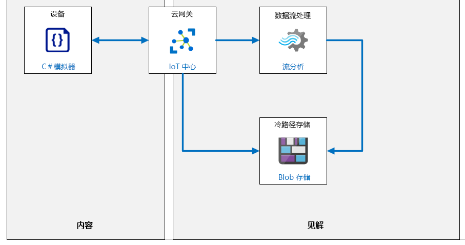

---
lab:
    title: '实验室 07：设备消息路由'
    module: '模块 4：消息处理和分析'
---

# 设备消息路由

## 实验室场景

你使用 DPS 来实现自动设备注册给 Contoso 管理层留下了深刻的印象。他们现在要求你开始针对与产品包装和运输相关的特定业务问题探索 IoT 解决方案。

Contoso 奶酪制作业务的关键组成部分是奶酪的包装和运输给客户。为了最大程度地提高成本效率，Contoso 运营了一个本地包装设备。其工作流非常简单 - 装箱进行运输，然后放到传送带系统上进行传送，最终放入邮递箱中。运输成功的衡量标准是在给定时间段（通常是工作班次）内离开传送带系统的包裹数量。

传送带系统是此过程中的关键环节，并进行直观监控以确保包裹正确送达。该系统具有三种操作员可控速度：停止、慢速和快速。当然，以较慢速度运输的包裹数量低于以较快速度运输的包裹数量。然而，在较慢的速度下运输，传送带系统的振动水平也较小。此外，高振动级别可加速系统的磨损，并可能导致包裹从传送带上掉落。如果振动过大，则必须停止传送带以进行检查，以免发生更严重的故障。

解决方案的主要目标是根据振动水平实现某种形式的预防性维护，该方法可用于在发生严重的系统损坏之前检测出故障。 

> **注释**：**预防性维护** （有时称为防止性维护或预测性维护）是一种设备维护程序，用于计划在设备正常运行时执行的维护活动。这种方法的目的是避免意外故障，这些故障通常会导致代价高昂的设备中断。

检测异常振动水平并不总是那么容易。因此，你正在寻求一种 Azure IoT 解决方案，该解决方案将有助于测量振动水平和数据异常。振动传感器将连接到传送带的各个位置，你将使用 IoT 设备将遥测发送到 IoT 中心。IoT 中心将使用 Azure 流分析和内置的机器学习 (ML) 模型来实时提醒你提防振动异常。你还计划将所有遥测数据存档，以便将来可以进一步分析。

你可以使用来自单个 IoT 设备的模拟遥测技术来进行解决方案的原型设计。

为了以逼真的方式模拟振动数据，你可以与一位工程师一起工作以了解导致振动的原因。事实证明，有多种不同类型的振动会影响整体振动级别。例如，“强制振动”可能是由损坏的导轮或者传送带过载引起的。当超出系统设计限制（例如速度或重量）时，也会引入“持续增加的振动”。在工程师的协助下，你就可以为模拟的 IoT 设备开发代码，该设备可以生成可接受振动数据描述并产生异常。

将创建以下资源：



## 本实验室概览

在本实验室中，你将完成以下活动：

* 验证是否满足实验室先决条件（具有必需的 Azure 资源）
* 使用 Azure CLI 创建 Azure IoT 中心和设备 ID
* 使用 Visual Studio Code 创建一个 C# 应用以将设备遥测发送到 IoT 中心
* 使用 Azure 门户创建到 Blob 存储的消息路由
* 使用 Azure 门户创建到 Azure 流分析作业的第二个消息路由

## 实验室说明

### 练习 1：验证实验室先决条件

本实验室假定以下 Azure 资源可用：

| 资源类型 | 资源名称 |
| :-- | :-- |
| 资源组 | AZ-220-RG |
| IoT 中心 | AZ-220-HUB-_{YOUR-ID}_ |
| 设备 ID | VibrationSensorId |

如果这些资源不可用，则需要在继续练习 2 之前按照以下说明运行 **lab07-setup.azcli** 脚本。脚本文件包含在本地克隆作为开发环境配置（实验室 3）的 GitHub 存储库中。

**lab07-setup.azcli** 脚本需要在 **bash** shell 环境中运行，在 Azure Cloud Shell 中执行此操作是最简单的方法。

1. 使用浏览器打开 Azure Shell[](https://shell.azure.com/)，并使用本课程所使用的 Azure 订阅登录。

    如果系统提示设置 Cloud Shell 的存储，请接受默认设置。

1. 验证 Azure Cloud Shell 是否正在使用 **Bash**。

    Azure Cloud Shell 页面左上角的下拉菜单用于选择环境。验证所选的下拉值是否为 **Bash**。

1. 在 Azure Shell 工具栏上，单击**上传/下载文件** （从右数第四个按钮）。

1. 在下拉菜单中，单击 **“上传”**。

1. 在“文件选择”对话框中，导航到配置开发环境时下载的 GitHub 实验室文件的文件夹位置。

    在_实验室 3 中：设置开发环境_，你可以通过下载 ZIP 文件并从本地提取内容来克隆包含实验室资源的 GitHub 存储库。提取的文件夹结构包括以下文件夹路径：

    * Allfiles
      * Labs
          * 07-Device Message Routing
            * Setup

    lab07-setup.azcli 脚本文件位于实验室 7 的 Setup 文件夹中。

1. 选择 **lab07-setup.azcli** 文件，然后单击 **“打开”**。

    文件上传完成后，将显示一条通知。

1. 若要验证在 Azure Cloud Shell 中已上传了正确文件，请输入以下命令：

    ```bash
    ls
    ```

    使用 `ls` 命令列出当前目录的内容。你应该会看到列出了 lab07-setup.azcli 文件。

1. 若要为此实验室创建一个包含安装脚本的目录，然后移至该目录，请输入以下 Bash 命令：

    ```bash
    mkdir lab7
    mv lab07-setup.azcli lab7
    cd lab7
    ```

1. 为了保证 **lab07-setup.azcli** 具有执行权限，请输入以下命令：

    ```bash
    chmod +x lab07-setup.azcli
    ```

1. 在“Cloud Shell”工具栏上，要编辑“lab07-setup.azcli”文件，请单击 **“打开编辑器”** （右侧第二个按钮 - **{ }**）。

1. 在 **“文件”** 列表中，要展开“lab7”文件夹并打开脚本文件，请单击 **“实验室 7”**，然后单击 **“lab07-setup.azcli”**。

    编辑器现在将显示 **“lab07-setup.azcli”** 文件。

1. 在编辑器中，更新 `{YOUR-ID}` 和 `{YOUR-LOCATION}` 已分配的值。

    以下面的示例为例，需要将 `{YOUR-ID}` 设置为在本课程开始时创建的唯一 ID，即 **CAH191211**，然后将 `{YOUR-LOCATION}` 设置为对你的资源有意义的位置。

    ```bash
    #!/bin/bash

    YourID="{YOUR-ID}"
    RGName="AZ-220-RG"
    IoTHubName="AZ-220-HUB-$YourID"

    Location="{YOUR-LOCATION}"
    ```

    > **注释**：  `{YOUR-LOCATION}` 变量应设置为该区域的短名称。输入以下命令，可以看到可用区域及其短名称的列表（**Name**列）：
    >
    > ```bash
    > az account list-locations -o Table
    >
    > DisplayName           Latitude    Longitude    Name
    > --------------------  ----------  -----------  ------------------
    > East Asia             22.267      114.188      eastasia
    > Southeast Asia        1.283       103.833      southeastasia
    > Central US            41.5908     -93.6208     centralus
    > East US               37.3719     -79.8164     eastus
    > East US 2             36.6681     -78.3889     eastus2
    > ```

1. 要保存对文件所做的更改并关闭编辑器，请单击编辑器窗口右上角的 **“...”**，然后单击 **“关闭编辑器”**。

    如果提示保存，请单击 **“保存”**，编辑器将会关闭。

    > **注释**：  可以使用 **CTRL+S** 随时保存，使用 **CTRL+Q** 关闭编辑器。

1. 要创建本实验室所需的资源，请输入以下命令：

    ```bash
    ./lab07-setup.azcli
    ```

    运行此脚本可能需要几分钟。每个步骤完成时，你将会看到 JSON 输出。

    该脚本将首先创建一个名为 **AZ-220-RG** 的资源组和一个名为 **AZ-220-HUB-{YourID}** 的 IoT 中心。如果它们已经存在，将显示相应的消息。然后，该脚本会将 ID 为 **VibrationSensorId** 的设备添加到 IoT 中心并显示设备连接字符串。

1. 请注意，脚本完成后，将显示设备的连接字符串。

    连接字符串以 "HostName=" 开头

1. 将连接字符串复制到文本文档中，并注意该字符串是否适用于 **VibrationSensorId** 设备。

    将连接字符串保存到容易找到的位置后，就可以继续进行本实验室了。

### 练习 2：编写振动遥测代码

监控传送带的关键是振动遥测的输出。振动通常以加速度 (m /s2) 表示，尽管有时以 g 力表示，其中1 g = 9.81 m/s2。有三种振动类型。

* 自然振动，即结构振动的频率。
* 当结构受到冲击时会发生自由振动，但随后即便不受干扰也会一直保持振动。
* 当结构处于一定应力下时会发生的强制振动。

受迫振动对我们的传送带而言是一个危险。即使最初的程度很弱，但这种振动会积累，最终导致结构过早失效。传送带操作中的自由振动很少。众所周知，大多数机器都有自然振动。

你将构建的代码示例将模拟传送带以一定速度（停止、慢速、快速）运行。传送带运行得越快，运送的包裹越多，但是振动的影响越大。我们将基于具有一定随机性的正弦波添加自然振动。我们的异常情况检测系统可能会错误地将此正弦波中的尖峰或下降识别为异常。然后，我们将添加两种形式的强制振动。第一，具有振动循环增加的效果（请参见下图）。第二，振动增加，增加了一个额外的正弦波，开始时振动较小但一直在增加。

在此原型阶段，我们假设传送带上只有一个传感器设备（我们的模拟 IoT 设备）。除了传递振动数据外，传感器还可以抽出一些其他数据（已交付的包裹、环境温度和类似指标）。在本实验中，其他值将发送到存储档案。

在本练习中，本实验中几乎所有的编码都将完成。你将使用 Visual Studio Code 以 C# 生成模拟器代码。你将在本实验的后部分完成少量 SQL 编码工作。

在本练习中，你将：

* 生成传送带模拟器
* 将遥测消息发送到上一个单元中创建的 IoT 中心

#### 任务 1：创建一个应用以发送遥测

1. 打开 Visual Studio Code，然后验证是否已安装 C# 扩展。

    你在本课程的实验 3 中设置了开发环境，但是在开始构建设备应用之前，需要快速仔细检查一下。 

    要在 Visual Studio Code 中使用 C#，必须安装 [.NET Core](https://dotnet.microsoft.com/download) 和 [C# 扩展](https://marketplace.visualstudio.com/items?itemName=ms-vscode.csharp)。你可以通过单击左侧工具栏中从下往下数的第 5 个按钮打开 Visual Studio Code“扩展”窗格。

1. 在 **“终端”** 菜单中，单击 **“新建终端”**。

    注意命令提示符中指示的目录路径。你无需在上一个实验室项目的文件夹结构中开始构建此项目。
  
1. 在终端命令提示符下，要创建一个名为“vibrationdevice”的目录，并将当前目录更改为该目录，请输入以下命令：

   ```bash
   mkdir vibrationdevice
   cd vibrationdevice
   ```

1. 要创建一个新的 .NET 控制台应用程序，请输入以下命令：

    ```bash
    dotnet new console
    ```

    此命令将在文件夹中创建一个 **Program.cs** 文件以及一个项目文件。

1. 要安装设备应用所需的代码库，请输入以下命令：

    ```bash
    dotnet add package Microsoft.Azure.Devices.Client
    dotnet add package Newtonsoft.Json
    ```

    在下一个任务中，你将构建并测试你的模拟设备应用。

#### 任务 2：添加代码以发送遥测

你在此任务中构建的模拟设备应用将模拟监视传送带的 IoT 设备。该应用将模拟传感器读数并每两秒钟报告一次振动传感器数据。

1. 在 Visual Studio Code **“文件”** 菜单中，单击 **“打开文件夹”**。

    你将使用终端命令提示符下列出的文件夹路径来查找你的项目文件夹。
  
1. 在“打开文件夹”对话框中，导航到“终端”命令提示符下显示的目录路径，然后依次单击 **“振动设备”** 和 **“选择文件夹”**。

    如果系统提示你加载所需资产，请单击 **“确定”**。

    此时将打开“Visual Studio Code 资源管理器”窗格。如果不是，请使用左侧的工具栏打开“资源管理器”窗格。你可以将鼠标指针悬停在工具栏按钮上以显示按钮名称。

1. 在“EXPLORER”窗格中，单击 **“Program.cs”**。

1. 在代码编辑器视图中，删除 Program.cs 文件的默认内容。

    当你在上一个任务中运行 `dotnet new console`  命令时，将创建默认内容。

1. 要为你的模拟设备创建代码，请将以下代码粘贴到空的 Program.cs 文件中：

    ```csharp
    // 版权所有 (c) Microsoft。版权所有。
    // 已获得 MIT License 颁发的许可证。有关完整的许可信息，请参阅项目根目录中的许可文件。

    using System;
    using Microsoft.Azure.Devices.Client;
    using Newtonsoft.Json;
    using System.Text;
    using System.Threading.Tasks;

    命名空间振动_设备
    {
        class SimulatedDevice
        {
            // 遥测数据全局变量。
            private const int intervalInMilliseconds = 2000;                                   //等待功能所需的时间间隔。
            private static readonly int intervalInSeconds = intervalInMilliseconds / 1000; 	       // 时间间隔（以秒为单位）。

            // 传送带全局。
            enum SpeedEnum
            {
                stopped,
                slow,
                fast
            }
            private static int packageCount = 0;                                        // 离开传送带的包裹数量。
            private static SpeedEnum beltSpeed = SpeedEnum.stopped;                     // 传送带的初始状态。
            private static readonly double slowPackagesPerSecond = 1;                   // 包裹以慢速/每秒的速度完成包装
            private static readonly double fastPackagesPerSecond = 2;                   // 以快速/每秒的速度完成程序包
            private static double beltStoppedSeconds = 0;                               // 传送带停止的时间。
            private static double temperature = 60;                                     // 设备的环境温度。
            private static double seconds = 0;                                          // 传送带的运行时间。

            // 振动全局。
            private static double forcedSeconds = 0;                                    // 自开始强制振动以来的时间。
            private static double increasingSeconds = 0;                                // 自开始增加振动以来的时间。
            private static double naturalConstant;                                      // 用于确定自然振动的严重程度的常数。
            private static double forcedConstant = 0;                                   // 用于确定强迫振动的严重程度的常数。
            private static double increasingConstant = 0;                               // 用于确定不断增加的振动的严重程度的常数。

            // IoT 中心全局变量。
            private static DeviceClient s_deviceClient;

            // 用于通过 IoT 中心对设备进行身份验证的设备连接字符串。
            private readonly static string s_deviceConnectionString = "<your device connection string>";

            private static void colorMessage(string text, ConsoleColor clr)
            {
                Console.ForegroundColor = clr;
                Console.WriteLine(text);
                Console.ResetColor();
            }
            private static void greenMessage(string text)
            {
                colorMessage(text, ConsoleColor.Green);
            }

            private static void redMessage(string text)
            {
                colorMessage(text, ConsoleColor.Red);
            }

            // 异步方法发送模拟遥测。
            private static async void SendDeviceToCloudMessagesAsync(Random rand)
            {
                // 模拟传送带的振动遥测。
                double vibration;

                while (true)
                {
                    // 随机调整传送带速度。
                    switch (beltSpeed)
                    {
                        case SpeedEnum.fast:
                            if (rand.NextDouble() < 0.01)
                            {
                                beltSpeed = SpeedEnum.stopped;
                            }
                            if (rand.NextDouble() > 0.95)
                            {
                                beltSpeed = SpeedEnum.slow;
                            }
                            break;

                        case SpeedEnum.slow:
                            if (rand.NextDouble() < 0.01)
                            {
                                beltSpeed = SpeedEnum.stopped;
                            }
                            if (rand.NextDouble() > 0.95)
                            {
                                beltSpeed = SpeedEnum.fast;
                            }
                            break;

                        case SpeedEnum.stopped:
                            if (rand.NextDouble() > 0.75)
                            {
                                beltSpeed = SpeedEnum.slow;
                            }
                            break;
                    }

                    //设置振动等级。
                    如果（beltSpeed == SpeedEnum.stopped）
                    {
                        //如果皮带停止，则所有振动都将停止。
                        forcedConstant = 0;
                        increasingConstant = 0;
                        vibration = 0;

                        // Record how much time the belt is stopped, in case we need to send an alert.
                        beltStoppedSeconds += intervalInSeconds;
                    }
                    else
                    {
                        // 传送带正在运行。
                        beltStoppedSeconds = 0;

                        // 检查是否随机启动不必要的振动。

                        // 检查是否存在强制振动。
                        if (forcedConstant == 0)
                        {
                            if (rand.NextDouble() < 0.1)
                            {
                                // 强制振动开始。
                                forcedConstant = 1 + 6 * rand.NextDouble();             // 1 到 7 之间的数字。
                                if (beltSpeed == SpeedEnum.slow)
                                    forcedConstant /= 2;                                // Lesser vibration if slower speeds.
                                forcedSeconds = 0;
                                redMessage($"Forced vibration starting with severity: {Math.Round(forcedConstant, 2)}");
                            }
                        }
                        else
                        {
                            if (rand.NextDouble() > 0.99)
                            {
                                forcedConstant = 0;
                                greenMessage("Forced vibration stopped");
                            }
                            else
                            {
                                redMessage($"Forced vibration: {Math.Round(forcedConstant, 1)} 开始于：{DateTime.Now.ToShortTimeString()}");
                            }
                        }

                        // 检查振动是否增加。
                        if (increasingConstant == 0)
                        {
                            if (rand.NextDouble() < 0.05)
                            {
                                // 开始增加振动。
                                increasingConstant = 100 + 100 * rand.NextDouble();     // 100 到 200 之间的数字。
                                if (beltSpeed == SpeedEnum.slow)
                                    increasingConstant *= 2;                            // 如果速度较慢，则周期较长。
                                increasingSeconds = 0;
                                redMessage($"Increasing vibration starting with severity: {Math.Round(increasingConstant, 2)}");
                            }
                        }
                        else
                        {
                            if (rand.NextDouble() > 0.99)
                            {
                                increasingConstant = 0;
                                greenMessage("Increasing vibration stopped");
                            }
                            else
                            {
                                redMessage($"Increasing vibration: {Math.Round(increasingConstant, 1)} started at: {DateTime.Now.ToShortTimeString()}");
                            }
                        }

                        / /从自然振动开始施加振动。
                        vibration = naturalConstant * Math.Sin(seconds);

                        if (forcedConstant > 0)
                        {
                            // 添加强制振动。
                            vibration += forcedConstant * Math.Sin(0.75 * forcedSeconds) * Math.Sin(10 * forcedSeconds);
                            forcedSeconds += intervalInSeconds;
                        }

                        if (increasingConstant > 0)
                        {
                            // 增加振动。
                            vibration += (increasingSeconds / increasingConstant) * Math.Sin(increasingSeconds);
                            increasingSeconds += intervalInSeconds;
                        }
                    }

                    // 增加自传送带应用启动以来的时间。
                    seconds += intervalInSeconds;

                    // 计算完成历程的包。
                    开关（传送带速度）
                    {
                        case SpeedEnum.fast:
                            packageCount += (int)(fastPackagesPerSecond * intervalInSeconds);
                            break;

                        case SpeedEnum.slow:
                            packageCount += (int)(slowPackagesPerSecond * intervalInSeconds);
                            break;

                        case SpeedEnum.stopped:
                            // 没有包！
                            break;
                    }

                    // 随机改变环境温度。
                    temperature += rand.NextDouble() - 0.5d;

                    // 创建两条消息：
                    // 1.仅限振动遥测，这会路由到 Azure 流分析。
                    // 2.记录路由到 Azure 存储帐户的信息。

                    // 创建遥测 JSON 消息。
                    var telemetryDataPoint = new
                    {
                        vibration = Math.Round(vibration, 2),
                    };
                    var telemetryMessageString = JsonConvert.SerializeObject(telemetryDataPoint);
                    var telemetryMessage = new Message(Encoding.ASCII.GetBytes(telemetryMessageString));

                    // 将自定义应用程序属性添加到消息中。这用于路由消息。
                    telemetryMessage.Properties.Add("sensorID", "VSTel");

                    // 如果传送带已经停止超过五秒钟，则发送警报。
                    telemetryMessage.Properties.Add("beltAlert", (beltStoppedSeconds > 5) ? "true" : "false");

                    Console.WriteLine($"Telemetry data: {telemetryMessageString}");

                    // 发送遥测消息。
                    await s_deviceClient.SendEventAsync(telemetryMessage);
                    greenMessage($"Telemetry sent {DateTime.Now.ToShortTimeString()}");

                    // 创建日志记 录JSON 消息。
                    var loggingDataPoint = new
                    {
                        vibration = Math.Round(vibration, 2),
                        packages = packageCount,
                        speed = beltSpeed.ToString(),
                        temp = Math.Round(temperature, 2),
                    };
                    var loggingMessageString = JsonConvert.SerializeObject(loggingDataPoint);
                    var loggingMessage = new Message(Encoding.ASCII.GetBytes(loggingMessageString));

                    // 将自定义应用程序属性添加到消息中。这用于路由消息。
                    loggingMessage.Properties.Add("sensorID", "VSLog");

                    // 如果传送带已经停止超过五秒钟，则发送警报。
                    loggingMessage.Properties.Add("beltAlert", (beltStoppedSeconds > 5) ? "true" : "false");

                    Console.WriteLine($"Log data: {loggingMessageString}");

                    // 发送日志记录消息。
                    await s_deviceClient.SendEventAsync(loggingMessage);
                    greenMessage("Log data sent\n");

                    await Task.Delay(intervalInMilliseconds);
                }
            }

            private static void Main(string[] args)
            {
                Random rand = new Random();
                colorMessage("Vibration sensor device app.\n", ConsoleColor.Yellow);

                // 使用 MQTT 协议连接到 IoT 中心。
                s_deviceClient = DeviceClient.CreateFromConnectionString(s_deviceConnectionString, TransportType.Mqtt);

                // 创建 2 到 4 之间的数字，作为正常振动水平的常数。
                naturalConstant = 2 + 2 * rand.NextDouble();

                SendDeviceToCloudMessagesAsync(rand);
                Console.ReadLine();
            }
        }
    }
    ```

1. 花几分钟时间查看代码。

    > **重要事项：** 花几分钟时间通读代码中的注释。用于了解 IoT 消息的最重要代码部分从“Create two messages:”注释开始。你还可能有兴趣了解用于定义传送带振动级别的数学（在本实验开始时的情景描述中介绍）如何在代码中发挥作用。

1. 将 `<your device connection string>`（第 44 行）替换为你在上一次练习中保存的设备连接字符串。

    > **注释**： 这是你需要对此代码进行的唯一更改。

1. 保存 **Program.cs** 文件。

    > **注释**：  该代码还可在实验室 7 的 `/Starter` 文件夹中找到。如果选择使用“启动程序”文件夹中的代码，请记住替换 `<your device connection string>`。

#### 任务 3：测试你的代码以发送遥测

1. 要在终端中运行该应用，请输入以下命令：

    ```bash
    dotnet run
    ```

   此命令将在当前文件夹中运行 **“Program.cs”** 文件。

1. 显示的控制台输出应类似于以下内容：

    ```
    Vibration sensor device app.

    Telemetry data: {"vibration":0.0}
    Telemetry sent 10:29 AM
    Log data: {"vibration":0.0,"packages":0,"speed":"stopped","temp":60.22}
    Log data sent

    Telemetry data: {"vibration":0.0}
    Telemetry sent 10:29 AM
    Log data: {"vibration":0.0,"packages":0,"speed":"stopped","temp":59.78}
    Log data sent
    ```

    > **注释**：  在“终端”窗口中，绿色文本表示工作正常，红色文本表示工作异常。如果收到错误消息，请先检查设备连接字符串。

1. 短暂观察遥测，检查其是否在预期范围内振动。

1. 让此应用继续运行下一个任务。

    如果你不会继续执行下一个任务，则可以在终端窗口中输入 **Ctrl-C** 停止该应用。你可以稍后使用 `dotnet run` 命令再次启动它。

#### 任务 4：验证 IoT 中心正在接收遥测

在本任务中，你将使用 Azure 门户来验证 IoT 中心是否在接收遥测数据。

1. 打开 “Azure 门户”[](https://portal.azure.com)

1. 在仪表板的 **“AZ-220-RG”** 资源组磁贴上，单击 **“AZ-220-HUB-_{YourID}_”**。

1. 在 **“总览”** 窗格中，向下滚动以查看指标磁贴。

1. 毗邻 **“显示最后的数据”**，将时间范围更改为一小时。 

    **“设备到云消息”** 磁贴应该正在绘制一些当前活动。如果未显示任何活动，请稍等片刻，因为有些延迟。

    随着设备抽出遥测并中心接收遥测，下一步是将消息路由到其正确的端点。

### 练习 3：创建到 Azure Blob 存储的消息路由

我们的振动监控系统的体系结构要求将数据发送到两个目的地：用于存档数据的存储位置和用于更直接分析的位置。Azure IoT 提供了一种通过*消息路由选择*将数据定向到正确服务的好方法。

在我们的场景中，我们需要创建两个路由：

* 第一条路由将是用于数据存档的存储
* 第二个路由是传输至事件中心进行异常情况检测

由于最好一次性生成并测试一条消息路由，因此本练习将重点介绍存储路由。我们将此路由称为“日志记录”路由，其中涉及深入研究创建 Azure 资源的几个级别。Azure 门户中提供了生成此路由所需的所有功能。

我们将使存储路由保持简单，并使用 Azure Blob 存储（不过也可以使用 Data Lake Storage）。消息路由的主要功能是过滤传入数据。仅当满足特定条件时，以 SQL 编写的筛选器才会向下输出路由。

筛选数据的最简单方法之一是根据消息属性筛选，这就是我们在代码中添加了这两行的原因：

```csharp
...
telemetryMessage.Properties.Add("sensorID", "VSTel");
...
loggingMessage.Properties.Add("sensorID", "VSLog");
```

嵌入到我们的消息路由中的 SQL 查询可以测试 `sensorID` 值。

在本练习中，你将创建并测试日志记录路由。

#### 任务 1：将日志消息路由到 Azure 存储

1. 在 [Azure 门户](https://portal.azure.com/)中，确保 IoT 中心的 **“概述”** 已打开。

1. 在左侧菜单上的 **“消息传递”** 下，单击 **“消息路由”**。

1. 在 **“消息路由”** 窗格中，确保选择 **“路线”** 选项卡。

1. 要添加第一条路线，请单击 **“添加”**。

    现在应显示 **“添加路线”** 边栏选项卡。

1. 在 **“添加路线”** 边栏选项卡的 **“名称”** 下，输入 `vibrationLoggingRoute`。

1. 在 **“终结点”** 的右侧，单击 **“添加终结点”**，然后在下拉列表中，单击 **“存储”**。

    随即将显示 **“添加存储终结点”** 边栏选项卡。

1. 在 **“终结点名称”** 下，输入 `vibrationLogEndpoint`。

1. 要创建存储并选择容器，请单击 **“选取容器”**。

    已列出 Azure 订阅中已存在的存储帐户列表。此时，你可以选择现有的存储帐户和容器，但对于本实验室，我们将新建帐户和容器。

1. 要新建存储帐户，请单击 **“存储帐户”**。

    将显示 **“创建存储”** 窗格。

1. 在 **“创建存储”** 窗格的 **“名称”**下，输入**vibrationstore**，然后在其后追加你的姓名首字母缩写和当天的日期 - **vibrationstorecah191211**。

    > **注释**：  此字段只能包含小写字母和数字，必须介于 3-24 个字符之间，并且必须是唯一的。

1. 在 **“帐户类型”** 选项下，选择 **“StorageV2（通用 V2）”**。

1. 在 **“性能”** 列表中选中 **“标准”**。

    这样可以降低成本，但整体性能会减弱。

1. 在 **“复制”** 选项下，确保 **“本地 - 冗余存储 (LRS)”** 已选定。

    这样可以降低成本，但有降低缓解灾难恢复能力的风险。在生产中，你的解决方案可能需要更强大的复制策略。

1. 在 **“位置”** 列表中，选择用于本课程中的实验的区域。

1. 若要创建存储帐户，请单击 **“确定”**。

1. 等待直到请求通过验证并且存储帐户部署已完成。

    验证和创建可能需要一两分钟。

    完成后，**“创建存储帐户”** 窗格将关闭，并将显示 **“存储帐户”** 边栏选项卡。“存储帐户”边栏选项卡应已更新为显示刚刚创建的存储帐户。

1. 搜索 **vibrationstore**，然后选择你刚创建的存储帐户。

   此时应显示 **“容器”** 边栏选项卡。由于这是一个新的存储帐户，因此没有容器列出。

1. 要创建容器，请单击 **“容器”**。

    随即将显示 **“新建容器”** 边栏选项卡。

1. 在 **“新建容器”** 弹出窗口的 **“名称”** 下，输入 **vibrationcontainer**

   同样，仅接受小写字母和数字。

1. 在 **“公共访问级别”** 下，确保选择 **“专用(不允许匿名访问)”**。

1. 要创建容器，请单击 **“OK”**。

    稍后，容器的 **“租用状态”** 将显示为 **“可用”** 。

1. 要选择解决方案的容器，请单击 **“振动容器”**，然后单击 **“选择”**。

    你应该返回到 **“添加存储终结点”** 窗格。请注意，**Azure 存储容器**已设置为你刚刚创建的存储帐户和容器的 URL。

1. 将 **“批处理频率”** 和 **“块大小窗口”** 保留为默认值 **“100”** 。

1. 在 **“编码”** 下，注意有两个选项，并且已选中 **“AVRO”**。

    > **注释**：  默认情况下，IoT 中心以 Avro 格式写入内容，该格式同时具有消息正文属性和消息属性。Avro 格式不用于任何其他终结点。Avro 格式适用于数据和消息保存，但是使用此格式查询数据是一个挑战。相比之下，JSON 或 CSV 格式更易于查询数据。IoT 中心现在支持使用 JSON 和 AVRO 格式将数据写入 Blob 存储。

1. 检查 **“文件名格式”** 字段中指定的值。

    **“文件名格式”** 字段指定用于将数据写入存储中的文件中的模式。创建文件时，将各个令牌替换为值。

1. 要创建终结点，请在窗格的底部单击 **“创建”**。

    验证和创建将需要一些时间。完成后，你应该回到 **“添加路由”** 边栏选项卡。

1. 在 **“添加路由”** 边栏选项卡的 **“数据源”** 下，确保选中 **“设备遥测消息”** 。

1. 在 **“启用路由”** 选项下， 确保 **“启用”** 已选定。

1. 在 **“路由查询”** 下，将 **true** 替换为以下查询：

    ```sql
    sensorID = "VSLog"
    ```

    这样可以确保只有在 `sensorID = "VSLog"` 时，消息才会遵循此路线。

1. 要保存此路线，请单击 **“保存”**。

    等待成功消息。完成后，**“消息路由”** 边栏选项卡上应该会列出该路线。

1. 导航回到 Azure 门户仪表板。

下一步将是验证日志记录路线是否正常工作。

### 练习 4：日志记录路由 Azure 流分析作业

为了验证日志记录路由是否按预期工作，我们将创建一个流分析作业，将日志记录消息路由到 Blob 存储，然后可以使用 Azure 门户中的存储资源管理器对其进行验证。

这将使我们能够验证我们的路由是否包括以下设置：

* **名称** - 振动日志记录路由
* **数据源** - 设备消息
* **路由查询** - sensorID = "VSLog"
* **终结点** - 振动记录终结点
* **已启用** - true

> **注释**：在本实验室中，我们将数据路由到存储，然后再通过 Azure 流分析将数据发送到存储，这似乎很奇怪。在生产场景中，这两条路径不会长期存在。事实上，我们在此处创建的第二条路径很可能不存在。在实验室环境中，我们将使用这种方法来验证我们的路由是否正常工作，并展示 Azure 流分析的简单实现。

#### 任务 1：创建流分析作业

1. 在 Azure 门户菜单上，单击 **“创建资源”**。

1. 在 **“新建”** 边栏选项卡上的 **“搜索市场”** 文本框中，输入 **“流分析作业”**，然后单击 **“流分析作业”**。

1. 在 **“流分析作业”** 边栏选项卡上，单击 **“创建”**。

    显示 **“新建流分析作业”** 窗格。

1. 在 **“新建流分析作业”** 窗格的 **“名称”** 下，输入 `vibrationJob`。

1. 在 **“订阅”** 下，选择将在本实验室中使用的订阅。

1. 在 **“资源组”** 下，选择 **AZ-220-RG**。

1. 在 **“位置”** 下，选择用于完成所有实验室工作的区域。

1. 在 **“托管环境”** 下，选择 **“云”**。

    Edge 托管将在本课程的后面部分讨论。

1. 在 **“流单元数”** 下，将数量从 **3** 减少到 **1**。

    本实验室不需要 3 个单元，此操作可降低成本。

1. 要创建流分析作业，请单击 **“创建”**。

1. 等待 **“部署成功”** 消息，然后打开新资源。

    > **提示：** 如果你错过了转到新资源的消息，或者需要随时查找资源，请选择 **“主页/所有资源”**。输入足够长的资源名称以使其出现在资源列表中。

1. 花点时间检查新的流分析作业。

    请注意，你有一个不显示任何输入或输出的空作业以及一个框架查询。下一步是填充这些条目。

1. 要创建输入，请在左侧导航栏中的 **“作业拓扑结构”** 单击 **“输入”**。

    **“输入”** 窗格则会显示。

1. 在 **“输入”** 窗格中单击 **“添加流输入”**，然后从下拉列表中选择 **“IoT 中心”** 。

    **“新输入”** 窗格将会显示。

1. 在 **“新输入”** 窗格的 **“输入别名”** 中输入 `vibrationInput`。

1. 选中 **“从你的订阅中选择 IoT 中心”**。

1. 请确保在 **“订阅”** 中选中你先前用于创建 IoT 中心的订阅。

1. 在 **“IoT 中心”** 选择在课程实验室开始时创建的 IoT 中心， 即 **“AZ-220-HUB-_{YourID}_”**。

1. 在 **“终结点”** 中选中 **“消息传送”**。

1. 在 **“共享访问策略名称”** 中，确保选中 **iothubowner**。

    > **注释**：  **“共享访问策略密钥”** 已填充且为只读。

1. 在 **“使用者组”** 下，确保选择 **$Default**。

1. 在 **“事件序列化格式”** 选项下， 确保 **“JSON”** 已选定。

1. 在 **“编码”** 选项下， 确保 **“UTF-8”** 已选定。

    你可能需要向下滚动才能看到某些字段。

1. 在 **“事件压缩类型”** 下，确保选择 **“无”**。

1. 要保存新输入，请单击 **“保存”**，然后等待输入创建完毕。

    **“输入”** 列表应更新为显示新输入。

1. 要创建输出，请在左侧导航栏的 **“作业拓扑”** 下，单击 **“输出”**。

    将显示 **“输出”** 窗格。

1. 在 **“输出”** 窗格中，单击 **“添加”**，然后从下拉列表中选择 **“Blob 存储/Data Lake Storage Gen2”**。

    随即将显示 **“新建输出”** 窗格。

1. 在 **“新建输出”** 窗格的 **“输出别名”** 下，输入 `vibrationOutput`。

1. 确保选择 **“从你的订阅中选择存储”**。

1. 在 **“订阅”** 下，选择你为本实验室使用的订阅。

1. 在 **“存储帐号”** 下，选择你之前创建的存储帐户 - **vibrationstore** 加上你的姓名首字母和日期。

    > **注释**：  **“存储帐户密钥”** 将自动填充且为只读。

1. 在 **“容器”** 下，确保选择了 **“使用现有”** ，并从下拉列表中选择了 **“振动容器”** 。

1. 将 **“路径模式”** 保留为空。

1. 将 **“日期格式”** 和 **“时间格式”** 保留为各自的默认值。

1. 在 **“事件序列化格式”** 选项下， 确保 **“JSON”** 已选定。

1. 在 **“编码”** 选项下， 确保 **“UTF-8”** 已选定。

1. 在 **“格式”** 下，确保选择 **“按行分隔”**。

    > **注释**：  此设置将每条记录整体作为一个 JSON 对象存储在每行上，最终导致文件是一个无效的 JSON 记录。另一个选项 **“数组”** 可确保将整个文档格式化为 JSON 数组，其中每条记录都是数组中的一项。这样就可以将整个文件解析为有效的 JSON。

1. 将 **“最小行数”** 保留为空白。

1. 将 **“最长时间”** 下的 **“小时”** 和 **“分钟”** 保留为空白。

1. 在 **“身份验证模式”** 选项下，确保选择了 **“连接字符串”**。

1. 要创建输出，请单击 **“保存”**，然后等待输出创建完毕。

    使用新输出更新**输出**列表。

1. 要编辑查询，请在左侧导航栏中的 **“作业拓扑”** 下，单击 **“查询”**。

1. 在“查询编辑器”窗格中，将现有查询替换为以下查询：

    ```sql
    SELECT
        *
    INTO
        vibrationOutput
    FROM
        vibrationInput
    ```

1. 在编辑窗格的上方，单击 **“保存查询”**。

1. 在左侧导航栏中，单击 **“概述”**。

#### 任务 2：测试日记记录路线

这部分很有趣。设备应用传出的遥测数据是否遵循该路线传入存储容器？

1. 确保你在 Visual Studio Code 中创建的设备应用仍在运行。 

    如果未运行，请使用 `dotnet run` 在 Visual Studio Code 终端运行它。

1. 在流分析作业的 **“概述”** 窗格中，单击 **“开始”**。

1. 在 **“开始作业”** 窗格中，将 **“作业输出开始时间”** 保留设置为 **“立即”**，然后单击 **“开始”**。

    可能需要一些时间才能开始作业。

1. 在“Azure 门户中心”菜单上，单击 **“仪表板”**。

1. 在资源组图块上，选择 **“vibrationstore”** （加上你的姓名首字母和日期）存储帐户。

    如果看不到你的存储帐户，请使用资源组图块顶部的 **“刷新”** 按钮。

1. 在存储帐户的 **“概览”** 窗格中，向下滚动直至看到 **“监控”** 部分。

1. 在 **“监控”** 下的 **“显示上次的数据”** 旁边，将时间范围更改为 **“1 小时”**。

    你应该在图表中看到活动。

1. 在左侧导航菜单上，单击 **“存储资源管理器(预览版)”**。

    我们可以使用存储资源管理器进一步确保你的所有数据都将进入存储帐户。 

    > **注释**：  “存储资源管理器”当前处于预览模式，因此其确切的操作模式可能会更改。

1. 在 **“存储资源管理器(预览版)”** 的 **“BLOB 容器”** 下，单击**vibrationcontainer**。

    要查看数据，你需要向下浏览文件夹的层次结构。第一个文件夹将以 IoT 中心命名，下一个文件夹将是分区，然后是年、月、日，最后是小时。 

1. 在右侧窗格的 **“名称”** 下，双击 IoT 中心的文件夹，然后继续双击以向下导航到层次结构，直到打开最新的小时文件夹。

    在小时文件夹中，你将看到以文件生成时的分钟命名的文件。

1. 若要停止 Azure 流式处理分析作业，请返回门户仪表板，然后选择 **vibrationJob**。

1. 在 **“流分析作业”** 页面上，单击 **“停止”**，然后单击 **“是”**。

    你已经跟踪了从设备应用到中心到路线再到存储容器的活动。非常好！在下一个模块（即快速查看数据可视化）中，我们将继续此方案的流分析。

1. 切换到 Visual Studio Code 窗口。

1. 在终端命令提示符下，要退出设备模拟器应用，请按 **CTRL-C**。

> **重要事项**：在完成本课程的数据可视化模块之前，请勿删除这些资源。
