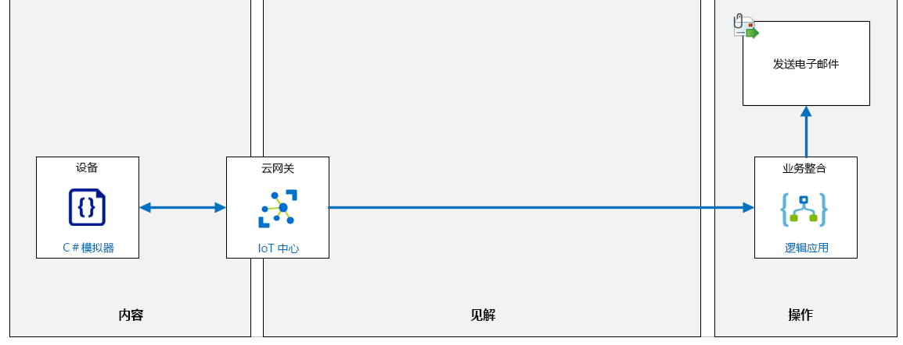

---
lab:
    title: '实验室 09：将 IoT 中心与事件网格集成'
    module: '模块 5：见解和业务集成'
---

# 将 IoT 中心与事件网格集成

## 实验室场景

你使用 Azure IoT 服务创建的原型解决方案给 Contoso 管理层留下了深刻印象，并且他们愿意为你所演示的功能分配额外预算。他们现在要求你尝试集成某些运营支持功能。具体来说，他们希望了解 Azure 工具如何支持向负责特定工作区域的经理发送警报通知。警报条件将由业务区域经理定义。到达 IoT 中心的遥测数据将被评估以生成通知。

你已经确定一位过去曾与之成功合作过的业务经理 Nancy。在解决方案的初始阶段，你将与她合作。

Nancy 告知你，她的设备技术员团队将负责安装新的联网恒温器，用于监视不同干酪储藏室的温度。恒温器设备用作可连接到 IoT 中心的 IoT 设备。要启动项目，你需要同意创建一个在实现新设备后能够生成通知的警报。

要生成警报，需要在 IoT 中心创建新恒温器设备时将一个设备创建的事件类型推送到事件网格。你将创建一个逻辑应用实例，用来（在事件网格上）对此事件做出响应，并在创建新设备时发送电子邮件到警报设施，用以指定设备 ID 和连接状态。

将创建以下资源：



## 本实验室概览

在本实验室中，你将完成以下活动：

* 验证是否满足实验室先决条件（具有必需的 Azure 资源）
* 创建能够发送电子邮件的逻辑应用
* 配置 Azure IoT 中心事件订阅
* 新建设备以触发逻辑应用

### 练习 1：验证实验室先决条件

本实验室假定以下 Azure 资源可用：

| 资源类型  | 资源名称          |
|----------------|------------------------|
| 资源组 | AZ-220-RG              |
| IoT 中心        | AZ-220-HUB-_{YOUR-ID}_ |

如果这些资源不可用，则按以下说明运行 **lab09-setup.azcli** 脚本，然后进行练习 2。脚本文件包含在本地克隆作为开发环境配置（实验室 3）的 GitHub 存储库中。

**“lab09-setup.azcli”** 脚本需要在 **“Bash”** shell 环境中运行，执行此操作的最简单方法是使用 Azure Cloud Shell。

1. 使用浏览器打开 [Azure Shell](https://shell.azure.com/)，并使用本课程所使用的 Azure 订阅登录。

1. 验证 Azure Cloud Shell 是否正在使用 **Bash**。

    Azure Cloud Shell 页面左上角的下拉菜单用于选择环境。验证所选的下拉值是否为 **Bash**。

1. 要上传安装脚本，则在 Azure Shell 工具栏中，单击 **“上传/下载文件”** （右数第四个按钮）。

1. 在 Azure Shell 工具栏上，单击**上传/下载文件** （从右数第四个按钮）。

1. 在下拉菜单中，单击 **“上传”**。

1. 在“文件选择”对话框中，导航到配置开发环境时下载的 GitHub 实验室文件的文件夹位置。

    在_实验室 3 中：设置开发环境_，你可以通过下载 ZIP 文件并从本地提取内容来克隆包含实验室资源的 GitHub 存储库。提取的文件夹结构包括以下文件夹路径：

    * Allfiles
        * 实验室
            * 实验室 09：将 IoT 中心与事件网格集成
                * 设置

    lab09-setup.azcli 脚本文件位于实验室 9 的配置文件夹中。

1. 选择 **“lab09-setup.azcli”** 文件，然后单击 **“打开”**。

    文件上传完成后，将显示一条通知。

1. 若要验证在 Azure Cloud Shell 中已上传了正确文件，请输入以下命令：

    ```bash
    ls
    ```

    使用 `ls` 命令列出当前目录的内容。你应该会看到列出的 lab09-setup.azcli 文件。

1. 若要为此实验室创建一个包含安装脚本的目录，然后移至该目录，请输入以下 Bash 命令：

    ```bash
    mkdir lab9
    mv lab09-setup.azcli lab9
    cd lab9
    ```

1. 为保证 **“lab09-setup.azcli”** 拥有执行权限，请输入以下命令：

    ```bash
    chmod +x lab09-setup.azcli
    ```

1. 在 Cloud Shell 工具栏上，要编辑 lab09-setup.azcli 文件，请单击 **“打开编辑器”** （右数第二个按钮 - **{ }**）。

1. 在 **“文件”** 列表中，要展开 lab9 文件夹并打开脚本文件，单击 **“lab9”**，然后单击 **“lab09-setup.azcli”**。

    编辑器现在将显示 **“lab09-setup.azcli”** 的文件内容。

1. 在编辑器中，更新 `{YOUR-ID}` 和 `{YOUR-LOCATION}` 已分配的值。

    以下面的示例为例，需要将 `{YOUR-ID}` 设置为在本课程开始时创建的唯一 ID，即 **CAH191211**，然后将 `{YOUR-LOCATION}` 设置为对你的资源有意义的位置。

    ```bash
    #!/bin/bash

    YourID="{YOUR-ID}"
    RGName="AZ-220-RG"
    IoTHubName="AZ-220-HUB-$YourID"

    Location="{YOUR-LOCATION}"
    ```

    > **注释**：  `Location` 变量应设置为位置的短名称。输入以下命令，可以看到可用位置及其短名称的列表（**“名称”** 列）：
    >
    > ```bash
    > az account list-locations -o Table
    > ```
    >
    > ```text
    > DisplayName           Latitude    Longitude    Name
    > --------------------  ----------  -----------  ------------------
    > 东亚            22.267      114.188      eastasia
    > 东南亚       1.283       103.833      southeastasia
    > 美国中部            41.5908     -93.6208     centralus
    > 美国东部               37.3719     -79.8164     eastus
    > East US 2             36.6681     -78.3889     eastus2
    > ```

1. 要保存对文件所做的更改并关闭编辑器，请单击编辑器窗口右上角的 **“...”**，然后单击 **“关闭编辑器”**。

    如果提示保存，请单击 **“保存”**，编辑器将会关闭。

    > **注释**：  可以使用 **CTRL+S** 随时保存，使用 **CTRL+Q** 关闭编辑器。

1. 要创建一个名为 **“AZ-220-RG”** 的资源组和一个名为 **“AZ-220-HUB-{YourID}”** 的 IoT 中心，请输入以下命令：

    ```bash
    ./lab09-setup.azcli
    ```

    运行将花费几分钟时间。每个步骤完成时，你将会看到 JSON 输出。

### 练习 2：创建发送电子邮件的 HTTP Webhook 逻辑应用

Azure 逻辑应用是一种云服务，可在需要跨企业或组织集成应用、数据、系统和服务时帮助你对任务、业务流程和工作流程进行计划、自动化和编排。

在本练习中，你将新建一个通过 HTTP Webhook 触发的 Azure 逻辑应用，然后使用 Outlook.com 电子邮件地址发送电子邮件。

#### 任务 1：在 Azure 门户中创建逻辑应用资源

1. 如有必要，使用你在本课程中使用的 Azure 帐户凭据登录到 [Azure 门户](https://portal.azure.com)。

    如果有多个 Azure 帐户，请确保使用与该课程将使用的订阅绑定的帐户登录。

1. 在 Azure 门户菜单上，单击 **“创建资源”**。

1. 在 **“新建”** 边栏选项卡的 **“搜索市场”** 框中，输入 **“逻辑应用”** 

1. 在搜索结果中，单击 **“逻辑应用”** .

1. 在 **“逻辑应用”** ”边栏选项卡中，单击 **“创建”** ”。

1. 在 **“基本”** 选项卡中的 **“项目详细信息”** 下，选择本课程所使用的 **“订阅”**。

1. 在 **“资源组”** 下拉菜单中的 **“选择现有”** 下，单击 **“AZ-220-RG”**。

1. 在 **“实例详细信息”** 下，  **“名称”** 字段内，输入 **“AZ-220-LogicApp-_{YOUR-ID}_”** 

    例如：**AZ-220-LogicApp-CP191218**

    Azure 逻辑应用的名称必须具有全球唯一性，因为它是可公开访问的资源，必须能够从任何 IP 连接的设备访问。

1. 在 **“位置”** 下拉菜单中，选择用于资源组的同一 Azure 区域。

1. 将 **“Log Analytics”** 设为 **“关”**。

1. 单击**审阅 + 创建**。

1. 在 **“查看 + 创建”** 选项卡上，单击 **“创建”**。

    > **注释**：  逻辑应用部署需要一两分钟才能完成。

1. 导航回到 Azure 门户仪表板。

#### 任务 2：配置你的逻辑应用。 

1. 在资源组磁贴上，单击指向刚刚部署的逻辑应用资源的链接。

    如果未显示 **“AZ-220-LogicApp-_{YOUR-ID}_”** 逻辑应用，请刷新资源组磁贴。

    > **注释**：首次导航到 **“逻辑应用”** 时，将显示 **“逻辑应用设计器”** 窗格。如果此页面没有自动显示，请单击 **“逻辑应用”** 边栏选项卡上 **“开发工具”** 部分下面的 **“逻辑应用设计器”**。

1. 在 **“从常见触发器开始”** 部分下，单击 **“收到 HTTP 请求时”**。

    开始使用逻辑应用时，从常用触发器开始会更便捷。

1. 请注意，视觉设计器打开时， **“收到 HTTP 请求时”** 触发器默认已选择。

1. 在 **“收到 HTTP 请求时”** 触发器上，在 **“请求正文 JSON 架构”** 文本框下方，单击 **“使用样本有效负载生成架构”** 链接。

    > **注释**：在下一步中，将向“请求正文 JSON 架构”文本框添加 **“DeviceCreated”** 示例事件架构。如需了解更多信息，可以通过下面的链接获取该事件架构示例以及其他示例和相关文档：[用于 IoT 中心的 Azure 事件网格事件架构](https://docs.microsoft.com/zh-cn/azure/event-grid/event-schema-iot-hub)。

1. 使用复制和粘贴操作将以下示例 JSON 添加到“请求正文 JSON 架构”文本框中，然后单击 **“完成”**。

    ```json
    [{
      "id": "56afc886-767b-d359-d59e-0da7877166b2",
      "topic": "/SUBSCRIPTIONS/<subscription ID>/RESOURCEGROUPS/<resource group name>/PROVIDERS/MICROSOFT.DEVICES/IOTHUBS/<hub name>",
      "subject": "devices/LogicAppTestDevice",
      "eventType": "Microsoft.Devices.DeviceCreated",
      "eventTime": "2018-01-02T19:17:44.4383997Z",
      "data": {
        "twin": {
          "deviceId": "LogicAppTestDevice",
          "etag": "AAAAAAAAAAE=",
          "deviceEtag": "null",
          "status": "enabled",
          "statusUpdateTime": "0001-01-01T00:00:00",
          "connectionState": "Disconnected",
          "lastActivityTime": "0001-01-01T00:00:00",
          "cloudToDeviceMessageCount": 0,
          "authenticationType": "sas",
          "x509Thumbprint": {
            "primaryThumbprint": null,
            "secondaryThumbprint": null
          },
          "version": 2,
          "properties": {
            "desired": {
              "$metadata": {
                "$lastUpdated": "2018-01-02T19:17:44.4383997Z"
              },
              "$version": 1
            },
            "reported": {
              "$metadata": {
                "$lastUpdated": "2018-01-02T19:17:44.4383997Z"
              },
              "$version": 1
            }
          }
        },
        "hubName": "egtesthub1",
        "deviceId": "LogicAppTestDevice"
      },
      "dataVersion": "1",
      "metadataVersion": "1"
    }]
    ```

    此示例 JSON 是一旦创建，事件网格就会发布到逻辑应用的 Webhook 终结点的 JSON 示例。该示例包括将发送遥测消息的 IoT 设备的 IoT 中心消息遥测属性。

1. 请注意 **“请求正文 JSON 架构”** 文本框中现已填充基于你提供的示例 JSON 自动生成的 JSON 架构。

1. 在 **“收到 HTTP 请求时”** 触发器下方，单击 **“新建步骤”**。

1. 在 **“选择动作”** 下方的搜索文本框中，输入 **“Outlook.com”** 

1. 在“操作”列表中，向下滚动到“发送”选项，然后单击 **“发送电子邮件 (V2)”**。

    > **注释**：  这些说明逐步介绍了如何配置逻辑应用以使用 **“Outlook.com”** 电子邮件地址发送电子邮件。另外，也可将逻辑应用配置为使用 Office 365 Outlook 或 Gmail 连接器发送电子邮件。

1. 在 **“Outlook.com”** 连接器上，单击 **“登录”**，然后按照提示使用现有 Outlook.com 帐户进行身份验证。

1. 如果提示 **“允许此应用访问你的个人信息”**，单击 **“是”**。

1. 在 **“发送电子邮件(V2)”** 操作的 **“收件人”** 字段中，输入要发送到的电子邮件地址。

    出于本实验的目的，你需要提供一个电子邮件地址，以便接收电子邮件通知。你可以输入用于此连接器的 Outlook.com 帐户，也可以输入其他易于访问的电子邮件帐户。

    将使用上一步中经过身份验证的 Outlook.com 帐户发送电子邮件。

1. 在 **“主题”** 字段中，输入 **“IoT 中心警报：”** 

1. 在 **“正文”** 字段中，输入以下消息内容：

    ```
    这是一封自动发送的电子邮件，告知你如下事项：

    {eventType} occurred at {eventTime}

    IoT Hub: {hubName}
    Device ID: {deviceID}
    Connection state: {connectionState}
    ```

1. 花点时间检查你刚刚输入的消息正文。

    你可能已经意识到，大括号条目旨在表示动态内容。你需要用实际的动态内容值替换这些占位符条目。

    > **注释**：如果连接器右侧未显示“添加动态内容”工具，请单击 **“正文”** 文本框正下方的 **“添加动态内容”** 超链接。如果未列出你需要的字段，请单击“动态内容”窗格中的 **“查看更多”**，以包括你输入的消息正文中包含的字段。

    在下一步中，将每个占位符值替换为相应的动态内容值。

1. 对于每个动态内容占位符，删除该条目，然后将其替换为相应的“动态内容”字段。

    在添加第一个动态内容值时，由于输入数据架构是针对数组的，因此逻辑应用设计器会自动将电子邮件操作更改为嵌套在 **“对于每个”** 操作中。出现这种情况时，**发送电子邮件 (V2)** 操作会折叠。要重新打开电子邮件，请单击 **“发送电子邮件 (V2)”**，然后继续编辑消息正文。

    完成此步骤后，你会看到类似于以下内容的消息正文：


1. 要将所有更改保存到逻辑应用工作流，单击设计器顶部的 **“保存”**。

1. 要展开“收到 HTTP 请求时”__触发器，请单击 **“收到 HTTP 请求时”**。

1. 复制 **“HTTP POST URL”** 的显示值。

    **“HTTP POST URL”** 类似于以下内容：

    ```text
    https://prod-87.eastus.logic.azure.com:443/workflows/b16b5556cbc54c97b063479ed55b2669/triggers/manual/paths/invoke?api-version=2016-10-01&sp=%2Ftriggers%2Fmanual%2Frun&sv=1.0&sig=ZGqYl-R5JKTugLG3GR5Ir1FuM0zIpCrMw4Q2WycJRiM
    ```

    该 URL 是用于通过 HTTPS 调用逻辑应用触发器的 Webhook 终结点。注意 **“sig”** 查询字符串参数及其值。 **“sig”** 参数包含用于验证对 Webhook 终结点的请求的共享访问密钥。

1. 保存该 URL，以备将来参考。

### 练习 3：配置 Azure IoT 中心事件订阅

Azure IoT 中心与 Azure 事件网格集成在一起，因此你可以将事件通知发送到其他服务并触发下游流程。你可以将业务应用程序配置为侦听 IoT 中心事件，以便以可靠、可缩放和安全的方式对关键事件做出反应。例如，生成一个可更新数据库，创建工单，并在新 IoT 设备注册到 IoT 中心时发送电子邮件通知的应用程序。

在本练习中，你将在 Azure IoT 中心内创建事件订阅以设置事件网格集成，用来触发逻辑应用发送警报电子邮件。

1. 导航回 Azure 门户仪表板。

1. 在资源组磁贴上，要导航到 IoT 中心，请单击 **“AZ-220-HUB-_{YOUR-ID}_”**。

1. 在 **“IoT 中心”** 边栏选项卡的左侧导航菜单上，单击 **“事件”**。

1. 在 **“事件”** 窗格顶部，单击 **“事件订阅”**。

1. 在“创建事件订阅”边栏选项卡的 **“名称”** 字段内，输入 **“MyDeviceCreateEvent”** 

1. 确保将 **“EventSchema”** 字段设为 **“事件网格架构”**。

1. 保持 **“主题详细信息”** 部分不变。

    本节信息量丰富，且为只读模式。

1. 在 **“事件类型”** 选项下， 打开 **“按事件类型筛选”** 下拉列表，然后取消选择除 **“已创建设备”** 之外的所有选择。

1. 在 **“终结点详细信息”** 选项下， 打开 **“终结点类型”** 下拉列表，然后单击 **“Web Hook”**。

1. 在 **“终结点详细信息”** 下，单击 **“选择终结点”**。

1. 在 **“选择 Webhook”** 窗格中的 **“订阅者终结点”** 下，粘贴你从逻辑应用复制的 URL，然后单击 **“确认选择”**。
  
    > **重要事项**：不要单击“创建”！

    可在此处保存事件订阅，并接收有关 IoT 中心创建的每个设备的通知。但是，我们将在本实验室中使用可选字段筛选特定设备。 

1. 在窗格顶部，单击 **“筛选器”**。

    你将使用筛选器来筛选特定设备。

1. 在 **“高级筛选器”** 下，单击 **“新增筛选器”**，然后使用以下值填充字段：

    * **密钥**：输入 `Subject`

    * **操作员**：选择 `String begins with`

    * **值**：  输入`devices/CheeseCave1_`

    我们将使用该值来筛选与奶酪储藏室 1 位置 (CheeseCave1) 相关的设备事件。

1. 要创建第二个筛选器，请单击 **“添加新的筛选器”**，然后使用以下值填充字段：

    * **密钥**：输入 `Subject`

    * **操作员**：选择 `String ends with`

    * **值**：输入 `_Thermostat`

    我们将使用该值筛选与温度相关的设备事件。

1. 要保存事件订阅，请单击 **“创建”**。

### 练习 4：使用新设备测试逻辑应用

通过新建设备触发事件通知电子邮件来测试逻辑应用。

1. 在 Azure 门户中，按需导航到“IoT 中心”边栏选项卡。

1. 在左侧导航菜单中的 **“资源管理器”** 选项下，单击 **“IoT 设备”**。

1. 在“IoT 设备”边栏选项卡顶部，单击 **“新建”**。

1. 在 **“设备 ID”** 字段中，输入 **“CheeseCave1_Building1_Thermostat”** 

1. 保留所有其他字段的默认值，然后单击 **“保存”**。

1. 要测试事件订阅筛选器，请使用以下设备 ID 创建其他设备：

    * `CheeseCave1_Building1_Light`
    * `CheeseCave2_Building1_Thermostat`
    * `CheeseCave2_Building2_Light`

    如果总共添加了四个示例，则 IoT 设备列表应如下图所示：


1. 在将一些设备添加到 IoT 中心后，检查你的电子邮件，查看哪些设备触发了逻辑应用。
