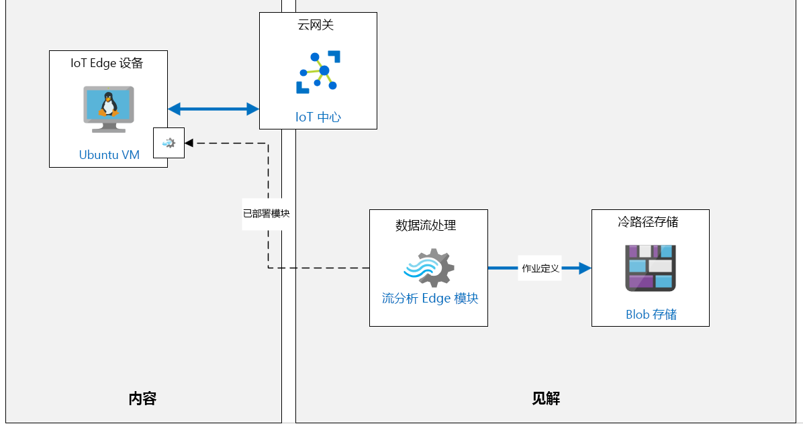

---
lab:
    title: '实验室 11：Azure IoT Edge 简介'
    module: '模块 6：Azure IoT Edge 部署过程'
---

# Azure IoT Edge 简介

## 实验室场景

为鼓励全球市场中的本地消费者，Contoso 已与本地工匠合作在全球新地区生产奶酪。 

每个地点都支持多条生产线，这些生产线配备有用于制造本地奶酪的混合与加工机器。目前，这些设施已将 IoT 设备连接到每台机器。这些设备将传感器数据流式传输到 Azure，并且所有数据都在云中进行处理。 

由于收集了大量数据，并且某些机器上需要急速响应，因此 Contoso 希望使用 IoT Edge 网关设备将某些智能引入 Edge 以进行即时处理。部分数据仍将发送到云。将数据智能引入 IoT Edge 还可确保即使在本地网络很差的情况，它们也能处理数据并快速做出反应。

你的任务是 Azure IoT Edge 解决方案原型设计。首先，将设置一个监视温度的 IoT Edge 设备（模拟连接到其中一台奶酪加工机的设备）。然后，将在设备上部署一个流分析模块，该模块将用于计算平均温度并在超出过程控制值时生成警报通知。

将创建以下资源：



## 本实验室概览

在本实验室中，你将完成以下活动：

* 验证实验室先决条件
* 部署启用 Azure IoT Edge 的 Linux VM
* 使用 Azure CLI 在 IoT 中心中创建 IoT Edge 设备标识
* 将 IoT Edge 设备连接到 IoT 中心
* 将 Edge 模块添加到 Edge 设备
* 将 Azure 流分析部署为 IoT Edge 模块

## 实验室说明

### 练习 1：验证实验室先决条件

本实验室假定以下 Azure 资源可用：

| 资源类型 | 资源名称 |
| :-- | :-- |
| 资源组 | AZ-220-RG |
| IoT 中心 | AZ-220-HUB-_{YOUR-ID}_ |

如果这些资源不可用，则需要先按照以下说明运行 **lab11-setup.azcli** 脚本，然后再继续完成练习 2。脚本文件包含在本地克隆作为开发环境配置（实验室 3）的 GitHub 存储库中。

> **注释**：  **lab11-setup.azcli** 脚本编写为在 **bash** shell 环境中运行（最简单的方法是在 Azure Cloud Shell 中执行此操作）。

1. 使用浏览器，打开 [Azure Cloud Shell](https://shell.azure.com/)，并使用本课程使用的 Azure 订阅登录。

1. 如果系统提示设置 Cloud Shell 的存储，请接受默认设置。

1. 验证 Azure Shell 是否在使用 **Bash**。

    Azure Cloud Shell 页面左上角的下拉菜单用于选择环境。验证所选的下拉值是否为 **Bash**。

1. 在 Azure Shell 工具栏上，单击 **上传/下载文件** （从右数第四个按钮）。

1. 在下拉菜单中，单击 **“上传”**。

1. 在“文件选择”对话框中，导航到配置开发环境时下载的 GitHub 实验室文件的文件夹位置。

    在本课程的实验室 3（“设置开发环境”）中，通过下载 ZIP 文件并在本地提取内容来克隆包含实验室资源的 GitHub 存储库。提取的文件夹结构包括以下文件夹路径：

    * Allfiles
      * 实验室
          * 11 - Azure IoT Edge 简介
            * 设置

    lab11-setup.azcli 脚本文件位于实验室 11 的设置文件夹中。

1. 选择 **lab11-setup.azcli** 文件，然后单击 **“打开”**。

    文件上传完成后，将显示一条通知。

1. 要验证是否上传了正确的文件，请输入以下命令：

    ```bash
    ls
    ```

    使用 `ls` 命令列出当前目录的内容。你会看到列出的 lab11-setup.azcli 文件。

1. 若要为此实验室创建一个包含安装脚本的目录，然后移至该目录，请输入以下 Bash 命令：

    ```bash
    mkdir lab11
    mv lab11-setup.azcli lab11
    cd lab11
    ```

    这些命令将为此实验室创建一个目录，将 **lab11-setup.azcli** 文件移入该目录，然后更改目录以使新目录成为当前工作目录。

1. 为了确保 **lab11-setup.azcli** 具有执行权限，请输入以下命令：

    ```bash
    chmod +x lab11-setup.azcli
    ```

1. 在 Cloud Shell 工具栏上，要编辑 **“lab11-setup.azcli”** 文件，请单击 **“打开编辑器”** （右侧第二个按钮 - **{ }**）。

1. 在 **“文件”** 列表中，要展开“lab4”文件夹，请单击 **“lab11”**，然后单击 **“lab11-setup.azcli”**。

    编辑器当前将显示 **lab11-setup.azcli** 文件的内容。

1. 在编辑器中，更新 `{YOUR-ID}` 和 `{YOUR-LOCATION}` 变量的值。

    以下面的示例为例，需要将 `{YOUR-ID}` 设置为在本课程开始时创建的唯一 ID，即 **“CAH191211”**，然后将 `{YOUR-LOCATION}` 设置为与资源组匹配的位置。

    ```bash
    #!/bin/bash

    RGName="AZ-220-RG"
    IoTHubName="AZ-220-HUB-{YOUR-ID}"

    Location="{YOUR-LOCATION}"
    ```

    > **注释**：  应将 `{YOUR-LOCATION}` 变量设置为要部署所有资源的区域的短名称。输入以下命令，可以看到可用位置及其短名称的列表（**“名称”** 列）：
    >
    > ```bash
    > az account list-locations -o Table
    >
    > DisplayName           Latitude    Longitude    Name
    > --------------------  ----------  -----------  ------------------
    > 东亚            22.267      114.188      eastasia
    > 东南亚       1.283       103.833      southeastasia
    > 美国中部            41.5908     -93.6208     centralus
    > 美国东部               37.3719     -79.8164     eastus
    > East US 2             36.6681     -78.3889     eastus2
    > ```

1. 要保存对文件所做的更改并关闭编辑器，请单击编辑器窗口右上角的 **“...”**，然后单击 **“关闭编辑器”**。

    如果提示保存，请单击 **“保存”**，编辑器将会关闭。

    > **注释**：  可以使用 **CTRL+S** 随时保存，使用 **CTRL+Q** 关闭编辑器。

1. 要创建本实验室所需的资源，请输入以下命令：

    ```bash
    ./lab11-setup.azcli
    ```

    运行将花费几分钟时间。每个步骤完成时，你将会看到 JSON 输出。

脚本完成后，就可以继续实验室的内容。

### 练习 2：部署启用 Azure IoT Edge 的 Linux VM

在本练习中，将从 Azure 市场部署具有 Azure IoT Edge 运行时支持的 Ubuntu Server VM。

1. 如有必要，请使用 Azure 帐户凭据登录到 Azure 门户。

    如果有多个 Azure 帐户，请确保使用与该课程将使用的订阅绑定的帐户登录。

1. 在 Azure 门户菜单上，单击 **“创建资源”**。

1. 在 **“新建”** 边栏选项卡的 **“搜索市场”** 框中，输入 **“在上的 Azure IoT Edge”**，然后单击 **“在 Ubuntu 上的 Azure IoT Edge”** 

1. 在 **“在 Ubuntu 上的 Azure IoT Edge”** 边栏选项卡中，单击 **“创建”**。

1. 在 **“创建虚拟机”** 边栏选项卡的 **“订阅”** 下拉菜单中，选择用于本课程的 Azure 订阅。

1. 在 **“资源组”** 右侧，单击 **“新建”**。

    我们将为 VM 创建一个新的资源组，完成后将有助于清理工作。

1. 在新资源组弹出窗口中的 **“名称”** 处，输入 **AZ-220-VM-RG**，然后单击 **“确定”**。

1. 在 **“虚拟机名称”** 文本框中，输入 **AZ-220-VM-EDGE**。

1. 在 **“区域”** 下拉菜单中，选择预配 Azure IoT 中心的区域。

1. 将 **“可用性选项”** 保留为 **“无需基础结构冗余”**。

1. 请注意，已将 **“映像”** 字段配置为使用 **“Ubuntu Server 16.04 LTS + Azure IoT Edge 运行时”** 映像。

1. 将 **“Azure Spot 实例”** 的设置保留为 **“无”**。

1. 在 **“大小”** 右侧，单击 **“改变大小”**。

1. 在 **“选择 VM 大小”** 边栏选项卡的 **“VM 大小”** 下，单击 **DS1_v2**，然后单击 **“选择”**。

    如果未列出 DS1_v2，则可能需要使用 **“清除所有筛选器”** 链接以在列表中提供此大小。

    > **注释**：  并非所有 VM 大小都可在所有区域中使用。如果在后续步骤中无法选择 VM 大小，请尝试其他区域。例如，如果 **“美国西部”** 没有可用的尺寸，请尝试 **“美国西部 2”**。

1. 在 **“管理员帐户”** 下的 **“身份验证类型”** 右侧，单击 **“密码”**。

1. 对于 VM 管理员帐户，输入 **用户名**、**密码** 和 **确认密码** 字段的值。

    > **重要事项：** 请勿遗失/忘记这些值 - 没有这些值就无法连接到 VM。

1. 请注意， **“入站端口规则”** 配置为启用入站 **SSH** 访问 VM 的权限。

    这将用于远程连接到 VM 进行配置/管理。

1. 单击 **审阅 + 创建**。

1. 等待将显示在边栏选项卡顶部的 **“验证通过”** 消息，然后单击 **“创建”**。

    > **注释**：  部署最多可能需要 5 分钟才能完成。可以在部署时继续进行下一个练习。

### 练习 3：使用 Azure CLI 在 IoT 中心中创建 IoT Edge 设备标识

在本练习中，你将使用 Azure CLI 在 Azure IoT 中心内创建新的 IoT Edge 设备标识。

1. 如有必要，请使用 Azure 帐户凭据登录到 Azure 门户。

    如果有多个 Azure 帐户，请确保使用与该课程将使用的订阅绑定的帐户登录。

1. 在“Azure 门户”工具栏上，要打开 Azure Cloud Shell，请单击 **“Cloud Shell”**。

    在“Azure 门户”工具栏上，而不是左侧导航菜单上的“Cloud Shell”按钮有一个看起来类似于命令提示符的图标。

1. 确保你在使用 **Bash** 环境选项。

    在 Cloud Shell 左上角的环境下拉列表中选择“Bash”。

1. 在命令提示符处，输入以下命令，即可在 IoT 中心中创建 IoT Edge 设备标识：

    ```cmd/sh
    az iot hub device-identity create --hub-name AZ-220-HUB-{YOUR-ID} --device-id myEdgeDevice --edge-enabled
    ```

    请务必将 `{YOUR-ID}` 占位符替换为你在本课程开始时创建的 YOUR-ID 值。

    > **注释**：还可以使用 Azure 门户中的 IoT 中心创建此 IoT Edge 设备：**IoT 中心** -> **IoT Edge** -> **添加 IoT Edge 设备**。

1. 查看该命令创建的输出。 

    请注意，输出中包含为 IoT Edge 设备创建的 **设备标识** 的信息。例如，可以看到它默认为具有自动生成密钥的 `symmetricKey` 身份验证，并且如指定的 `--edge-enabled` 参数所示，`iotEdge` 功能被设置为 `true`。

    ```json
    {
        "authentication": {
            "symmetricKey": {
                "primaryKey": "jftBfeefPsXgrd87UcotVKJ88kBl5Zjk1oWmMwwxlME=",
                "secondaryKey": "vbegAag/mTJReQjNvuEM9HEe1zpGPnGI2j6DJ7nECxo="
            },
            "type": "sas",
            "x509Thumbprint": {
                "primaryThumbprint": null,
                "secondaryThumbprint": null
            }
        },
        "capabilities": {
            "iotEdge": true
        },
        "cloudToDeviceMessageCount": 0,
        "connectionState": "Disconnected",
        "connectionStateUpdatedTime": "0001-01-01T00:00:00",
        "deviceId": "myEdgeDevice",
        "deviceScope": "ms-azure-iot-edge://myEdgeDevice-637093398936580016",
        "etag": "OTg0MjI1NzE1",
        "generationId": "637093398936580016",
        "lastActivityTime": "0001-01-01T00:00:00",
        "status": "enabled",
        "statusReason": null,
        "statusUpdatedTime": "0001-01-01T00:00:00"
    }
    ```

1. 输入以下命令，显示 IoT Edge 设备的 **连接字符串**：

    ```cmd/sh
    az iot hub device-identity show-connection-string --device-id myEdgeDevice --hub-name AZ-220-HUB-_{YOUR-ID}_
    ```

    请务必将 `{YOUR-ID}` 占位符替换为你在本课程开始时创建的 YOUR-ID 值。

1. 从命令的 JSON 输出中复制 `connectionString` 的值，并将其保存以供稍后引用。

    此连接字符串将用于配置 IoT Edge 设备以连接到 IoT 中心。

    ```json
        {
          "connectionString": "HostName={IoTHubName}.azure-devices.net;DeviceId=myEdgeDevice;SharedAccessKey=jftBfeefPsXgrd87UcotVKJ88kBl5Zjk1oWmMwwxlME="
        }
    ```

    > **注释**：  还可以通过以下方式在 Azure 门户中访问 IoT Edge 设备连接字符串：导航到 **IoT 中心** -> **IoT Edge** -> **你的 Edge 设备** -> **连接字符串（主密钥）**

### 练习 4：将 IoT Edge 设备连接到 IoT 中心

在本练习中，你将把 IoT Edge 设备连接到 Azure IoT 中心。

1. 验证 IoT Edge 虚拟机是否已成功部署。

    可以查看 Azure 门户中的“通知”窗格。

1. 在 Azure 门户菜单上，单击 **“资源组”**。

1. 在 **“资源组”** 边栏选项卡上，找到 AZ-220-VM-RG 资源组。

1. 在边栏选项卡右侧的 **AZ-220-VM-RG** 中，单击 **“单击以打开上下文菜单”** （省略号图标 - **...**）

1. 在上下文菜单上，单击 **“固定到仪表板”**，然后导航回仪表板。

    如果 **编辑** 仪表板来重新排列磁贴更易于访问资源，你可以对其进行编辑。
 
1. 在 **AZ-220-VM-RG** 资源组磁贴，单击 **AZ-220-VM-EDGE**，打开 IoT Edge 虚拟机。

1. 在 **“概述”** 窗格中，单击 **“连接”**，然后单击 **“SSH”**。

1. 在 **“连接”** 窗格的 **“运行以下示例命令以连接到 VM 4.”** 下，复制示例命令。

    这是一个示例 SSH 命令，可用于连接到包含 VM 的 IP 地址和管理员用户名的虚拟机。该命令的格式应类似于 `ssh username@52.170.205.79`。

    > **注释**：如果示例命令包含 `-i <private key path>`，使用文本编辑器删除命令的该部分，然后将更新的命令复制到剪贴板。

1. 如果仍未打开 Cloud Shell，请单击 **“Cloud Shell”**。

1. 在 Cloud Shell 命令提示符处，粘贴在文本编辑器中更新的 `ssh` 命令，然后按 **Enter**。

1. 当提示 **“确定要继续连接吗？”**，输入 `是` ，然后按 **Enter**。

    此提示是安全性确认，因为用于保护与 VM 的连接的证书是自签名证书。后续连接将记住该提示的答案，并且仅在第一次连接时提示。

1. 当系统提示输入密码时，请输入预配 VM 时创建的管理员密码。

1. 连接后，终端命令提示符将更改为显示 Linux VM 的名称，类似于以下内容。

    ```cmd/sh
    username@AZ-220-VM-EDGE:~$
    ```

    这会告诉你连接的是哪个 VM。

    > **重要事项：** 连接时，你可能会被告知 Edge VM 有未完成的 OS 更新。  出于实验室目的，我们忽略了这一点，但是在生产环境中，你始终需要确保 Edge 设备保持最新状态。

1. 若要确认 VM 上是否已安装 Azure IoT Edge 运行时，请运行以下命令：

    ```cmd/sh
    iotedge version
    ```

    此命令输出的 Azure IoT Edge 运行时版本是当前在虚拟机上安装的运行时版本。

1. 若要使用 Azure IoT 中心的设备连接字符串配置 Edge 设备，请输入以下命令：

    ```cmd/sh
    sudo /etc/iotedge/configedge.sh "{iot-edge-device-connection-string}"
    ```

    务必将上述 `{iot-edge-device-connection-string}` 占位符替换为创建 IoT Edge 设备时记录的连接字符串值（并确保在命令行中包括引号）。

    使用 `/etc/iotedge/configedge.sh` 脚本，通过连接到 Azure IoT 中心所需的连接字符串来配置 Edge 设备。此脚本是作为 Azure IoT Edge 运行时的一部分安装的。

1. 验证是否已设置连接字符串。

    此命令完成后，将配置 IoT Edge 设备以使用输入的连接字符串连接到 Azure IoT 中心。该命令将输出 `连接字符串设置为...` 消息，其中包括已设置的连接字符串。

### 练习 5：将 Edge 模块添加到 Edge 设备

在本练习中，你将添加模拟温度传感器作为自定义 IoT Edge 模块，并将其部署在 IoT Edge 设备上运行。

1. 如有必要，请使用 Azure 帐户凭据登录到 Azure 门户。

    如果有多个 Azure 帐户，请确保使用与该课程将使用的订阅绑定的帐户登录。

1. 在“资源组”磁贴上，打开 IoT 中心，单击 **AZ-220-HUB-_{YOUR-ID}_**。

1. 在 **“IoT 中心”** 边栏选项卡左侧的 **“自动设备管理”** 下，单击 **“IoT Edge”**。

1. 在 IoT Edge 设备列表上，单击 **myEdgeDevice**。

1. 请注意，**“myEdgeDevice”** 边栏选项卡上的 **“模块”** 选项卡会显示当前为设备配置的模块的列表。

    当前，IoT Edge 设备仅配置了作为 IoT Edge 运行时一部分的 Edge 代理 (`$edgeAgent`) 和 Edge 中心 (`$edgeHub`) 模块。

1. 在 **myEdgeDevice** 边栏选项卡顶部，单击 **“设置模块”**。

1. 在 **“在设备上设置模块：myEdgeDevice”** 边栏选项卡中，找到 **“IoT Edge 模块”** 部分。

1. 在 **“IoT Edge 模块”** 下，单击 **“添加”**，然后单击 **“IoT Edge 模块”**。

1. 在 **“添加 IoT Edge 模块”** 窗格的 **“IoT Edge 模块名称”** 中输入 **tempsensor**

    我们将命名自定义模块“tempsensor”

1. 在 **“映像 URI”** 处输入 **asaedgedockerhubtest/asa-edge-test-module:simulated-temperature-sensor**

    > **注释**：此映像是 Docker Hub 上的已发布映像，该映像由产品组提供以支持此测试方案。

1. 若要更改选定的选项卡，请单击 **“模块孪生设置”**。

1. 若要为模块孪生指定所需的属性，请输入以下 JSON：

    ```json
    {
        "EnableProtobufSerializer": false,
        "EventGeneratingSettings": {
            "IntervalMilliSec": 500,
            "PercentageChange": 2,
            "SpikeFactor": 2,
            "StartValue": 20,
            "SpikeFrequency": 20
        }
    }
    ```

    此 JSON 通过设置其模块孪生的所需属性来配置 Edge 模块。

1. 在边栏选项卡底部，单击 **“添加”**。

1. 在 **“在设备上设置模块：myEdgeDevice”** 边栏选项卡底部，单击 **“下一步：路由 >”**。

1. 请注意，已配置了默认路由。

    * 名称：**route**
    * 值：`FROM /messages/* INTO $upstream`

    此路由会将所有消息从 IoT Edge 设备上的所有模块发送到 IoT 中心

1. 单击 **审阅 + 创建**。

1. 在 **“部署”** 处，请花点时间查看显示的部署清单。 

    可以看到，IoT Edge 设备的部署清单格式设置为 JSON，这样更易读取。

    在 `properties.desired` 部分下是声明将要部署到 IoT Edge 设备的 IoT Edge 模块的 `modules` 部分。这包括所有模块的映像 URI，包括任何容器注册表凭据。

    ```json
    {
        "modulesContent": {
            "$edgeAgent": {
                "properties.desired": {
                    "modules": {
                        "tempsensor": {
                            "settings": {
                                "image": "asaedgedockerhubtest/asa-edge-test-module:simulated-temperature-sensor",
                                "createOptions": ""
                            },
                            "type": "docker",
                            "version": "1.0",
                            "status": "running",
                            "restartPolicy": "always"
                        },
    ```

    JSON 下方是包含 Edge 中心所需属性的 **$edgeHub** 部分。本部分还包括用于在模块之间路由事件以及路由到 IoT 中心的路由配置。

    ```json
        "$edgeHub": {
            "properties.desired": {
                "routes": {
                  "route": "FROM /messages/* INTO $upstream"
                },
                "schemaVersion": "1.0",
                "storeAndForwardConfiguration": {
                    "timeToLiveSecs": 7200
                }
            }
        },
    ```

    JSON 下方是 **tempsensor** 模块部分，其中 `properties.desired` 部分包含 Edge 模块配置所需的属性。

    ```json
                },
                "tempsensor": {
                    "properties.desired": {
                        "EnableProtobufSerializer": false,
                        "EventGeneratingSettings": {
                            "IntervalMilliSec": 500,
                            "PercentageChange": 2,
                            "SpikeFactor": 2,
                            "StartValue": 20,
                            "SpikeFrequency": 20
                        }
                    }
                }
            }
        }
    ```

1. 在边栏选项卡底部，单击 **“创建”**，完成设备模块的设置。

1. 请注意，在 **myEdgeDevice** 边栏选项卡的 **“模块”** 下，现已列出 **tempsensor**。

    > **注释**：可能需要单击 **“刷新”** 才能首次看到列出的模块。

    你可能会注意到未报告 **tempsensor** 运行时状态。

1. 在边栏选项卡顶部，单击 **“刷新”**。

1. 请注意，**tempsensor** 模块的 **运行时状态** 现设置为 **“运行”**。

    如果仍未报告该值，请稍等片刻，然后再次刷新该边栏选项卡。
 
1. 打开 Cloud Shell 会话（如果尚未打开）。

    如果不再连接到 `AZ-220-VM-EDGE` 虚拟机，则和以前一样使用 **SSH** 进行连接。

1. 在 Cloud Shell 命令提示符处，输入以下命令，列出当前在 IoT Edge 设备上运行的模块：

    ```cmd/sh
    iotedge list
    ```

1. 命令的输出类似于以下内容。 

    ```cmd/sh
    demouser@AZ-220-VM-EDGE:~$ iotedge list
    NAME             STATUS           DESCRIPTION      CONFIG
    edgeHub          running          Up a minute      mcr.microsoft.com/azureiotedge-hub:1.0
    edgeAgent        running          Up 26 minutes    mcr.microsoft.com/azureiotedge-agent:1.0
    tempsensor       running          Up 34 seconds    asaedgedockerhubtest/asa-edge-test-module:simulated-temperature-sensor
    ```

    请注意，`tempsensor` 被列为正在运行的模块之一。

1. 输入以下命令，查看模块日志：

    ```cmd/sh
    iotedge logs tempsensor
    ```

    命令的输出类似于以下内容：

    ```cmd/sh
    demouser@AZ-220-VM-EDGE:~$ iotedge logs tempsensor
    11/14/2019 18:05:02 - Send Json Event : {"machine":{"temperature":41.199999999999925,"pressure":1.0182182583425192},"ambient":{"temperature":21.460937846433808,"humidity":25},"timeCreated":"2019-11-14T18:05:02.8765526Z"}
    11/14/2019 18:05:03 - Send Json Event : {"machine":{"temperature":41.599999999999923,"pressure":1.0185790159334602},"ambient":{"temperature":20.51992724976499,"humidity":26},"timeCreated":"2019-11-14T18:05:03.3789786Z"}
    11/14/2019 18:05:03 - Send Json Event : {"machine":{"temperature":41.999999999999922,"pressure":1.0189397735244012},"ambient":{"temperature":20.715225311096397,"humidity":26},"timeCreated":"2019-11-14T18:05:03.8811372Z"}
    ```

    `iotedge logs` 命令可用于查看任何 Edge 模块的模块日志。

1. 模拟温度传感器模块将在发送 500 条消息后停止。可以通过运行以下命令重启。

    ```cmd/sh
    iotedge restart tempsensor
    ```

    现在无需重启模块，但是如果发现它之后不再发送遥测数据，则返回到 Cloud Shell、Edge VM 的 SSH，然后运行此命令将其重置。重置后，模块将再次开始发送遥测数据。

### 练习 6：将 Azure 流分析部署为 IoT Edge 模块

现在，tempSensor 模块已部署并在 IoT Edge 设备上运行，我们可以添加一个流分析模块，该模块可以在将消息发送到 IoT 中心之前处理 IoT Edge 设备上的消息。

#### 任务 1：创建 Azure 存储帐户

1. 如有必要，请使用 Azure 帐户凭据登录到 Azure 门户。

    如果有多个 Azure 帐户，请确保使用与该课程将使用的订阅绑定的帐户登录。

1. 在 Azure 门户菜单上，单击 **“创建资源”**。

1. 在 **“新建”** 边栏选项卡上的搜索文本框中键入 **“存储”**，然后按 **Enter** 键。

1. 在 **“市场”** 边栏选项卡上，单击 **“存储帐户 - blob、文件、表、队列”**。

1. 在 **“存储帐户 - blob、文件、表、队列”** 边栏选项卡上，单击 **“创建”** 按钮。

1. 在 **“创建存储帐户”** 边栏选项卡上，确保“订阅”下拉菜单显示的是此课程正使用的订阅。

1. 在 **“资源组”** 下拉列表中，单击 **“AZ-220-RG”**。

1. 在 **“存储帐户名称”** 文本框中，输入 **az220store{YOUR-ID}**。

    > **注释**：对于此字段，{YOUR-ID} 必须以小写形式输入，并且不允许使用短划线或下划线字符。

1. 将 **“位置”** 字段设置为用于 Azure IoT 中心的同一 Azure 区域。

1. 将 **“复制”** 字段设置为 **“本地冗余存储 (LRS)”**。

1. 保留所有其他设置不变。

1. 在边栏选项卡底部，单击 **“查看 + 创建”**。

1. 等你看到 **“验证通过”** 消息后，单击 **“创建”**。

    部署可能需要一些时间才能完成 - 你可以在创建流分析资源的同时继续创建该资源。

#### 任务 2：创建 Azure 流分析

1. 在 Azure 门户菜单上，单击 **“创建资源”**。

1. 在 **“新建”** 边栏选项卡的 **“Azure 市场”** 下，单击 **“物联网”**，然后单击 **“流分析作业”**。

1. 在 **“新的流分析作业”** 边栏选项卡的 **“作业名称”** 字段中，输入 **“AZ-220-ASA-_{YOUR-ID}_”** 

1. 在 **“资源组”** 下拉列表中，单击 **“AZ-220-RG”**。

1. 在 **“位置”** 下拉列表中，选择与存储帐户和 Azure IoT 中心相同的 Azure 区域。

1. 将 **“托管环境”** 字段设置为 **“Edge”**。

    这决定了流分析作业将部署到本地 IoT 网关 Edge 设备。

1. 在边栏选项卡底部，单击 **“创建”**。

    部署此资源可能需要一些时间。

#### 任务 3：配置 Azure 流分析作业

1. 当你看到 **“部署已完成”** 消息时，单击 **“前往资源”**。

    你现在应该在新建流分析作业的“概述”窗格中。
 
1. 在左侧导航菜单的 **“作业拓扑”** 下，单击 **“输入”**。

1. 在 **“输入”** 窗格中，单击 **“添加流输入”**，然后单击 **“Edge 中心”**。

1. 在 **“Edge 中心”** 窗格中的 **“输入别名”** 字段，输入 **“temperature”** 

1. 请确保在 **“事件序列化格式”** 下拉菜单中，选择了 **JSON 格式**。 

    流分析需要了解消息格式。JSON 是标准格式。

1. 请确认在 **“编码”** 下拉菜单中选择了 **“UTF-8”**。

    > **注释**：  UTF-8 是编写时唯一支持的 JSON 编码。

1. 请确保在 **“事件压缩类型”** 下拉菜单中选择了 **“无”**。

    在本实验室中，将不使用压缩。该服务还支持 GZip 和 Deflate 格式。

1. 在窗格底部，单击 **“保存”**。

1. 在左侧导航菜单的 **“作业拓扑”** 下，单击 **“输出”**。

1. 在 **“输出”** 窗格中，单击 **“添加”**，然后单击 **“Edge 中心”**。

1. 在 **“Edge 中心”** 窗格中的 **“输出别名”** 字段中，输入 **“警报”** 

1. 请确保在 **“事件序列化格式”** 下拉菜单中，选择了 **JSON 格式**。

    流分析需要了解消息格式。JSON 是标准格式，但该服务也支持 CSV。

1. 请确保，在 **“格式”** 下拉菜单中选择了 **“行分隔”**。

1. 请确认在 **“编码”** 下拉菜单中选择了 **“UTF-8”**。

    > **注释**：  UTF-8 是编写时唯一支持的 JSON 编码。

1. 在窗格底部，单击 **“保存”**。

1. 在左侧导航菜单的 **“作业拓扑”** 下，单击 **“查询”**。

1. 在 **“查询”** 窗格中，使用以下内容替换默认查询：

    ```sql
    SELECT  
        'reset' AS command
    INTO
        alert
    FROM
        temperature TIMESTAMP BY timeCreated
    GROUP BY TumblingWindow(second,15)
    HAVING Avg(machine.temperature) > 25
    ```

    该查询查看进入 `temperature` 输入的事件，并通过 15 秒的翻转窗口进行分组，然后检查该分组中的平均温度值是否大于 25。如果平均值大于 25，则将 `command` 属性设置为 `reset` 值的事件发送到 `alert` 输出。

    有关 `TumblingWindow` 函数的更多信息，请参阅以下链接：[https://docs.microsoft.com/zh-cn/stream-analytics-query/tumbling-window-azure-stream-analytics](https://docs.microsoft.com/zh-cn/stream-analytics-query/tumbling-window-azure-stream-analytics)

1. 在查询编辑器顶部，单击 **“保存查询”**。

#### 任务 4：配置存储帐户设置

若准备将流分析作业部署到 IoT Edge 设备，则需要将其关联到 Azure Blob 存储容器。部署作业后，作业定义将导出到存储容器。

1. 在 **“流分析作业”** 边栏选项卡上，在 **“配置”** 选项的左侧导航菜单处，单击 **“存储帐户设置”**。

1. 在 **“存储帐户设置”** 窗格上，单击 **“添加存储帐户”**。

1. 请确保在 **“存储帐户设置”** 下选择了 **“从订阅中选择存储帐户”**。

1. 在 **“存储帐户”** 下拉菜单中，请确保选择了 **az220store{your-id}** 存储帐户。

1. 在 **“容器”** 下，单击 **“新建”**，然后输入 **jobdefinition** 作为容器的名称。

1. 在窗格顶部，单击 **“保存”**。

    如果系统提示确认是否要保存更改，请单击 **“是”** 

#### 任务 5：部署流分析作业

1. 在 Azure 门户中，导航到 **AZ-220-HUB-_{YOUR-ID}_** IoT 中心资源。

1. 在左侧导航菜单的 **“自动设备管理”** 下，单击 **“IoT Edge”**。

1. 在 **“设备 ID”** 下，单击 **myEdgeDevice**。

1. 在 **myEdgeDevice** 窗格顶部，单击 **“设置模块”**。

1. 在 **“在设备上设置模块：myEdgeDevice”** 窗格中，找到 **“IoT Edge 模块”** 部分。

1. 在 **“IoT Edge 模块”** 下，单击 **“添加”**，然后单击 **“Azure 流分析模块”**。

1. 在 **“Edge 部署”** 窗格的 **“订阅”** 下，确保选择了本课程要使用的订阅。

1. 请确保，在 **“Edge 作业”** 下拉菜单，选择了 **AZ-220-ASA-_{YOUR-ID}_** 流分析作业。

    > **注释**：  作业可能已被选择，但 **“保存”** 按钮处于禁用状态 - 只需再次打开 **“Edge 作业”** 下拉菜单，并再次选择 **AZ-220-ASA-_{YOUR-ID}_** 作业即可。之后，**“保存”** 按钮即可处于启用状态。

1. 在窗格底部，单击 **“保存”**。

    部署可能需要一些时间。

1. 请注意，在 Edge 程序包成功发布后，新的 ASA 模块会列在 **“IoT Edge 模块”** 部分

1. 在 **“IoT Edge 模块”** 下，单击 **AZ-220-ASA-_{YOUR-ID}_**。 

    这是刚刚添加到 Edge 设备中的流分析模块。

1. 在 **“更新 IoT Edge 模块”** 窗格中，注意 **映像 URI** 指向标准 Azure 流分析映像。

    ```text
    mcr.microsoft.com/azure-stream-analytics/azureiotedge:1.0.6
    ```

    这与部署到 IoT Edge 设备的每个 ASA 作业使用的图像相同

    > **注释**：  配置的 **映像 URI** 末尾的版本号反映了创建流分析模块时的当前最新版本。在编写本单位时，版本是 `1.0.6`。

1. 将所有值保留为默认值，然后关闭 **IoT Edge 自定义模块** 窗格。

1. 在 **“在设备上设置模块：myEdgeDevice”** 窗格中，单击 **“下一步：路由 >”**。

    注意，将显示现有路由。

1. 将定义的默认路由替换为以下三个路由：

    * 路由 1
        * 名称：**telemetryToCloud**
        * 值：`FROM /messages/modules/tempsensor/* INTO $upstream`
    * 路由 2
        * 名称：**alertToReset**
        * 值：`FROM /messages/modules/AZ-220-ASA-{YOUR-ID}/* INTO BrokeredEndpoint("/modules/tempsensor/inputs/control")`
    * 路由 3
        * 名称：**telemetryToAsa**
        * 值：`FROM /messages/modules/tempsensor/* INTO BrokeredEndpoint("/modules/AZ-220-ASA-{YOUR-ID}/inputs/temperature")`

    > **注释**：务必将 `AZ-220-ASA-{YOUR-ID}` 占位符替换为 Azure 流分析作业模块的名称。可以单击 **“上一步”** 查看模块列表及其名称，然后单击 **“下一步”** 返回到这一步。

    定义的路由如下：

    * **telemetryToCloud** 路由将所有消息从 `tempsensor` 模块输出发送到 Azure IoT 中心。
    * **alertToReset**  路由将所有警报消息从流分析模块输出发送到 **tempsensor**  模块输入。
    * **telemetryToAsa**  路由将所有消息从 `tempsensor` 模块输出发送到流分析模块输入。

1. 在 **“在设备上设置模块: myEdgeDevice”** 边栏选项卡底部，单击 **“查看 + 创建”**。

1. 请注意，在 **“查看 + 创建”** 选项卡中，现在使用流分析模块和刚配置的路由定义对 **部署清单** JSON 进行更新。

1. 请注意，`tempsensor` 模拟温度传感器模块的 JSON 配置：

    ```json
    "tempsensor": {
        "settings": {
            "image": "asaedgedockerhubtest/asa-edge-test-module:simulated-temperature-sensor",
            "createOptions": ""
        },
        "type": "docker",
        "version": "1.0",
        "status": "running",
        "restartPolicy": "always"
    },
    ```

1. 请注意，之前配置的路由的 JSON 配置以及在 JSON 部署定义中如何配置这些路由：

    ```json
    "$edgeHub": {
        "properties.desired": {
            "routes": {
                "telemetryToCloud": "FROM /messages/modules/tempsensor/* INTO $upstream",
                "alertsToReset": "FROM /messages/modules/AZ-220-ASA-CP122619/* INTO BrokeredEndpoint(\\\"/modules/tempsensor/inputs/control\\\")",
                "telemetryToAsa": "FROM /messages/modules/tempsensor/* INTO BrokeredEndpoint(\\\"/modules/AZ-220-ASA-CP122619/inputs/temperature\\\")"
            },
            "schemaVersion": "1.0",
            "storeAndForwardConfiguration": {
                "timeToLiveSecs": 7200
            }
        }
    },
    ```

1. 在边栏选项卡底部，单击 **“创建”**。

#### 任务 6：查看数据

1. 返回到你通过 **SSH** 连接到 **IoT Edge 设备**的 **Cloud Shell** 会话。  

    如果关闭或超时，请重新连接。运行 `SSH` 命令并像以前一样登录。

1. 在命令提示符处，输入以下命令，以查看已部署到设备的模块的列表：

    ```cmd/sh
    iotedge 列表
    ```

    将新的流分析模块部署到 IoT Edge 设备可能需要花费一分钟时间。一旦存在，将在此命令的列表输出中看到它。

    ```cmd/sh
    demouser@AZ-220-VM-EDGE:~$ iotedge list
    NAME               STATUS           DESCRIPTION      CONFIG
    AZ-220-ASA-CP1119  running          Up a minute      mcr.microsoft.com/azure-stream-analytics/azureiotedge:1.0.5
    edgeAgent          running          Up 6 hours       mcr.microsoft.com/azureiotedge-agent:1.0
    edgeHub            running          Up 4 hours       mcr.microsoft.com/azureiotedge-hub:1.0
    tempsensor         running          Up 4 hours       asaedgedockerhubtest/asa-edge-test-module:simulated-temperature-sensor
    ```

    > **注释**：  如果流分析模块未显示在列表中，请等待一两分钟，然后重试。在 IoT Edge 设备上更新模块部署可能需要一分钟。

1. 在命令提示符处，输入以下命令，以查看 `tempsensor` 模块从 Edge 设备发送的遥测数据：

    ```cmd/sh
    iotedge logs tempsensor
    ```

1. 花一分钟查看输出。

    在查看 **tempsensor** 发送的温度遥测数据时，请注意，当 `machine.temperature` 达到高于 `25` 的平均值时，由流分析作业发送 **“重启”** 命令。这是在流分析作业查询中配置的操作。

    此事件输出类似于以下内容：

    ```cmd/sh
    11/14/2019 22:26:44 - Send Json Event : {"machine":{"temperature":231.599999999999959,"pressure":1.0095600761599359},"ambient":{"temperature":21.430643635304012,"humidity":24},"timeCreated":"2019-11-14T22:26:44.7904425Z"}
    11/14/2019 22:26:45 - Send Json Event : {"machine":{"temperature":531.999999999999957,"pressure":1.0099208337508767},"ambient":{"temperature":20.569532965342297,"humidity":25},"timeCreated":"2019-11-14T22:26:45.2901801Z"}
    接收的消息
    接收的消息正文：[{"command":"reset"}]
    接收的消息元数据：{"MessageId":null,"To":null,"ExpiryTimeUtc":"0001-01-01T00:00:00","CorrelationId":null,"SequenceNumber":0,"LockToken":"e0e778b5-60ff-4e5d-93a4-ba5295b995941","EnqueuedTimeUtc":"0001-01-01T00:00:00","DeliveryCount":0,"UserId":null,"MessageSchema":null,"CreationTimeUtc":"0001-01-01T00:00:00","ContentType":"application/json","InputName":"control","ConnectionDeviceId":"myEdgeDevice","ConnectionModuleId":"AZ-220-ASA-CP1119","ContentEncoding":"utf-8","Properties":{},"BodyStream":{"CanRead":true,"CanSeek":false,"CanWrite":false,"CanTimeout":false}}
    重置温度传感器..
    11/14/2019 22:26:45 - Send Json Event : {"machine":{"temperature":320.4,"pressure":0.99945886361358849},"ambient":{"temperature":20.940019742324957,"humidity":26},"timeCreated":"2019-11-14T22:26:45.7931201Z"}
    ```

完成本实验室后，请保留资源 - 下一个实验室将需要这些资源。
