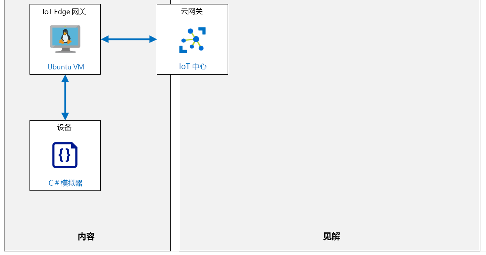

---
lab:
    title: '实验室 12：设置 IoT Edge 网关'
    module: '模块 6：Azure IoT Edge 部署过程'
---

# 设置 IoT Edge 网关

## 实验室场景

本实验室是理论性实验室，将带你逐步了解如何将 IoT Edge 设备用作网关。

将 IoT Edge 设备用作网关有三种模式：透明、协议转换和标识转换：

**透明** - 理论上可以连接到 IoT 中心的设备可以改为连接到网关设备。下游设备有其自己的 IoT 中心标识，并将使用任一 MQTT、AMQP 或 HTTP 协议。网关只是在设备与 IoT 中心之间传递通信。这些设备不知道它们正在通过网关与云进行通信，通过 IoT 中心与设备交互的用户觉察不到中间网关设备。因此，网关是透明的。请参阅“创建透明网关”，了解有关将 IoT Edge 设备用作透明网关的详细信息。

**协议转换** - 也称为不透明网关模式，某些不支持 MQTT、AMQP 或 HTTP 的设备可以使用网关设备以这些设备的名义向 IoT 中心发送数据。网关能够理解下游设备使用的协议，是 IoT 中心唯一具有标识的设备。所有信息看起来像来自同一台设备，即网关。如果云应用程序想要以设备为单位分析数据，则下游设备就必须在其消息中嵌入额外的标识信息。此外，IoT 中心基元（例如孪生和方法）仅适用于网关设备，而不适用于下游设备。

**标识转换** - 无法连接到 IoT 中心的设备可以改为连接到网关设备。网关代表下游设备提供 IoT 中心标识和协议转换。网关非常智能，它能够理解下游设备使用的协议，为其提供标识，并转换 IoT 中心基元。下游设备作为一流设备出现在 IoT 中心，随附孪生和方法。用户可以与 IoT 中心的设备进行交互，但并觉察不到中间网关设备。

将创建以下资源：



## 本实验室概览

在本实验室中，你将完成以下活动：

* 验证实验室先决条件
* 将启用 Azure IoT Edge 的 Linux VM 部署为 IoT Edge 设备
* 生成和配置 IoT Edge 设备 CA 证书
* 使用 Azure 门户在 IoT 中心中创建 IoT Edge 设备标识
* 设置 IoT Edge 网关主机名
* 将 IoT Edge 网关设备连接到 IoT 中心
* 打开 IoT Edge 网关设备端口进行通信
* 在 IoT 中心中创建下游设备标识
* 将下游设备连接到 IoT Edge 网关
* 验证事件流

## 实验室说明

### 练习 1：验证实验室先决条件

本实验室假定以下 Azure 资源可用：

| 资源类型 | 资源名称 |
| :-- | :-- |
| 资源组 | AZ-220-RG |
| IoT 中心 | AZ-220-HUB-_{YOUR-ID}_ |

如果这些资源不可用，则需要在继续练习 2 之前按下述说明运行 **lab12-setup.azcli** 脚本。脚本文件包含在本地克隆作为开发环境配置（实验室 3）的 GitHub 存储库中。

> **注释**：  **lab12-setup.azcli** 脚本编写为在 **bash** shell 环境中运行，执行此操作的最简单方法是在 Azure Cloud Shell 中进行。

1. 使用浏览器，打开 [Azure Cloud Shell](https://shell.azure.com/)，并使用本课程使用的 Azure 订阅登录。

1. 如果系统提示设置 Cloud Shell 的存储，请接受默认设置。

1. 验证 Azure Shell 是否在使用 **Bash**。

    Azure Cloud Shell 页面左上角的下拉菜单用于选择环境。验证所选的下拉值是否为 **Bash**。

1. 在 Azure Shell 工具栏上，单击 **上传/下载文件** （从右数第四个按钮）。

1. 在下拉菜单中，单击 **“上传”**。

1. 在“文件选择”对话框中，导航到配置开发环境时下载的 GitHub 实验室文件的文件夹位置。

    在本课程的实验室 3（“设置开发环境”）中，通过下载 ZIP 文件并在本地提取内容来克隆包含实验室资源的 GitHub 存储库。提取的文件夹结构包括以下文件夹路径：

    * Allfiles
      * Labs
          * 12-Setup an IoT Edge Gateway
            * Setup

    lab12-setup.azcli 脚本文件位于实验室 12 的设置文件夹中。

1. 选择 **“lab12-setup.azcli”** 文件，然后单击 **“打开”**。

    文件上传完成后，将显示一条通知。

1. 要验证是否上传了正确的文件，请输入以下命令：

    ```bash
    ls
    ```

    使用 `ls` 命令列出当前目录的内容。你会看到列出的 lab12-setup.azcli 文件。

1. 若要为此实验室创建一个包含安装脚本的目录，然后移至该目录，请输入以下 Bash 命令：

    ```bash
    mkdir lab12
    mv lab12-setup.azcli lab12
    cd lab12
    ```

    这些命令将为此实验室创建一个目录，并将 **lab12-setup.azcli** 文件移入该目录，然后更改目录以使新目录成为当前工作目录。

1. 为了确保 **lab12-setup.azcli** 具有执行权限，请输入以下命令：

    ```bash
    chmod +x lab12-setup.azcli
    ```

1. 在 Cloud Shell 工具栏上，要编辑 **lab12-setup.azcli** 文件，请单击 **“打开编辑器”** （右侧第二个按钮 - **{ }**）。

1. 在 **“文件”** 列表，展开 lab4 文件夹，单击 **“lab12”**，然后单击 **“lab12-setup.azcli”**。

    编辑器当前将显示 **lab12-setup.azcli** 文件的内容。

1. 在编辑器中，更新 `{YOUR-ID}` 和 `{YOUR-LOCATION}` 变量的值。

    以下面的示例为例，需要将 `{YOUR-ID}` 设置为在本课程开始时创建的唯一 ID，即 **“CAH191211”**，然后将 `{YOUR-LOCATION}` 设置为与资源组匹配的位置。

    ```bash
    #!/bin/bash

    RGName="AZ-220-RG"
    IoTHubName="AZ-220-HUB-{YOUR-ID}"

    Location="{YOUR-LOCATION}"
    ```

    > **注释**：  应将 `{YOUR-LOCATION}` 变量设置为要部署所有资源的区域的短名称。输入以下命令，可以看到可用位置及其短名称的列表（**Name** 列）：
    >
    > ```bash
    > az account list-locations -o Table
    >
    > DisplayName           Latitude    Longitude    Name
    > --------------------  ----------  -----------  ------------------
    > East Asia             22.267      114.188      eastasia
    > Southeast Asia        1.283       103.833      southeastasia
    > Central US            41.5908     -93.6208     centralus
    > East US               37.3719     -79.8164     eastus
    > East US 2             36.6681     -78.3889     eastus2
    > ```

1. 要保存对文件所做的更改并关闭编辑器，请单击编辑器窗口右上角的 **“...”**，然后单击 **“关闭编辑器”**。

    如果提示保存，请单击 **“保存”**，编辑器将会关闭。

    > **注释**：  可以使用 **CTRL+S** 随时保存，使用 **CTRL+Q** 关闭编辑器。

1. 要创建本实验室所需的资源，请输入以下命令：

    ```bash
    ./lab12-setup.azcli
    ```

    运行将花费几分钟时间。每个步骤完成时，你将会看到 JSON 输出。

脚本完成后，就可以继续实验室的内容。

### 练习 2：部署启用 Azure IoT Edge 的 Linux VM

在本练习中，将从 Azure 市场部署具有 Azure IoT Edge 运行时支持的 Ubuntu Server VM。你将配置此模拟 IoT Edge 设备用作 Edge 网关。

1. 如有必要，请使用 Azure 帐户凭据登录到 Azure 门户。

    如果有多个 Azure 帐户，请确保使用与该课程将使用的订阅绑定的帐户登录。

1. 在 Azure 门户菜单上，单击 **“创建资源”**。

1. 在 **“新建”** 边栏选项卡的 **“搜索市场”** 框中，输入 **在上的 Azure IoT Edge**，然后单击 **“在 Ubuntu 上的 Azure IoT Edge”**。

1. 在 **“在 Ubuntu 上的 Azure IoT Edge”** 边栏选项卡中，单击 **“创建”**。

1. 在 **“创建虚拟机”** 边栏选项卡的 **“订阅”** 下拉菜单中，请确保已选择将用于本课程的订阅。

1. 在 **“资源组”** 下拉菜单中，单击 **“新建”**。

1. 在资源组的“名称”弹出窗口中的 **“名称”** 下，输入 **“AZ-220-GWVM-RG”**，然后单击 **“确定”**。

1. 在 **“实例详细信息”** 的 **“虚拟机名称”** 文本框中，输入 **“AZ-220-VM-EDGEGW-{YOUR-ID}”**。

1. 在 **“区域”** 下拉菜单中，选择预配 Azure IoT 中心的区域。

1. 将 **“可用性选项”** 字段保留为 **“无需基础结构冗余”**。

1. 请注意，**“映像”** 下拉菜单中有选定的 **“Ubuntu Server 16.04 LTS + Azure IoT Edge 运行时”** 映像。

1. 将 **“Azure Spot 实例”** 字段保留为 **“无”**。

1. 在 **“大小”** 下，单击 **“更改大小”**。

1. 在 **“选择 VM 大小”** 边栏选项卡上，单击 **“DS1_v2”**，然后单击 **“选择”**。

    可能需要使用 **“清除筛选器”** 链接以在列表中提供此大小。

    > **注释**：并非所有 VM 大小都可在所有区域中使用。如果在后续步骤中无法选择 VM 大小，请尝试其他区域。例如，如果 **“美国西部”** 没有可用的尺寸，请尝试 **“美国西部 2”**。

1. 在 **“管理员帐户”** 下的 **“身份验证类型”** 右侧，单击 **“密码”**。

1. 对于 VM 管理员帐户，输入 **用户名**、**密码** 和 **确认密码** 字段的值。

    > **重要事项：** 请勿遗失/忘记这些值 - 没有这些值就无法连接到 VM。

1. 请注意，**“入站端口规则”** 配置为启用入站 **SSH** 访问 VM 的权限。

    这将用于远程连接到 VM 进行配置/管理。

1. 单击 **审阅 + 创建**。

1. 等待将显示在边栏选项卡顶部的 **“验证通过”** 消息，然后单击 **“创建”**。

    > **注释**：  部署最多可能需要 5 分钟才能完成。可以在部署时继续进行下一个练习。

### 练习 3：生成和配置 IoT Edge 设备 CA 证书

在本练习中，将使用 Linux 生成测试证书。你将在 `AZ-220-VM-EDGEGW-{YOUR-ID}` 虚拟机上使用在本课程的实验室 3 中为该实验室创建的“初学者”文件夹中包含的帮助程序脚本来执行此操作。

1. 验证 IoT Edge 虚拟机是否已成功部署。

    可以查看 Azure 门户中的“通知”窗格。

1. 在 Azure 门户菜单上，单击 **“资源组”**。

1. 在 **“资源组”** 边栏选项卡上，找到 AZ-220-GWVM-RG 资源组。

1. 在边栏选项卡右侧的 **AZ-220-GWVM-RG** 中，单击 **“单击以打开上下文菜单”**（省略号图标 - **...**）

1. 在上下文菜单上，单击 **“固定到仪表板”**，然后导航回仪表板。

    如果 **编辑** 仪表板来重新排列磁贴更易于访问资源，你可以对其进行编辑。
 
1. 在 **“AZ-220-GWVM-RG”** 资源组磁贴上，单击 **“AZ-220-GWVM-EDGE-{YOUR-ID}”**，打开 Edge 网关虚拟机。

    > **注释**：由于资源名称很长且有些相似，因此请确保选择 VM，而不是磁盘、公共 IP 地址或网络安全组。  

1. 在 **“AZ-220-GWVM-EDGE-{YOUR-ID}”** 边栏选项卡，单击 **“连接”**，然后单击 **“SSH”**。

1. 在 **“连接”** 窗格的 **“运行以下示例命令以连接到 VM 4.”** 下，复制示例命令。

    这是一个示例 SSH 命令，可用于连接到包含 VM 的 IP 地址和管理员用户名的虚拟机。该命令的格式应类似于 `ssh username@52.170.205.79`。

    > **注释**：如果示例命令包含 `-i <private key path>`，使用文本编辑器删除命令的该部分，然后将更新的命令复制到剪贴板。

1. 在 Azure 门户工具栏上，单击 **“Cloud Shell”**

1. 在 Cloud Shell 命令提示符处，粘贴在文本编辑器中更新的 `ssh` 命令，然后按 **Enter**。

1. 当提示 **“确定要继续连接吗？”**，输入 `是` ，然后按 **Enter**。

    此提示是安全性确认，因为用于保护与 VM 的连接的证书是自签名证书。后续连接将记住该提示的答案，并且仅在第一次连接时提示。

1. 当提示输入密码时，请输入在预配 Edge 网关 VM 时创建的管理员密码。

1. 连接后，终端将更改为显示 Linux VM 的名称，类似于以下内容。这会告诉你连接的是哪个 VM。

    ``` bash
    username@AZ-220-VM-EDGEGW-{YOUR-ID}:~$
    ```

    > **重要事项**：连接时，你可能会被告知 Edge VM 有未完成的 OS 更新。  出于实验室目的，我们忽略了这一点，但是在生产环境中，你始终需要确保 Edge 设备保持最新状态。

1. 若要下载和配置一些 Azure IoT Edge 帮助程序脚本，请输入以下命令：

    ```bash
    git clone https://github.com/Azure/iotedge.git
    ```

    `Azure/IoTEdge` GitHub 项目包含要生成 **非生产** 证书的脚本。这些脚本将帮助你创建设置透明的 IoT Edge 网关所需的脚本。

    > **注释**：  [Azure/iotedge](https://github.com/Azure/iotedge) 开放源代码项目是 Azure IoT Edge 的官方开放源代码项目。该项目包含 Edge 代理、Edge 中心和 IoT Edge 安全守护程序的源代码；此外，还包括本单元中使用的帮助程序脚本。

1. 请输入以下命令，创建一个名为“lab12”的工作目录，然后移动到该目录中：

    ```bash
    mkdir lab12
    cd lab12
    ```

    > **注释**：你将使用网关 VM 上的 “lab12” 目录生成证书。若要生成证书，需要将帮助程序脚本复制到工作目录中。

1.  请输入以下命令，将帮助程序脚本复制到 lab12 目录中：

    ```bash
    cp ../iotedge/tools/CACertificates/*.cnf .
    cp ../iotedge/tools/CACertificates/certGen.sh .
    ```

    这些命令将仅复制用于运行帮助程序脚本以生成测试 CA 证书所需的文件。本实验室不需要 Azure/iotedge 存储库中的其余源文件。

1. 请输入以下命令，验证是否已正确复制帮助程序脚本文件：

    ```bash
    ls
    ```

    此命令应输出一个显示目录中有 2 个文件的文件列表。`certGen.sh` 是帮助程序 Bash 脚本，`openssl_root_ca.cnf` 文件是通过使用 OpenSSL 的帮助程序脚本生成证书所需的配置文件。

    验证命令提示符是否包含 `~/lab12`，这表明你是否在正确的位置运行命令。这映射到 `/home/<username>/lab12` 目录，其中 `<username>` 是登录到 SSH 所使用的用户。将 Azure IoT Edge 配置为使用生成的证书时，稍后将需要使用此目录位置。

1. 请输入以下命令，生成根 CA 证书和一个中间证书：

    ```bash
    ./certGen.sh create_root_and_intermediate
    ```

    `certGen.sh` 帮助程序脚本使用 `create_root_and_intermediate` 参数生成根 CA 证书和一个中间证书。该脚本将创建几个证书和密钥文件。记下以下 **根 CA 证书** 文件，稍后将引用它：

    ```text
    ＃根 CA 证书
    ~/lab12/certs/azure-iot-test-only.root.ca.cert.pem
    ```

    生成了根 CA 之后，需要生成 IoT Edge 设备 CA 证书和私钥。 

1. 请输入以下命令，生成 IoT Edge 设备 CA 证书：

    ```bash
    ./certGen.sh create_edge_device_ca_certificate "MyEdgeDeviceCA"
    ```

    使用此命令指定的名称创建生成的证书。如果使用的名称不是 `MyEdgeDeviceCA`，则生成的证书将反映该名称。

    该脚本创建了多个证书和密钥文件。记下稍后将引用的以下文件：

    ```text
    ＃设备 CA 证书
    ~/lab12/certs/iot-edge-device-ca-MyEdgeDeviceCA-full-chain.cert.pem
    ＃设备 CA 私钥
    ~/lab12/private/iot-edge-device-ca-MyEdgeDeviceCA.key.pem
    ```

    > **注释**：生成了 IoT Edge 设备 CA 证书之后，请勿重新运行可生成根 CA 证书的上述命令。这样将用新证书覆盖现有证书，新证书与刚生成的 `MyEdgeDeviceCA` IoT Edge 设备 CA 证书不再匹配。

1. 请输入以下命令，确认 VM 上安装了 Azure IoT Edge 运行时：

    ```bash
    iotedge version
    ```

    此命令将输出当前在虚拟机上安装的 Azure IoT Edge 运行时的版本。

    版本输出类似于以下内容：

    ```bash
    username@AZ-220-VM-EDGEGW:~/lab12$ iotedge version
    iotedge 1.0.8 (208b2204fd30e856d00b280112422130c104b9f0)
    ```

1. 为确保能够配置 Azure IoT Edge，请输入以下命令：

    ```bash
    sudo chmod a+w /etc/iotedge/config.yaml
    ```

    要配置 Azure IoT Edge，需要修改 `/etc/iotedge/config.yaml` 配置文件以包含指向 IoT Edge 设备上的证书和密钥文件的完整路径。必须确保 `config.yaml` 文件不是只读文件，然后才能编辑文件。上述命令将 `config.yaml` 文件设置为可写。

1. 请输入以下命令，在 vi/vim 编辑器中打开 `config.yaml` 文件：

    ```bash
    sudo vi /etc/iotedge/config.yaml
    ```

    > **注释**：如果你想使用其他编辑器，例如 `code`、`nano` 或 `emacs`，也没有问题。

1. 在 vi/vim 编辑器中，在文件中向下滚动，直到找到 **“证书设置”** 部分。

    > **注释**：  以下是在编辑 `config.yaml` 文件时使用 **vi** 的一些技巧：
    > * 按 `i` 键将编辑器置于“插入”模式，然后就可以进行更改。
    > * 按 `Esc` 键停止“插入”模式并返回到“普通”模式。
    > * 若要保存并退出，请键入 `:x` 并按 `Enter`。
    > * 键入 `:w` 并按 `Enter` 键，保存文件。
    > * 输入 `:quit` 并按 `Enter` 键，退出 vi。
    >
    > 必须先停止插入模式，然后才能保存或退出。

1. 若要更新 `certificates` 代码行，请删除前导 `# ` 字符并输入证书路径，如下所示：

    ```yaml
    certificates:
        device_ca_cert: "/home/<username>/lab12/certs/iot-edge-device-ca-MyEdgeDeviceCA-full-chain.cert.pem"
        device_ca_pk: "/home/<username>/lab12/private/iot-edge-device-ca-MyEdgeDeviceCA.key.pem"
        trusted_ca_certs: "/home/<username>/lab12/certs/azure-iot-test-only.root.ca.cert.pem"
    ```

    > **注释**：请务必替换上述文件路径规范中的 `<username>` 占位符。需要指定连接到 SSH 的用户的 **用户名**（在创建 VM 时指定的管理员用户）。 

    > **重要事项**：YAML 将空格视为重要字符。在上面输入的行中，意味着 `certificates:` 前面不应有任何前导空格，并且在 `device_ca_cert:`、`device_ca_pk:` 和 `trusted_ca_certs:` 之前应有两个前导空格。

    本部分中配置的 X.509 证书用于以下目的：

    | 设置 | 目的 |
    | :--- | :--- |
    | `device_ca_cert` | 这是 IoT Edge 设备的设备 CA 证书。 |
    | `device_ca_pk` | 这是 IoT Edge 设备的设备 CA 私钥。 |
    | `trusted_ca_certs` | 这是根 CA 证书。该证书必须包含 Edge 模块通信所需的所有受信任 CA 证书。|

1. 请输入 **x**，然后按 **“Enter”**，即可保存更改并退出编辑器。

    请记住，在保存或退出 vi/vim 编辑器之前，需要停止“插入”模式。

1. 在 Cloud Shell 命令提示符处，输入以下命令即可结束 SSH 会话：

    ```sh
    exit
    ```

    接下来，你需要从 `AZ-220-VM-EDGEGW` 虚拟机中“下载” `MyEdgeDeviceCA` 证书，以便可以将其用于在 Azure IoT 中心设备预配服务中配置 IoT Edge 设备注册。

1. 在 Cloud Shell 命令提示符处，输入以下命令，从 **AZ-220-VM-EDGEGW** 虚拟机下载 `~/lab12` 目录到 **Cloud Shell** 存储：

    ```bash
    mkdir lab12
    scp -r -p <username>@<ipaddress>:~/lab12 .
    ```

    > **注释**：将 `<username>` 占位符替换为 VM 管理员用户名的用户名，然后将 `<ipaddress>` 占位符替换为 VM 的 IP 地址。如有必要，请参阅你用来打开 SSH 会话的命令。

    输入 `scp` 命令后，在出现提示时输入 VM 的管理员密码。

    执行该命令后，它会通过 SSH 将带有证书和密钥文件的 `~/lab12` 目录副本下载到 Cloud Shell 存储中。 
    
1. 若要验证是否已下载文件，请输入以下命令：

    ```bash
    cd lab12
    ls
    ```

    你会看到列出的以下文件：

    ```bash
    certGen.sh  csr        index.txt.attr      index.txt.old  openssl_root_ca.cnf  serial
    certs       index.txt  index.txt.attr.old  newcerts       private              serial.old
    ```

    将文件从 `AZ-220-VM-EDGEGW` 虚拟机复制到 Cloud Shell 存储后，你将可以根据需要将任一 IoT Edge 设备证书和密钥文件轻松下载到本地计算机。可以使用 `download <filename>` 命令从 Cloud Shell 中下载文件。  实验室稍后会介绍此内容。

### 练习 4：使用 Azure 门户在 IoT 中心中创建 IoT Edge 设备标识

在本练习中，你将使用 Azure IoT 中心为 IoT Edge 透明网关创建新的 IoT Edge 设备标识。

1. 如有必要，请使用 Azure 帐户凭据登录到 Azure 门户。

    如果有多个 Azure 帐户，请确保使用与该课程将使用的订阅绑定的帐户登录。

1. 在 **AZ-220-RG** 磁贴上，单击 **AZ-220-HUB-{YOUR-ID}**，打开 IoT 中心。

1. 在 **AZ-220-HUB-{YOUR-ID}** 边栏选项卡上，在左侧导航菜单中的 **“自动设备管理”** 下，单击 **“IoT Edge”**。

    可通过 IoT Edge 窗格管理连接到 IoT 中心的 IoT Edge 设备。

1. 在窗格顶部，单击 **“添加 IoT Edge 设备”**。

1. 在 **“创建设备”** 边栏选项卡的 **“设备 ID”** 字段中，输入 **AZ-220-VM-EDGEGW-{YOUR-ID}**。

    请务必将 {YOUR-ID} 替换为在该课程开始时创建的值。这是将用于身份验证和访问控制的设备标识。

1. 在 **“身份验证类型”** 处， 确保已选中 **“对称密钥”**，并保留选中 **“自动生成密钥”** 框。

    这将使 IoT 中心自动生成用于对设备进行身份验证的对称密钥。

1. 将其他设置保留为默认值，然后单击 **“保存”**。

    稍后，新的 IoT Edge 设备将添加到 IoT Edge 设备列表中。

1. 在 **“设备 ID”** 处，单击 **AZ-220-VM-EDGEGW-{YOUR-ID}**。

1. 在 **“AAZ-220-VM-EDGEGW-{YOUR-ID}”** 边栏选项卡处，复制 **“主连接字符串”**。

    值的右侧提供一个“复制”按钮。

1. 将 **“主连接字符串”** 的值复制到文件，并记下与之关联的设备。

1. 在 **“AZ-220-VM-EDGEGW-{YOUR-ID}”** 边栏选项卡处，请注意 **“模块”** 列表仅限于 **“\$edgeAgent”** 和 **“\$edgeHub”**。

    IoT Edge 代理 (`$edgeAgent`) 和 IoT Edge 中心 (`$edgeHub`) 模块是 IoT Edge 运行时的一部分。Edge 中心负责通信，Edge 代理则部署和监视设备上的模块。

1. 在边栏选项卡顶部，单击 **“设置模块”**。

    **“在设备上设置模块”** 边栏选项卡可用于向 IoT Edge 设备添加其他模块。目前，将使用此边栏选项卡来确保为 IoT Edge 网关设备正确配置了消息路由。

1. 在 **“在设备上设置模块”** 边栏选项卡顶部，单击 **“路由”**。

    在 **“路由”** 处，编辑器将显示为 IoT Edge 设备配置的默认路由。此时，应配置将所有消息从所有模块发送到 Azure IoT 中心的路由。如果路由配置与此不匹配，请更新以匹配以下路由：

    * **NAME**: `route`
    * **VALUE**: `FROM /* INTO $upstream`

    消息路由的 `FROM /*` 部分将匹配所有设备到云的消息，或者来自任何模块或叶设备的孪生更改通知。然后，`INTO $upstream` 告诉路由将这些消息发送到 Azure IoT 中心。

    > **注释**：  若要详细了解如何在 Azure IoT Edge 中配置消息路由，请参阅[了解如何在 IoT Edge 中部署模块和建立路由](https://docs.microsoft.com/azure/iot-edge/module-composition#declare-routes#declare-routes)一文。

1. 在边栏选项卡顶部，单击 **“查看 + 创建”**。

    **“在设备上设置模块”** 边栏选项卡的标签页上显示 Edge 设备的部署清单。你会在边栏选项卡顶部看到一条消息，显示“验证通过”

1. 请花费片刻时间查看部署清单。

1. 在边栏选项卡底部，单击 **“创建”**。

### 练习 5：设置 IoT Edge 网关主机名

在本练习中，你将为 **AZ-220-VM-EDGEGW-_{YOUR-ID}__** 模拟 Edge 设备的公共 IP 地址配置 DNS 名称，并将该 DNS 名称配置为 IoT Edge 网关设备的 `hostname`。

1. 如有必要，请使用 Azure 帐户凭据登录到 Azure 门户。

    如果有多个 Azure 帐户，请确保使用与该课程将使用的订阅绑定的帐户登录。

1. 在“仪表板”页面上，单击 **“AZ-220-VM-EDGEGW-_{YOUR-ID}_”**，打开 IoT Edge 虚拟机。

1. 在 **“AZ-220-VM-EDGEGW-_{YOUR-ID}_”** 边栏选项卡上部，找到 **“DNS 名称”** 字段。

    如果“概述”边栏选项卡顶部的“软件包”部分已折叠，要展开，请单击 **“软件包”**。

1. 在 **“DNS 名称”** 字段右侧，单击 **“配置”**。

1. 在 **“AZ-220-VM-EDGEGW-_{YOUR-ID}_-ip - Configuration”** 边栏选项卡上的 **“DNS 名称标签”** 字段中，输入 **“az-220-vm-edgegw-{your-id}”**

    此标签必须全局唯一，并且只能是小写字母、数字和连字符。

1. 在边栏选项卡顶部，单击 **“保存”**。

1. 留意位于 **“DNS 名称标签”** 字段下方和右侧的文本。

    输出应类似于以下内容：`.westus2.cloudapp.azure.com`，但是你的网站可能会列出其他地区。

    完整的 DNS 名称由 `AZ-220-VM-EDGEGW-{YOUR-ID}` 值组成，这个值的后缀为 **“DNS 名称标签”** 字段下方的文本。

    例如，完整的 DNS 名称可以是：

    ```text
    az-220-vm-edgegw-cah191230.westus2.cloudapp.azure.com
    ```

    标准 Azure 商业云中的所有公共 IP 地址 DNS 名称都将位于 **cloudapp.azure.com** 域名中。此示例适用于托管在 **westus2** Azure 区域中的 VM。此部分 DNS 名称将取决于 VM 托管在哪个 Azure 区域。

    为 **AZ-220-VM-EDGEGW** 虚拟机的公共 IP 地址设置 DNS 名称将为下游设备提供一个 FQDN（完全限定的域名），作为与之连接的 `GatewayHostName`。在这种情况下，因为可以通过 Internet 访问 VM，因此需要 Internet DNS 名称。如果 Azure IoT Edge 网关托管在专用或混合网络中，则计算机名称将满足 `GatewayHostName` 供本地下游设备进行连接的要求。

1. 记录 **AZ-220-VM-EDGEGW-{YOUR-ID}** 虚拟机的完整 DNS 名称，并保存供以后引用。

1. 导航回 **“AZ-220-VM-EDGEGW-{YOUR-ID}”** 边栏选项卡，然后单击 **“刷新”**。 

    > **注释**：如果仍处于“IP 配置”边栏选项卡中，则可以使用页面顶部的痕迹导航跟踪快速返回 VM。  在这种情况下， 在 **“概述”** 窗格中，使用“刷新”按钮更新显示的 DNS 名称。

1. 在边栏选项卡顶部，单击 **“连接”**，然后单击 **“SSH”**。

1. 和以前一样，找到 **“运行以下示例命令以连接到 VM。 4.”** 的值。

1. 请注意，示例命令当前包含新的 DNS 名称，而不是之前包含的 IP 地址。

1. 在 **“运行以下示例命令以连接到 VM。4.”** 选项下，要复制命令，请单击 **“复制到剪贴板”**。

    此示例 SSH 命令可用于连接到包含 VM 的 IP 地址和管理员用户名的虚拟机。在配置了 DNS 名称标签之后，该命令应类似于以下内容：`ssh demouser@AZ-220-VM-EDGEGW.eastus.cloudapp.azure.com`

    > **注释**：如果示例命令包含 `-i <private key path>`，使用文本编辑器删除命令的该部分，然后将更新的命令复制到剪贴板。
 
1. 在 Azure 门户工具栏上，单击 **“Cloud Shell”**。

    确保将 Cloud Shell 环境设置为使用 **Bash**。

1. 在 Cloud Shell 命令提示符处，从上方输入`ssh`命令，然后按 **“输入”**。

    如果看到警告询问是否确定要继续，请输入 **“是”**

1. 当系统提示输入密码时，请输入你在预配 VM 时指定的管理员密码。

1. 请输入以下命令，在 vi/vim 编辑器中打开 `config.yaml` 文件：

    ```bash
    sudo vi /etc/iotedge/config.yaml
    ```

    > **注释**：同样，可以根据需要使用其他编辑器。

1. 在文件中向下滚动以找到 **“Edge 设备主机名”** 部分。 

1. 将 **“主机名”** 的值设置为之前保存的 **完整 DNS 名称**。

    这是 **AZ-220-VM-EDGEGW-_{YOUR-ID}_** 虚拟机的 **完整 DNS 名称**。

    > **注释**：如果未保存名称，则可以在虚拟机的 **“概述”** 窗格找到该名称。  甚至可以在此复制它，并将其粘贴到 Cloud Shell 窗口中。

    生成的值类似于以下内容：

    ```yaml
    hostname: "az-220-vm-edgegw-{YOUR-ID}.eastus.cloudapp.azure.com"
    ```

    `hostname` 设置用于配置 Edge 中心服务器主机名。不管本设置对大小写作何要求，配置 Edge 中心服务器一律使用小写值。这也是下游 IoT 设备在连接到 IoT Edge 网关时需要使用的主机名，以使加密通信能够正常工作。

    > **注释**：  以下是在编辑 `config.yaml` 文件时使用 **vi** 的一些技巧：
    > * 按 `Esc` 并输入 `/`，后跟一个搜索字符串，然后按 Enter 进行搜索
    > * 按 `n` 将循环显示匹配项。
    > * 按 `i` 键将编辑器置于“插入”模式，然后就可以进行更改。
    > * 按 `Esc` 键停止“插入”模式并返回到“普通”模式。
    > * 若要保存并退出，请键入 `:x` 并按 `Enter`。
    > * 键入 `:w` 并按 `Enter` 键，保存文件。
    > * 输入 `:quit` 并按 `Enter` 键，退出 vi。

1. 保存文件并退出 vi/vim。

### 练习 6：将 IoT Edge 网关设备连接到 IoT 中心

在本练习中，你将把 IoT Edge 设备连接到 Azure IoT 中心。

1. 在 Azure 门户中，如果 Cloud Shell SSH 会话不能再打开，请重新连接。

1. 要使用连接字符串为 Azure IoT 中心配置 Edge 设备，请运行以下命令：

    ```bash
    sudo /etc/iotedge/configedge.sh "{iot-edge-device-connection-string}"
    ```

    务必将 `{iot-edge-device-connection-string}` 占位符替换为先前为 IoT Edge 设备复制的连接字符串。

    `/etc/iotedge/configedge.sh` 脚本是作为 Azure IoT Edge 运行时的一部分安装的。它可用于通过连接到 Azure IoT 中心所需的连接字符串对 Edge 设备进行配置 。

    此命令完成后，将使用输入的连接字符串将 IoT Edge 设备配置为连接到 Azure IoT 中心。

1. 稍等片刻。

1. 要列出当前在 IoT Edge 设备上运行的所有 **IoT Edge 模块**，请运行以下命令：

    ```sh
    iotedge list
    ```

    片刻之后，此命令将显示 `edgeAgent` 和 `edgeHub` 模块正在运行。输出类似于以下内容：

    ```text
    root@AZ-220-VM-EDGEGW:~# iotedge list
    NAME             STATUS           DESCRIPTION      CONFIG
    edgeHub          running          Up 15 seconds    mcr.microsoft.com/azureiotedge-hub:1.0
    edgeAgent        running          Up 18 seconds    mcr.microsoft.com/azureiotedge-agent:1.0
    ```

    如果报告了错误，则需要再次检查配置是否正确设置。为了排除故障，可以运行 `iotedge check --verbose` 命令来查看是否有任何错误。

### 练习 7：打开 IoT Edge 网关设备端口进行通信

在本练习中，将配置网络安全组 (NSG)，以确保从 Internet 访问 Azure IoT Edge 网关的安全。需要打开用于 MQTT、AMQP 和 HTTPS 通信的必要端口，以便下游 IoT 设备可以与网关通信。

为使 Azure IoT Edge 网关正常运行，必须打开至少一个受 IoT Edge 中心支持的协议以接收来自下游设备的入站流量。受支持的协议为 MQTT、AMQP 和 HTTPS。

受 Azure IoT Edge 支持的 IoT 通信协议具有以下端口映射：

| 协议 | 端口号 |
| --- | --- |
| MQTT | 8883 |
| AMQP | 5671 |
| HTTPS<br/>MQTT + WS (Websocket)<br/>AMQP + WS (Websocket) | 443 |

为设备选择的 IoT 通信协议需要为防火墙打开相应的端口，以保护 IoT Edge 网关设备的安全。在此实验室中，将使用 Azure 网络安全组 (NSG) 来保护 IoT Edge 网关的安全，因此将在这些端口上打开 NSG 的入站安全规则。

在生产方案中，只需为设备打开最小数量的端口即可进行设备通信。如果使用的是 MQTT，则仅打开端口 8883 进行入站通信。打开其他端口将引入攻击者可利用的其他安全攻击途径。最好的安全做法是仅打开解决方案所需的最小端口数。

1. 如有必要，请使用 Azure 帐户凭据登录到 Azure 门户。

    如果有多个 Azure 帐户，请确保使用与该课程将使用的订阅绑定的帐户登录。

1. 在 Azure 仪表板上，找到包含 **AZ-220-VM-EDGEGW-{YOUR-ID}** VM 的资源磁贴。

    请注意，此资源组磁贴还包括指向关联的网络安全组的链接。
  
1. 在“资源”磁贴上，单击 **“AZ-220-VM-EDGEGW-_{YOUR-ID}_-nsg”**。

1. 在 **“网络安全组”** 边栏选项卡的 **“设置”** 下的左侧导航菜单处，单击 **“入站安全规则”**。

1. 在 **“入站安全规则”** 窗格顶部，单击 **“添加”**。

1. 在 **“添加入站安全规则”** 窗格的 **“目标端口范围”** 下，将值更改为 **“8883”**

1. 在 **“协议”** 下，单击 **“TCP”**。

1. 在 **“名称”** 下，将值更改为 **MQTT**

1. 将所有其他设置保留为默认值，并单击 **“添加”**。

    这将定义入站安全规则，该规则将允许 MQTT 协议到 IoT Edge 网关的通信。

1. 添加 MQTT 规则后，添加另外两个具有以下值的规则，即可打开 **AMQP** 和 **HTTPS** 通信协议的端口：

    | 目标端口范围 | 协议 | 名称 |
    | :--- | :--- | :--- |
    | 5671 | TCP | AMQP |
    | 443 | TCP | HTTPS |

   > **注释**：你可能需要使用窗格顶部工具栏中的 **“刷新”** 按钮来查看新规则的出现。

1. 在网络安全组 (NSG) 上打开这三个端口后，下游设备将能够使用 MQTT、AMQP 或 HTTPS 协议连接到 IoT Edge 网关。

### 练习 8：在 IoT 中心中创建下游设备标识

在本练习中，将在 Azure IoT 中心为下游 IoT 设备创建一个新的 IoT 设备标识。将配置此设备标识，以便 Azure IoT Edge 网关成为此下游设备的父设备。

1. 如有必要，请使用 Azure 帐户凭据登录到 Azure 门户。

    如果有多个 Azure 帐户，请确保使用与该课程将使用的订阅绑定的帐户登录。

1. 在 Azure 仪表板上，单击 **AZ-220-HUB-_{YOUR-ID}_** 即可打开 IoT 中心。

1. 在 **“AZ-220-HUB-_{YOUR-ID}_”** 边栏选项卡上，在 **“资源管理器”** 左侧的导航菜单中，单击 **“IoT 设备”**。

    IoT 中心边栏选项卡的此窗格允许你管理连接到 IoT 中心的 IoT 设备。

1. 在窗格顶部，要开始配置新的 IoT 设备，请单击 **“新建”**。

1. 在 **“创建设备”** 边栏选项卡的 **“设备 ID”** 选项下，输入 **“DownstreamDevice1”**。

    这是用于身份验证和访问控制的设备标识。

1. 确保在 **“身份验证类型”** 下， 选中 **“对称密钥”**。

1. 在 **“自动生成密钥”** 下，保留此框的选中状态。

    这将使 IoT 中心自动生成对设备进行身份验证的对称密钥。

1. 在 **“父设备”** 选项下，单击 **“设置父设备”**。

    我们将配置此下游设备，以便通过之前在本实验室创建的 IoT Edge 网关设备与 IoT 中心通信。

1. 在 **“将 Edge 设备设置为父设备”** 边栏选项卡的 **“设备 ID”** 选项下，单击 **“AZ-220-VM-EDGEGW-_{YOUR-ID}_”**，然后单击 **“确定”**。

1. 在 **“创建设备”** 边栏选项卡上，单击 **“保存”**，即可创建下游设备的 IoT 设备标识。

1. 在 **“IoT 设备”** 窗格顶部，单击 **“刷新”**。

1. 在 **“设备 ID”** 下，单击 **DownstreamDevice1**。 

    这将打开该设备的详细信息视图。

1. 在“IoT 设备摘要”窗格中，在 **“主连接字符串”** 字段的右侧，单击 **“复制”**。

1. 保存连接字符串，以便以后引用。

    务必注意此连接字符串适用于 DownstreamDevice1。

### 练习 9：将下游设备连接到 IoT Edge 网关

在本练习中，将配置预生成的下游设备以连接到 IoT Edge 网关。

1. 如有必要，请使用 Azure 帐户凭据登录到 Azure 门户。

    如果有多个 Azure 帐户，请确保使用与该课程将使用的订阅绑定的帐户登录。

1. 如果未打开 Cloud Shell，请在 Azure 门户工具栏上单击 **“Cloud Shell”**。

    确保将环境设置为 **Bash**。

    > **注释**：如果 Cloud Shell 已打开，并且你仍然连接到 Edge 设备，请使用 `exit` 命令关闭 SSH 会话。

1. 在 Cloud Shell 命令提示符处，要下载 IoT Edge 网关虚拟机的根 CA X.509 证书，请输入以下命令：

    ```bash
    download lab12/certs/azure-iot-test-only.root.ca.cert.pem
    ```

    Azure IoT Edge 网关以前配置在 `/etc/IoT Edge/config.yaml` 文件中，以便使用此根 CA X.509 证书来加密与连接到网关的任何下游设备的通信。此 X.509 证书将需要复制到下游设备，以便下游设备可以使用该证书来加密与网关的通信。

1. 将 `azure-iot-test-only.root.ca.cert.pem` X.509 证书文件复制到下游 IoT 设备源代码所在的 `/Starter/DownstreamDevice` 目录中。

    > **重要事项**：确保文件具有正确的名称。  它的名称可能与以前的实验室不同，例如添加了 `(1)`，因此如有必要，请在复制后重命名。

1. 打开 Visual Studio Code。

1. 在 **“文件”** 菜单上，单击 **“打开文件夹”**。

1. 在 **“打开文件夹”** 对话框中，导航到实验室 12 的“初学者”文件夹，单击 **“DownstreamDevice”**，然后单击 **“选择文件夹”**。

    你会看到“资源管理器”窗格中列出的 azure-iot-test-only.root.ca.cert.pem 文件以及 SimulatedDevice.cs 文件。

    > **注释**：如果看到有关还原 dotnet 和/或加载 C＃扩展的消息，请完成安装。

1. 在“资源管理器”窗格中，单击 **“SimulatedDevice.cs”**。

1. 找到 `s_connectionString` 变量的声明，然后将占位符的值替换为 `DownstreamDevice1` IoT 设备的 IoT 中心连接字符串。

1. 修改 `s_connectionString` 的值，使其包括 `GatewayHostName` 属性，并将 GatewayHostName 的值设置为 IoT Edge 网关设备的完整 DNS 名称 (`AZ-220-VM-EDGEGW`)。

    连接字符串将与以下格式匹配：

    ```text
    HostName=<IoT-Hub-Name>.azure-devices.net;DeviceId=DownstreamDevice1;SharedAccessKey=<IoT-Device-Primary-Key>;GatewayHostName=<IoT-Edge-Device-DNS-Name>
    ```

    请务必使用适当的值替换上述占位符：

    * `<IoT-Hub-Name>`: Azure IoT 中心的名称。
    * `<IoT-Device-Primary-Key>`: Azure IoT 中心中 **DownstreamDevice1** IoT 设备的主键。
    * `<IoT-Edge-DNS-Name>`: 为 **AZ-220-VM-EDGEGW** 设置的 DNS 名称。

    带有连接字符串值的 `s_connectionString` 变量类似于以下内容：

    ```csharp
    private readonly static string s_connectionString = "HostName=AZ-220-HUB-1119.azure-devices.net;DeviceId=DownstreamDevice1;SharedAccessKey=ygNT/WqWs2d8AbVD9NAlxcoSS2rr628fI7YLPzmBdgE=;GatewayHostName=AZ-220-VM-EDGEGW.eastus.cloudapp.azure.com";
    ```

1. 在 **“文件”** 菜单中，单击 **“保存”**。

1. 向下滚动以找到 **Main** 方法，然后花点时间查看代码。

    该方法包含使用配置的连接字符串实例化 `DeviceClient` 的代码，并将 `MQTT` 指定为用于与 Azure IoT Edge 网关通信的传输协议。

    ```csharp
    s_deviceClient = DeviceClient.CreateFromConnectionString(s_connectionString, TransportType.Mqtt);
    SendDeviceToCloudMessagesAsync().GetAwaiter().GetResult();;
    ```

    此方法还执行 **InstallCACert** 方法，该方法具有一些代码，可以将根 CA X.509 证书自动安装到本地计算机。它还会执行可将事件遥测数据从模拟设备发送的 **SendDeviceToCloudMessagesAsync** 方法。

    > **注释**：不必考虑 `GetAwaiter().GetResult()` 调用，这是 C# 如何处理 C# 7.1 之前的 `Main` 方法的异步调用项目。  由于本实验室不具备这种支持水平，因此需要一些临时解决方法。

1. 找到 **SendDeviceToCloudMessagesAsync** 方法，然后花点时间查看代码。

    此方法包含生成模拟设备遥测数据的代码，并将事件发送到 IoT Edge 网关。

1. 找到 **InstallCACert** 并浏览将根 CA X.509 证书安装到本地计算机证书存储的代码。

1. 在 Visual Studio Code 中，仍然打开 `SimulatedDevice.cs` 文件，并在 **“终端”** 菜单中，选择 **“新终端”**。

1. 在 Visual Studio Code 底部的 **“终端”** 窗口中，运行以下命令：

    ```bash
    dotnet run
    ```

    此命令将为要开始发送设备遥测数据的 **DownstreamDevice1** 模拟设备生成并运行代码。

    > **备注**：当应用尝试在本地计算机上安装 X.509 证书（以便可以使用它来向 IoT Edge 网关进行身份验证）时，你可能会看到一个安全警告，询问有关安装证书的问题。需要单击 **“是”**，以允许该应用继续运行。

1. 如果询问你是否要安装证书，请单击 **“是”**。

1. 模拟设备运行后，控制台输出将显示正在发送到 Azure IoT Edge 网关的事件。

    终端输出类似于以下内容：

    ```bash
    IoT Hub Quickstarts #1 - Simulated device. Ctrl-C to exit.

    User configured CA certificate path: azure-iot-test-only.root.ca.cert.pem
    Attempting to install CA certificate: azure-iot-test-only.root.ca.cert.pem
    Successfully added certificate: azure-iot-test-only.root.ca.cert.pem
    11/27/2019 4:18:26 AM > Sending message: {"temperature":21.768769073192388,"humidity":79.89793652663843}
    11/27/2019 4:18:27 AM > Sending message: {"temperature":28.317862208149332,"humidity":73.60970909409677}
    11/27/2019 4:18:28 AM > Sending message: {"temperature":25.552859350830715,"humidity":72.7897707153064}
    11/27/2019 4:18:29 AM > Sending message: {"temperature":32.81164186439088,"humidity":72.6606041624493}
    ```

    > **注释**：如果设备发送在第一次发送时暂停的时间似乎超过了一秒，可能是你之前未正确添加 NSG 传入规则，因此 MQTT 流量被阻止了。  查看 NSG 配置。

1. 在继续进行下一个练习时，让模拟设备保持运行状态。

### 练习 10：验证事件流

在本练习中，将使用 Azure CLI 监视通过 IoT Edge 网关从下游 IoT 设备发送到 Azure IoT 中心的事件。这将验证一切是否正常运行。

1. 如有必要，请使用 Azure 帐户凭据登录到 Azure 门户。

    如果有多个 Azure 帐户，请确保使用与该课程将使用的订阅绑定的帐户登录。

1. 如果未运行 Cloud Shell，请在 Azure 门户工具栏上单击 **“Cloud Shell”**。

1. 如果仍通过 Cloud Shell 中的 SSH 连接连接到 Edge 设备，请退出该连接。

1. 在 Cloud Shell 命令提示符处，运行以下命令，即可监视流到 Azure IoT 中心的事件流：

    ```bash
    az iot hub monitor-events -n AZ-220-HUB-{YOUR-ID}
    ```

    务必将 `-n` 参数的 `{YOUR-ID}` 占位符替换为 Azure IoT 中心的名称。

    使用 `az iot hub monitor-events` 命令即可监视发送到 Azure IoT 中心的设备遥测数据和消息。这将验证 Azure IoT 中心是否已接收到来自模拟设备且发送到 IoT Edge 网关的事件。

1. 在一切正常运行的情况下，`az iot hub monitor-events` 命令的输出类似于以下内容：

    ```bash
    chris@Azure:~$ az iot hub monitor-events -n AZ-220-HUB-1119
    Starting event monitor, use ctrl-c to stop...
    {
        "event": {
            "origin": "DownstreamDevice1",
            "payload": "{\"temperature\":30.931512529929872,\"humidity\":78.70672198883571}"
        }
    }
    {
        "event": {
            "origin": "DownstreamDevice1",
            "payload": "{\"temperature\":30.699204018199445,\"humidity\":78.04910910224966}"
        }
    }
    ```

完成本实验室并验证事件流后，请按 **CTRL+C**，退出控制台应用程序。
