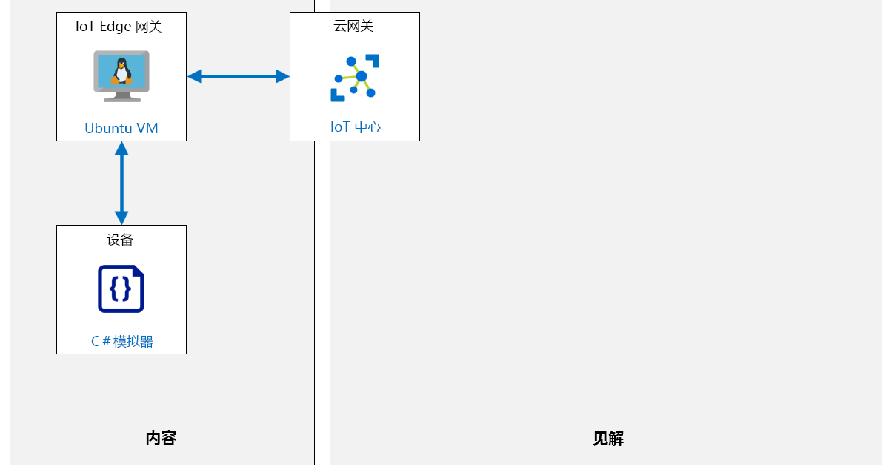
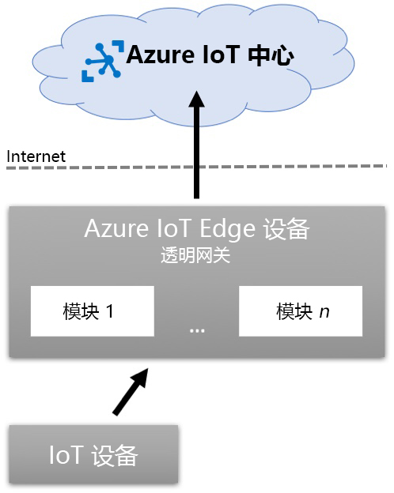

---
lab:
    title: '实验室 14：在受限网络中和离线运行 IoT Edge 设备'
    module: '模块 7：Azure IoT Edge 模块'
---

# 在受限网络中离线运行 IoT Edge 设备

## 实验室场景

你在 Contoso 的奶酪包装和运输设施中实施的传送带监控系统正在获得回报。该系统现在将遥测数据发送到 Azure IoT 中心，以帮助操作人员管理皮带的振动水平，而新的 IoT Edge 设备通过跟踪通过系统的奶酪包装的数量来帮助管理库存。

你的经理希望系统能够灵活应对网络中断，在某些奶酪加工区域这种情况仍然偶有发生。此外，IT 部门已要求你优化系统以在一天中的特定时间内批量上传所有非关键遥测数据，从而帮助平衡网络使用情况。

你建议将 IoT Edge 配置为在网络中断的情况下支持脱机方案，并将考虑在本地（在设备上）存储来自传感器的遥测，同时将 Edge 设备配置成在给定的时间段内能够定期同步。

将创建以下资源：



## 在本实验室中

在本实验室中，你将完成以下活动：

* 验证实验室先决条件
* 创建 IoT 中心和设备 ID
* 部署启用 Azure IoT Edge 的 Linux VM
* 使用子级 IoT 设备设置 IoT Edge 父级
* 将 IoT Edge 设备配置为网关
* 使用 Azure CLI 打开 IoT Edge 网关设备入站端口
* 配置 IoT Edge 设备的生存时间和消息存储
* 将子级 IoT 设备连接到 IoT Edge 网关
* 测试设备连接性和脱机支持

## 实验室说明

### 练习 1：验证实验室先决条件

本实验室假定以下 Azure 资源可用：

| 资源类型 | 资源名称 |
| :-- | :-- |
| 资源组 | AZ-220-RG |
| IoT 中心 | AZ-220-HUB-_{YOUR-ID}_ |
| IoT 设备 | SimulatedThermostat |

如果这些资源不可用，你需要按以下说明运行 **“lab14 setup.azcli”** 脚本，然后再前往练习 2。脚本文件包含在本地克隆作为开发环境配置（实验室 3）的 GitHub 存储库中。

写入 **lab14 setup.azcli** 脚本并在 **bash** shell 环境中运行 - 执行此操作的最简便方法是在 Azure Cloud Shell 中。

>**注：**你将需要 **SimulatedThermostat** 设备的连接字符串。如果你已经在 Azure IoT 中心注册了此设备，则可以通过在 Azure Cloud Shell 中运行以下命令来获取连接字符串
>
> ```bash
> az iot hub device-identity show-connection-string --hub-name AZ-220-HUB-{YOUR-ID} --device-id SimulatedThermostat -o tsv
> ```

#### 任务1：执行设置脚本

1. 使用浏览器打开 [Azure Shell](https://shell.azure.com/)，并使用本课程所使用的 Azure 订阅登录。

    如果系统提示设置 Cloud Shell 的存储，请接受默认设置。

1. 验证 Azure Cloud Shell 是否正在使用 **Bash**。

    Azure Cloud Shell 页面左上角的下拉菜单用于选择环境。验证所选的下拉值是否为 **Bash**。

1. 在 Azure Shell 工具栏上，单击 **上传/下载文件** （从右数第四个按钮）。

1. 在下拉菜单中，单击 **“上传”**。

1. 在“文件选择”对话框中，导航到配置开发环境时下载的 GitHub 实验室文件的文件夹位置。

    在_实验室 3 中：设置开发环境_，你可以通过下载 ZIP 文件并从本地提取内容来克隆包含实验室资源的 GitHub 存储库。提取的文件夹结构包括以下文件夹路径：

    * Allfiles
      * 实验室
          * 14-在受限网络中离线运行 IoT Edge 设备
            * 设置

    lab14-setup.azcli 脚本文件位于实验室 14 的 Setup 文件夹中。

1. 选择 **lab14-setup.azcli** 文件，然后单击 **“打开”**。

    文件上传完成后，将显示一条通知。

1. 若要验证在 Azure Cloud Shell 中已上传了正确文件，请输入以下命令：

    ```bash
    ls
    ```

    使用 `ls` 命令列出当前目录的内容。你应该看到列出的 lab14-setup.azcli 文件。

1. 若要为此实验室创建一个包含安装脚本的目录，然后移至该目录，请输入以下 Bash 命令：

    ```bash
    mkdir lab14
    mv lab14-setup.azcli lab14
    cd lab14
    ```

1. 为了保证 **lab14-setup.azcli** 具有执行权限，请输入以下命令：

    ```bash
    chmod +x lab14-setup.azcli
    ```

1. 在 Cloud Shell 工具栏上，请单击 **“打开编辑器”** （右侧的第二个按钮 - **{ }**）编辑 lab14-setup.azcli 文件。

1. 在 **“文件”** 列表中，要展开 lab14 文件夹并打开脚本文件，请依次单击 **“lab14”**、**“lab14-setup.azcli”**。

    编辑器现在将显示 **lab14-setup.azcli** 文件的内容。

1. 在编辑器中，更新 `{YOUR-ID}` 和 `{YOUR-LOCATION}` 已分配的值。

    以下面的示例为例，需要将 `{YOUR-ID}` 设置为在本课程开始时创建的唯一 ID，即 **CAH191211**，然后将 `{YOUR-LOCATION}` 设置为对你的资源有意义的位置。

    ```bash
    #!/bin/bash

    RGName="AZ-220-RG"
    IoTHubName="AZ-220-HUB-{YOUR-ID}"

    Location="{YOUR-LOCATION}"
    ```

    > **注释**：  `{YOUR-LOCATION}` 变量应设置为该区域的短名称。输入以下命令，可以看到可用区域及其短名称的列表（**名称**列）：
    >
    > ```bash
    > az account list-locations -o Table
    >
    > DisplayName           Latitude    Longitude    Name
    > --------------------  ----------  -----------  ------------------
    > 东亚            22.267      114.188      eastasia
    > 东南亚       1.283       103.833      southeastasia
    > 美国中部            41.5908     -93.6208     centralus
    > 美国东部               37.3719     -79.8164     eastus
    > East US 2             36.6681     -78.3889     eastus2
    > ```

1. 要保存对文件所做的更改并关闭编辑器，请单击编辑器窗口右上角的 **“...”**，然后单击 **“关闭编辑器”**。

    如果提示保存，请单击 **“保存”**，编辑器将会关闭。

    > **注释**：  可以使用 **CTRL+S** 随时保存，使用 **CTRL+Q** 关闭编辑器。

1. 要创建本实验室所需的资源，请输入以下命令：

    ```bash
    ./lab14-setup.azcli
    ```

    运行此脚本可能需要几分钟。每个步骤完成时，你将会看到 JSON 输出。

    该脚本将首先创建一个名为 **AZ-220-RG** 的资源组和一个名为 **AZ-220-HUB-{YourID}** 的 IoT 中心。如果它们已经存在，将显示相应的消息。然后，脚本将添加 ID 为 **SimulatedThermostat** 设备到 IoT 中心并显示设备连接字符串。

1. 请注意，脚本完成后，将显示设备的连接字符串。

    连接字符串以 "HostName=" 开头

1. 将连接字符串复制到文本文档中，并注意它用于 **SimulatedThermostat** 设备。

    将连接字符串保存到容易找到的位置后，就可以继续进行本实验室了。

### 练习 2：部署启用 Azure IoT Edge 的 Linux VM

在本练习中，将从 Azure 市场部署具有 Azure IoT Edge 运行时支持的 Ubuntu Server VM。

在以前的实验室中，你已经使用 Azure 门户创建了 VM。在本实验室中，你将使用 Azure CLI 创建 VM。

1. 如有必要，请使用 Azure 帐户凭据登录到 Azure 门户。

    如果有多个 Azure 帐户，请确保使用与该课程将使用的订阅绑定的帐户登录。

1. 在 Azure 门户工具栏上，单击 **“Cloud Shell”**。

    确保在 shell 中将环境设置为 **Bash**。

1. 要为启用了 Azure IoT Edge 的 VM 创建资源组，请输入以下命令：

    ```bash
    az group create --name AZ-220-IoTEdge-RG --location {YOUR-LOCATION}
    ```

    请记住，将 `{YOUR-LOCATION}` 替换为你附近的区域。

1. 要创建 Linux VM，请输入以下两个命令：

    ```bash
    az vm image terms accept --urn microsoft_iot_edge:iot_edge_vm_ubuntu:ubuntu_1604_edgeruntimeonly:latest
    az vm create --resource-group AZ-220-IoTEdge-RG --name AZ220EdgeVM{YOUR-ID} --image microsoft_iot_edge:iot_edge_vm_ubuntu:ubuntu_1604_edgeruntimeonly:latest --admin-username vmadmin --admin-password {YOUR-PASSWORD-HERE} --authentication-type password
    ```

    > **注释**：确保替换第二个命令中包含的占位符。

    上面的第一个命令接受 VM 映像的使用条款和条件。

    第二个命令实际上是在上面指定的资源组内创建 VM。请记住使用你的唯一 ID 更新 `AZ220EdgeVM {YOUR-ID}`，并用适当安全的密码替换 `{YOUR-PASSWORD-HERE}`。

    > **注释**：在生产中，你可以选择生成 SSH 密钥，而不是使用用户名/密码方法。你可以在此处了解有关 Linux VM 和 SSH 的更多信息：[https://docs.microsoft.com/zh-cn/azure/virtual-machines/linux/create-ssh-keys-detailed](https://docs.microsoft.com/zh-cn/azure/virtual-machines/linux/create-ssh-keys-detailed)。
    >
    > **注释**：  部署大约需要 5 分钟才能完成。你可以在部署时继续下一单元。

### 练习 3：使用子级 IoT 设备设置 IoT Edge 父级

使用父级/子级关系（包括 IoT Edge 网关（父级）和其他 IoT 设备（子级或叶设备））可以在 Azure IoT 解决方案中实现离线功能。只要 IoT Edge 设备有机会连接到 IoT 中心，该设备和任何子设备就可以在断断续续或在没有 Internet 连接的情况下继续运行。

下图显示了 IoT Edge 设备父级和子级设备之间的关系：



在此图中，子级设备连接到父级 IoT Edge 设备并对其进行身份验证。子设备使用其 Azure IoT 中心凭据来实现此身份验证。身份验证后，子级 IoT 设备将消息发送到 IoT Edge 设备上的 Edge 中心 (`$edgeHub`) 。一旦消息到达父级 IoT Edge 设备，则 IoT Edge 模块和路由将按配置处理消息；包括在连接后将消息发送到 Azure IoT 中心。

当父级 IoT Edge 设备断开连接（或断开与 Azure IoT 中心的连接）时，它将自动将所有设备消息存储到 IoT Edge 设备。恢复连接后，IoT Edge 设备将恢复连接并将所有存储的消息发送到 Azure IoT 中心。根据设备的生存时间 (TTL) 配置，存储在 IoT Edge 设备上的消息可能会过期；默认情况下，该消息最多可存储 `7200` 秒（两个小时）。

在本练习中，你将向 Azure IoT 中心注册 IoT Edge 设备，然后创建 IoT 设备并将其配置为 IoT Edge 设备的子级。这将启用上述方案，其中子级 IoT 设备在将消息发送到云中的 Azure IoT 中心之前，通过父级 IoT Edge 网关设备发送消息。如果 Edge 网关设备和 IoT 中心之间的连接丢失，则消息将由 Edge 网关设备保存（在配置的限制内），直到恢复连接为止。

1. 如有必要，请使用 Azure 帐户凭据登录到 Azure 门户。

    如果有多个 Azure 帐户，请确保使用与该课程将使用的订阅绑定的帐户登录。

1. 在 Azure 门户工具栏上，单击 **“Cloud Shell”**

    确保环境正在使用 **Bash**。

1. 要在 Azure IoT 中心创建一个新的 **IoT Edge 设备标识**，请输入以下命令：

    ```sh
    az iot hub device-identity create --edge-enabled --hub-name AZ-220-HUB-{YOUR-ID} --auth-method shared_private_key --device-id IoTEdgeGateway
    ```

    > **注释**：  请务必将 **AZ-220-HUB-_{YOUR-ID}_** IoT 中心名称更换为你的 Azure IoT 中心的名称。

    请注意，`az iot hub device-identity create` 命令中包含以下参数：

    * `--hub-name`: 此必填参数用于指定将新设备添加到的 **Azure IoT 中心**的名称。

    * `--device-id`: 此必需参数用于指定要创建的 IoT 设备的**设备 ID**。

    * `--edge-enabled`: 它指定要创建的 IoT 设备是一个 **IoT Edge 设备**，并将为 IoT Edge 启用。

    * `--auth-method`: 它指定了用于 IoT 设备的身份验证方法。`shared_private_key` 的值指定使用对称密钥加密。其他可用的选项是 `x509_ca` 和 `x509_thumbprint`。

1. 花一点时间查看命令生成的 JSON 输出。

    请注意，命令完成后，将向终结点返回一个 JSON 文件。这个 JSON 文件包含了一些刚刚创建的 **IoT Edge 设备** 的配置详细信息。设备详细信息包括由设备的服务自动生成的 **对称密钥**。

    ```json
        {
          "authentication": {
            "symmetricKey": {
              "primaryKey": "gOAYooDeRrinZzyo0yWZNEkvc0wZaF9/4qaXv7s7olw=",
              "secondaryKey": "MzE5VtKJzOO6HGnNkI4kyn+MCziUYXZ/MSJCKxHIHa0="
            },
            "type": "sas",
            "x509Thumbprint": {
              "primaryThumbprint": null,
              "secondaryThumbprint": null
            }
          },
          "capabilities": {
            "iotEdge": true
          },
          "cloudToDeviceMessageCount": 0,
          "connectionState": "Disconnected",
          "connectionStateUpdatedTime": "0001-01-01T00:00:00",
          "deviceId": "IoTEdgeGateway",
          "deviceScope": "ms-azure-iot-edge://IoTEdgeGateway-637121074930370650",
          "etag": "Nzk1MjE0NjM2",
          "generationId": "637121074930370650",
          "lastActivityTime": "0001-01-01T00:00:00",
          "status": "enabled",
          "statusReason": null,
          "statusUpdatedTime": "0001-01-01T00:00:00"
        }
    ```

1. 要从 IoT 中心检索 **IoEdgeGateway** 设备的 **连接字符串**，请输入以下命令：

    ```cmd/sh
    az iot hub device-identity show-connection-string --hub-name AZ-220-HUB-{YOUR-ID} --device-id IoTEdgeGateway -o tsv
    ```

    > **注释**：  请务必将 **AZ-220-HUB-_{YOUR-ID}_** IoT 中心名称更换为你的 Azure IoT 中心的名称。

    注意，通过传入几个参数来调用 `az iot hub device-identity show-connection-string` 命令：

    * `--hub-name`: 此必填参数用于指定将新设备添加到的 **Azure IoT 中心** 的名称。

    * `--device-id`: 此必需参数用于指定要创建的 IoT 设备的 **设备 ID**。

    从 **IoTEdgeGateway** 设备的 IoT 中心连接字符串输出将采用以下格式：

    ```text
    HostName={iot-hub-name}.azure-devices.net;DeviceId=IoTEdgeGateway;SharedAccessKey={shared-access-key}
    ```

1. 保存连接字符串值的副本，以供本实验室稍后参考。

    下一步是创建子级 IoT 设备，该子级 IoT 设备将直接连接到父级 IoT Edge 网关设备以与 IoT 中心进行通信。

1. 要创建 IoT 设备并将其配置为 IoT Edge 设备的子级，请运行以下命令：

    ```sh
    az iot hub device-identity create -n AZ-220-HUB-{YOUR-ID} --device-id ChildDevice1 --pd IoTEdgeGateway
    ```

    > **注释**：  请务必将 **AZ-220-HUB-_{YOUR-ID}_** IoT 中心名称更换为你的 Azure IoT 中心的名称。

    此命令传递以下参数：

    * `-n`: 此必需的参数是 `--hub-name` 的简写，用于指定将新设备添加到的 **Azure IoT 中心** 的名称。

    * `--device-id`: 此必需参数用于指定要创建的 IoT 设备的 **设备 ID**。

    * `--pd`: 此参数指定要创建的 IoT 设备的 **父级设备**。传入的值必须是将此 **子级设备** 分配到的 **父级设备** 的 **设备 ID**。

    注意，该命令没有传递 `--auth-method`。通过省略此参数，将使用 `shared_private_key` 的默认值。

1. 花点时间查看此命令的 JSON 输出。

    注意，命令完成后，将向终端返回一个 JSON 博客。该 JSON 文件包含刚刚创建的 **IoT 设备** 的配置详细信息。请注意，包含对称密钥的 `symmetricKey` 节点可用于通过 Azure IoT 中心或子设备连接到父级 IoT Edge 网关来对设备进行身份验证。

    你需要此 IoT 设备的 **primaryKey**，以便以后使用。

    ```json
        {
          "authentication": {
            "symmetricKey": {
              "primaryKey": "uMhYoXK/WRoXrIATh25aijyEbA401PKDxy4KCS488U4=",
              "secondaryKey": "9tOPmSkmoqRd2KEP1JFyQQ6y2JdA5HPO7qnckFrBVm4="
            },
            "type": "sas",
            "x509Thumbprint": {
              "primaryThumbprint": null,
              "secondaryThumbprint": null
            }
          },
          "capabilities": {
            "iotEdge": false
          },
          "cloudToDeviceMessageCount": 0,
          "connectionState": "Disconnected",
          "connectionStateUpdatedTime": "0001-01-01T00:00:00",
          "deviceId": "ChildDevice1",
          "deviceScope": "ms-azure-iot-edge://IoTEdgeGateway-637121074930370650",
          "etag": "MTgxNjg1MjE0",
          "generationId": "637121169262975883",
          "lastActivityTime": "0001-01-01T00:00:00",
          "status": "enabled",
          "statusReason": null,
          "statusUpdatedTime": "0001-01-01T00:00:00"
        }
    ```

1. 保存 `primaryKey` 值的副本，以便稍后在本实验室中参考。

1. 要从 IoT 中心检索 **ChildDevice1** 设备的 **连接字符串**，请输入以下命令：

    ```cmd/sh
    az iot hub device-identity show-connection-string --hub-name AZ-220-HUB-{YOUR-ID} --device-id ChildDevice1 -o tsv
    ```

    > **注释**：  请务必将 **AZ-220-HUB-_{YOUR-ID}_** IoT 中心名称更换为你的 Azure IoT 中心的名称。

1. 保存连接字符串值的副本，以供本实验室稍后参考。

1. 考虑刚刚完成的操作的结果。

    现在，你有了一个在 Azure IoT 中心中注册的 IoT Edge 设备和一个子 IoT 设备。使用 **IoT Edge 设备**将 **IoT 设备**配置为其父设备。

    此配置能使子 IoT 设备能够连接到父 IoT Edge 设备并与之通信，而不是直接连接到 Azure IoT 中心。通过这种方式配置 IoT 设备拓扑，可以采用具有脱机功能的方案。即使与 Azure IoT 中心的连接断开，IoT 设备和 IoT Edge 设备也可以继续工作。

1. 在 Azure 门户中，导航至 Azure 仪表板。

1. 在 Azure 门户菜单上，单击 **“资源组”**。

1. 在 **“资源组”** 边栏选项卡上的 **“名称”** 下，找到 **“AZ-220-IoTEdge-RG”** 资源组。

1. 在 **“AZ-220-IoTEdge-RG”** 行，在边栏选项卡的右侧，单击 **...**，然后单击 **“固定到仪表板”**。

    你可能需要编辑仪表板，以使 RG 磁贴和列出的资源更易于访问。

### 练习 4：将 IoT Edge 设备配置为网关

在本练习中，你将在 Ubuntu 虚拟机（之前已创建）上配置 Azure IoT Edge，使该虚拟机成为 IoT Edge 透明网关设备。

回想一下，当下游设备具有自己的 IoT 中心身份并且理论上可以自行连接到 IoT 中心时，将使用 IoT Edge 透明网关。网关只是在设备与 IoT 中心之间传递通信。你要在该网关设备上实现对网络连接丢失时发生的离线场景的支持。

> **注释**：你将使用帮助程序脚本将 IoT Edge 设备配置为透明网关。这将使你能够更快地完成该过程。

1. 打开一个新的 Visual Studio Code 实例。

1. 在 Visual Studio Code 中的 **“文件”** 菜单上，单击 **“打开文件夹”**。

1. 在“打开文件夹”对话框中，导航到 **“Allfile\Labs\14-Run an IoT Edge device in restricted network and offline\Setup”** 文件夹。 

    在_实验室 3 中：设置开发环境_，你可以通过下载 ZIP 文件并从本地提取内容来克隆包含实验室资源的 GitHub 存储库。提取的文件夹结构包括以下文件夹路径：

    * Allfiles
      * 实验室
          * 14-在受限网络中离线运行 IoT Edge 设备
            * 设置

1. 单击 **“Setup”**，然后单击 **“选择文件夹”**。

1. 在 **“资源管理器”** 窗格中，单击 **“setup-iot-edge-gateway.sh”**。 

1. 在代码编辑器中，替换占位符值，如下所示：

    你需要更新的变量位于 `setup-iot-edg-gateway.sh` 脚本顶部附近，并且在替换占位符之前类似于以下内容：

    ```sh
    connectionstring="{iot-edge-device-connection-string}"
    hostname="{iot-edge-device-hostname}"
    ```

    占位符值指南： 

    | 占位符 | 要替换的值 |
    | :--- | :--- |
    | `{iot-edge-device-connection-string}` | 粘贴之前在 Azure IoT 中心内创建的 **IoTEdgeGateway** IoT Edge 设备的**连接字符串**。
    | `{iot-edge-device-hostname}` | 粘贴在以上步骤中创建的 Ubuntu VM 上的 **AZ220EdgeVM{Your ID}** IoT Edge 的 **公用 IP 地址**。子 IoT 设备将使用公用 IP 地址作为连接到 IoT Edge 透明网关所需的 DNS 主机名。可以 Azure 门户中的 **“AZ220EdgeVM{Your ID}”** 虚拟机的“概览”窗格中找到列出的公用 IP 地址。

1. 在 **“文件”** 菜单中，单击 **“保存”**。

1. 在 **“资源管理器”** 窗格中，单击 **“setup-remote-iot-edge-gateway.sh”**。 

1. 在代码编辑器中，替换占位符值，如下所示：

    需要更新的变量位于 `setup-remote-iot-edg-gateway.sh` 脚本顶部附近，并且在替换占位符之前类似于以下内容：

    ```sh
    username="{iot-edge-username}"
    ipaddress="{iot-edge-ipaddress}"
    ```

    占位符值指南： 

    | 占位符 | 要替换的值 |
    | :--- | :--- |
    | `{iot-edge-username}` | 输入管理员 **“用户名”** 以连接到 Ubuntu VM 上的 **“AZ220EdgeVM{Your ID}”** IoT Edge。将使用该用户名通过 SSH 连接到该 VM。该用户名被指定为之前在本实验室中提供的 Azure CLI 命令（用于创建该 VM）内的 **“vmadmin”**。 
    | `{iot-edge-ipaddress}` | 输入 Ubuntu VM 上 **AZ220EdgeVM{Your ID}** IoT Edge 的 **公共 IP 地址**。将使用该 IP 地址通过 SSH 连接到 VM。

1. 在 **“文件”** 菜单中，单击 **“保存”**。

1. 如有必要，请使用 Azure 帐户凭据登录到 Azure 门户。

    如果有多个 Azure 帐户，请确保使用与该课程将使用的订阅绑定的帐户登录。

1. 在 Azure 门户工具栏上，单击 **“Cloud Shell”**

    确保将环境设置为使用 **“Bash”**。

1. 在 Azure Cloud Shell 工具栏上，要上传安装脚本，请单击 **“上传/下载文件”** （右数第四个按钮）。

1. 在下拉菜单中，单击 **“上传”**。

1. 在“文件选择”对话框中，导航到配置开发环境时下载的 GitHub 实验室文件的文件夹位置。

    在本课程的实验室 3（“设置开发环境”）中，通过下载 ZIP 文件并在本地提取内容来克隆包含实验室资源的 GitHub 存储库。提取的文件夹结构包括以下文件夹路径：

    * Allfiles
      * 实验室
          * 14-在受限网络中离线运行 IoT Edge 设备
            * 设置

    setup-iot-edge-gateway.sh 和 setup-remote-iot-edge-gateway.sh 脚本文件位于实验室 14 的 Setup 文件夹中。

1. 选择 **“setup-iot-edge-gateway.sh”** 和 **“setup-remote-iot-edge-gateway.sh”** 脚本文件，然后单击 **“打开”**。

    上传完成后会出现一条通知。

    > **注释**：  当在 Ubuntu VM 上将 Azure IoT Edge 设置为透明网关设备时，这两个帮助程序脚本将提供帮助。这些脚本用于本实验室中的开发，而不用于生产用途。

1. 要验证两个文件均已上传，请输入以下命令：

    ```bash
    ls
    ```

    使用 `ls` 命令列出当前目录的内容。继续操作之前，请确保拥有这两个文件。

1. 为了确保 **setup-remote-iot-edge-gateway.sh** 具有读/写/执行权限，输入以下命令：

    ```sh
    chmod 700 setup-remote-iot-edge-gateway.sh
    ```

1. 若要在 Ubuntu VM 上将 IoT Edge 设置为 IoT Edge 透明网关，请输入以下命令：

    ```sh
    ./setup-remote-iot-edge-gateway.sh
    ```

    如果看到一条消息，提示无法建立主机的真实性，并询问是否确定要继续连接，请输入 **“yes”**

1. 出现提示时，输入 Ubuntu VM 上 IoT Edge 的 **密码**。

    总共会有 3 次输入密码的提示。这些提示缘于  `ssh` 和 `scp` 命令，用于将 `setup-iot-edge-gateway.sh` 帮助程序脚本上传到 VM。运行该脚本，然后下载 x.509 证书，用于之后向 IoT Edge 透明网关对子 IoT 设备进行身份验证。

    当帮助程序脚本完成将 Ubuntu VM 上的 IoT Edge 配置为 IoT Edge 透明网关时，Cloud Shell 将下载 `azure-iot-test-only.root.ca.cert.pem` x.509 证书。

1. 出现提示时，将 x.509 证书保存到“下载”文件夹中。 

    该证书将用于配置子 IoT 设备的身份验证。

    > **注释**：如果未在 Web 浏览器中自动下载 x.509 证书，请打开 Cloud Shell 命令提示符，然后运行以下命令：

    ```sh
    download azure-iot-test-only.root.ca.cert.pem
    ```

    在本练习中，使用帮助程序脚本在 Ubuntu VM 上将 IoT Edge 设置和配置为 IoT Edge 透明网关设备。使用脚本文件可使实验室活动集中在更大的场景上 - 了解 Azure IoT Edge 的受限网络和脱机功能。有关在 Ubuntu VM 上将 IoT Edge 设置为 IoT Edge 透明网关的分步说明，请参阅本课程的实验室 12。 

### 练习 5：使用 Azure CLI 打开 IoT Edge 网关设备入站端口

在本练习中，将使用 Azure CLI 配置网络安全组 (NSG)，以确保从 internet 访问 Azure IoT Edge 网关的安全性。需要打开用于 MQTT、AMQP 和 HTTPS 通信的必要端口，以便下游 IoT 设备可以与网关通信。

为了使 Azure IoT Edge 网关与子 IoT 设备能够进行通信，必须打开设备协议的 TCP/IP 端口以用 **于入站** 通讯。设备可以使用三种支持的协议中的任何一种来与 IoT 网关通信。

以下是受支持协议的 TCP/IP 端口号：

| 协议 | 端口号 |
| --- | --- |
| MQTT | 8883 |
| AMQP | 5671 |
| HTTPS<br/>MQTT + WS (Websocket)<br/>AMQP + WS (Websocket) | 443 |

1. 如有必要，请使用 Azure 帐户凭据登录到 Azure 门户。

    如果有多个 Azure 帐户，请确保使用与该课程将使用的订阅绑定的帐户登录。

1. 在仪表板上找到包含 **AZ220EdgeVM{Your ID}** 虚拟机的资源组磁贴。

    此 RG 磁贴还应包含为 **AZ220EdgeVM{Your ID}** 虚拟机创建的 **AZ220EdgeVM{Your ID}NSG** 网络安全组 (NSG)。

1. 在 Azure 门户工具栏上，单击 **“Cloud Shell”**。

    确保将环境设置为使用 **“Bash”**。

1. 在 Cloud Shell 命令提示符下，请输入以下命令，列出 Azure IoT Edge 网关 VM 正在使用的网络安全组 (NSG) 的名称：

    ```bash
    az network nsg list --resource-group AZ-220-IoTEdge-RG -o table
    ```

    你会看到类似于以下内容的输出：

    ```text
    Location    Name                     ProvisioningState    ResourceGroup            ResourceGuid
    ----------  -----------------------  -------------------  -----------------------  ------------------------------------
    westus2     AZ220EdgeVM{YOUR-ID}NSG  Succeeded            AZ-220-IoTEdge-RG        <GUID>
    ```

1. 在 Cloud Shell 命令提示符处，要将 **入站规则** 添加到用于 MQTT、AMQP 和 HTTPS 通信协议的 NSG 中，请输入以下命令：

    ```cmd/sh
    az network nsg rule create --name MQTT --nsg-name AZ220EdgeVM{YOUR-ID}NSG --resource-group AZ-220-IoTEdge-RG --destination-port-ranges 8883 --priority 101
    az network nsg rule create --name AMQP --nsg-name AZ220EdgeVM{YOUR-ID}NSG --resource-group AZ-220-IoTEdge-RG --destination-port-ranges 5671 --priority 102
    az network nsg rule create --name HTTPS --nsg-name AZ220EdgeVM{YOUR-ID}NSG --resource-group AZ-220-IoTEdge-RG --destination-port-ranges 443 --priority 103
    ```

    在运行这些命令之前，务必将以上 **{YOUR-ID}** 占位符替换为合适的值。

    > **注释**：  在生产中，最佳做法是将入站通信仅向 IoT 设备正在使用的通信协议开放。如果设备仅使用 MQTT，则仅开放该端口的入站通信。这有助于限制可被利用的开放端口的表面攻击区域。

    将 **入站规则** 添加到 **网络安全组** (NSG)，将允许子 IoT 设备与 IoT Edge 网关虚拟机进行通信。

### 练习 6：配置 IoT Edge 设备的生存时间和消息存储

在本练习中，你将在 Azure IoT Edge 网关设备上将 Edge 中心模块的消息生存时间 (TTL) 配置为比默认值长。你还将在 IoT Edge 设备上配置要存储消息的位置。

TTL 的默认值为 `7200` （2 小时），足以应对快速中断。但是，在某些情况下，两个小时可能不够长，因为设备或解决方案需要在脱机模式下长时间运行。当出现长时间断开连接的情况时，为使解决方案能够执行而不会丢失遥测数据，你可以将 IoT Edge 中心模块的 TTL 属性值配置为 1,209,600 秒（2 周 TTL 周期）。

IoT Edge 中心模块 (`$edgeHub`) 用于协调设备上运行的 IoT Edge 中心与 Azure IoT 中心服务之间的通信。在模块孪生的所需属性中， `storeAndForwardConfiguration.timeToLiveSecs` 属性会以秒为单位指定当处于与路由终结点断开的状态时，例如 Azure IoT 中心，IoT Edge 中心能够保留消息的时间。

可以在特定设备上的部署清单中将 Edge 中心的 `timeToLiveSecs` 属性指定为单设备或大规模部署的一部分。在本练习中，你将使用适用于 Azure IoT 中心的 Azure 门户用户界面来修改单个 IoT Edge 网关设备上 Edge 中心 (`$edgeHub`) 模块的 `timeToLiveSecs` 属性。

#### 任务 1：配置模块孪生

1. 如有必要，请使用 Azure 帐户凭据登录到 Azure 门户。

    如果有多个 Azure 帐户，请确保使用与该课程将使用的订阅绑定的帐户登录。

1. 在“资源组”磁贴上，单击 **“AZ-220-HUB-{YOUR-ID}”**。

1. 在 **“AZ-220-HUB-{YOUR-ID}”** 边栏选项卡的左侧导航菜单上， **“自动设备管理”** 下方，单击 **“IoT Edge”**。

    通过该窗格，可以管理连接到 IoT 中心的 IoT Edge 设备。

1. 在 **“设备 ID”** 下，单击 **“IoTEdgeGateway”**。

1. 在 **“模组”** 下，单击 **“$edgeHub”**。

    **“Edge 中心”** 模块的“模块标识详细信息”边栏选项卡可为 IoT Edge 设备提供模块标识孪生和其他资源的访问权限。

1. 在 **“模块标识详细信息”** 边栏选项卡，单击 **“模块身份孪生”**。

    该边栏选项卡包含在编辑器窗格中显示为 JSON 的 `IoTEdgeGateway/$edgeHub` 的模块标识孪生。 
    
1. 花些时间查看 $edgeHub 模块标识孪生的内容。

    注意，由于这是一个新设备，因此所需的属性基本上为空。

1. 关闭 **“模块标识孪生”** 边栏选项卡。

1. 导航回到 **IoTEdgeGateway** 边栏选项卡。

1. 在边栏选项卡顶部，单击 **“设置模块”**。

    借助 **“在设备上设置模块”** 边栏选项卡，你可以创建和配置部署到此 IoT Edge 设备的 IoT Edge 模块。

1. 在 **“设置模块”** 边栏选项卡的 **“IoT Edge 模块”** 下，单击 **“运行时设置”**。

1. 在 **“运行时设置”** 窗格的 **“Edge 中心”** 选项下，找到 **“存储和转发配置 - 生存时间（秒）”** 字段。

1. 在 **存储和转发配置 - 生存时间（秒）** 选项下，将值更改为 **1209600**

    这指定了 IoT Edge 设备的消息生存时间为 2 周。

    > **注释**：  在为 Edge 中心 (`$edgeHub`) 模块配置 **消息生存时间** (TTL) 时，需要考虑以下几点。当 IoT Edge 设备断开连接时，消息将存储在本地设备上。你需要计算在 TTL 期间将要存储的数据量，并确保设备上有足够的存储空间来存储这数据。如果要避免丢失重要数据，则配置的存储量和 TTL 需要满足解决方案要求。
    >
    > 如果设备的存储空间不足，则需要配置较短的 TTL。消息的期限达到 TTL 时间限制后，如果尚未发送到 Azure IoT 中心，则将其删除。

    当处于断开/脱机状态时，IoT Edge 设备将自动存储消息。可以使用 `HostConfig` 对象配置存储位置。

1. 在 **“Edge 中心”** 下，找到 **“创建选项”** 字段。

    请注意，此字段包含可以配置的 `HostConfig` JSON 对象。

1. 在 **“创建选项”** 下，按如下所示更新 `HostConfig` 对象：

    要在 `HostConfig` 对象中配置存储位置，你需要将以下 `Binds` 属性添加到 `HostConfig` 中。

    ```json
    "Binds": [
        "/etc/iotedge/storage/:/iotedge/storage/"
    ]
    ```

    此 `Binds` 值将 Docker 容器中的 `/IoT Edge/storage/` 目录配置为将 Edge 中心模块映射到物理 IoT Edge 设备上的 `/etc/iotedge/storage/` 主机系统目录。

    该值的格式为 `<HostStoragePath>:<ModuleStoragePath>`。`<HostStoragePath>` 值是 IoT Edge 设备上的主机目录位置。`<ModuleStoragePath>` 是容器内可用的模块存储路径。这两个值都必须是绝对路径。

    可以将 `Binds` 属性添加到 `PortBindings` 属性下方的 `HostConfig` 中。确保用逗号分隔各属性。

    在 **“创建选项”** 框中生成的 JSON 应类似于：

    ```json
    {
        "HostConfig": {
            "PortBindings": {
                "443/tcp": [
                {
                    "HostPort": "443"
                }
                ],
                "5671/tcp": [
                {
                    "HostPort": "5671"
                }
                ],
                "8883/tcp": [
                {
                    "HostPort": "8883"
                }
                ]
            },
            "Binds": [
                "/etc/iotedge/storage/:/iotedge/storage/"
            ]
        }
    }
    ```

1. 在 **“Edge 中心”** 下，找到 **“环境变量”** 字段。

    若要完成消息存储位置更改的更新，需要添加新的环境变量。

1. 在 **“环境变量”** 下的 **“名称”** 文本框中，输入 **storageFolder**

1. 在 **“环境变量”** 下的 **“值”** 文本框中，输入 **/iotedge/storage/**

1. 在边栏选项卡顶部，单击 **“保存”**。

1. 在 **“设置模块”** 边栏选项卡上，单击 **“查看 + 创建”**。

1. 花些时间查看部署清单的内容。

    在部署清单中找到你的更新。你需要在 `$edgeAgent` 和 `$edgeHub` 下查找它们。  

1. 在边栏选项卡底部，单击 **“创建”**。

    保存更改后，将通知 **IoT Edge 设备** 有关模块配置的更改，并且将在设备上对新设置进行相应的重新配置。

    将更改传递到 Azure IoT Edge 设备后，它将使用新配置重启 **edgeHub** 模块。

#### 任务 2：更新目录权限

在继续之前，必须确保 IoT Edge 中心模块的用户配置文件对 **/etc/iotedge/storage/** 目录具有所需的读取、写入和执行权限。

1. 在 Azure 门户仪表板上，单击 **“AZ220EdgeVM{YOUR-ID}”**。

    这应该会打开 IoT Edge 虚拟机的一个边栏选项卡，并已选择“概览”窗格。

1. 在 **“AZ220EdgeVM{YOUR-ID}}”** 边栏选项卡的顶部，单击 **“连接”**，然后单击 **“SSH”**。

1. 在 **“通过 SSH 与客户端连接”** 下，找到 **“运行以下示例命令以连接到你的 VM。” 4.** 字段。

    这是一个示例 SSH 命令，将用于连接到虚拟机。它包含 VM 的 IP 地址和管理员用户名。该命令的格式类似于 `ssh username@52.170.205.79`。

    > **注释**：如果示例命令中包含此命令的 `-i <private key path>` 部分，则需要将其删除。 

1. 在 **“运行以下示例命令以连接到你的 VM。” 4.** 下，在值右侧，单击 **“复制到剪贴板”**。

    > **注释**：如果上面的示例命令中包含 `-i <private key path>`，请使用文本编辑器删除该命令部分，并将更新后的命令复制到剪贴板中。 

1. 在 Azure 门户工具栏上，单击 **“Cloud Shell”**。

    确保将环境设置为 **Bash**。

1. 在 Cloud Shell 命令提示符下，从剪贴板中粘贴 `ssh` 命令，然后按 **Enter** 键。

1. 当提示 **“你确定要继续连接吗？”**，输入 `yes`，然后按 Enter。

    此提示是安全性确认，因为用于保护与 VM 的连接的证书是自签名证书。后续连接将记住该提示的答案，并且仅在第一次连接时提示。

1. 当提示你输入密码时，请输入在预配 VM 时输入的管理员密码。

    连接后，终端提示符将更新以显示你连接到的 Linux VM 的名称。例如：

    ```cmd/sh
    username@AZ220EdgeVM{YOUR-ID}:~$
    ```

1. 要查看运行的 IoT Edge 模块，请输入以下命令：

    ```bash
    iotedge list
    ```

1. 花点时间查看 `iotedge list` 命令的输出：

    你应该会看到 *edgeHub* 启动失败：

    ```text
    NAME             STATUS           DESCRIPTION                 CONFIG
    edgeAgent        running          Up 4 seconds                mcr.microsoft.com/azureiotedge-agent:1.0
    edgeHub          failed           Failed (139) 0 seconds ago  mcr.microsoft.com/azureiotedge-hub:1.0
    ```

    这是由于 *edgeHub* 进程没有写入 **/etc/iotedge/storage/** 目录的权限。

1. 要确认目录权限问题，请输入以下命令：

    ```bash
    iotedge logs edgeHub
    ```

    终端将输出当前日志。如果滚动浏览日志，则会看到相关条目：

    ```text
    未经处理的异常：System.AggregateException: 发生一个或多个错误。（拒绝访问路径 '/iotedge/storage/edgeHub'。）---> System.UnauthorizedAccessException: 拒绝访问路径 '/iotedge/storage/edgeHub' 。---> System.IO.IOException: 权限被拒绝
    ```
  
1. 要更新目录权限，请输入以下命令：

    ```sh
    sudo chown $( whoami ):iotedge /etc/iotedge/storage/
    sudo chmod 775 /etc/iotedge/storage/
    ```

    第一个命令将目录的所有者设置为当前用户，将拥有的用户组设置为 **iotedge**。第二个命令启用对当前用户及 **iotedge** 组成员的完全访问权限。这将确保 *edgeHub* 模块能够在 **/etc/iotedge/storage/** 目录中创建目录和文件。

1. 要重启 *edgeHub* 模块，然后验证它是否已启动，请输入以下命令：

    ```bash
    iotedge restart edgeHub
    iotedge 列表
    ```

    你应该看到 *edgeHub* 模块现在正在运行：

    ```text
    NAME             STATUS           DESCRIPTION      CONFIG
    edgeAgent        running          Up 13 minutes    mcr.microsoft.com/azureiotedge-agent:1.0
    edgeHub          running          Up 6 seconds     mcr.microsoft.com/azureiotedge-hub:1.0
    ```

现在你可以将设备连接到此 IoT Edge 网关设备。

### 练习 7：将子级 IoT 设备连接到 IoT Edge 网关

使用对称密钥向 IoT 中心对常规 IoT 设备进行身份验证的过程也适用于下游（或子级/叶）设备。唯一的区别是，你需要添加一个指向网关设备的指针来路由连接，或者在离线情况下，代表 IoT 中心处理身份验证。

> **注释**：在本练习中，你将使用你之前在实验室中保存的连接字符串值 **ChildDevice1**。如果需要连接字符串的新副本，可以从 Azure 门户内的 Azure IoT 中心访问它。打开 IoT 中心的 **“IoT 设备”** 窗格，单击 **ChildDevice1**，复制 **“主连接字符串”**，然后将其保存到文本文件。 

在本练习中，你将配置下游 IoT 设备（子级设备或叶设备），以使用其配置的对称密钥连接到 IoT 中心。设备将配置为使用包含对称密钥（除了父级 IoT Edge 设备的网关主机名）的连接字符串连接到 IoT 中心和父级 IoT Edge 设备。

1. 打开 Windows **“文件资源管理器”** 应用，然后导航到 **“下载”** 文件夹。

    你的“下载”文件夹应该包含 x.509 证书文件，该证书文件是在配置 IoT Edge 网关时下载的。你需要将此证书文件复制到子级 IoT 设备的源代码所在的目录。实验室 14 的 Starter 文件夹包含一个名为 ChildIoTDevice 的文件夹。你将在该 ChildIoTDevice 文件夹中找到所需的源代码。

1. 在 **“下载”** 文件夹中，右键单击 **Azure-iot-test-only.root.ca.cert.pem**，然后单击 **“复制”**。

    该文件是你下载的 x.509 证书文件，将被添加到 `/Starter/ChildIoTDevice` 目录 （子 IoT 设备的源代码所在的目录）。

1. 打开一个新的 Visual Studio Code 实例。

1. 在 **“文件”** 菜单上，单击 **“打开文件夹”**。

1. 在 **“打开文件夹”** 对话框中导航到实验室 14 **“初学者”** 文件夹，单击 **ChildIoTDevice**，然后单击 **“选择文件夹”**。

    你现在应该看到“Explorer”窗格中列出的项目文件。

1. 在 Visual Studio Code 的 **“EXPLORER”** 窗格中，单击 **“ChildIoTDevice.cs”**。

1. 在里面 **ChildIoTDevice.cs** 文件中，找到 `s_connectionString` 变量的声明。

1. 将 **ChildDevice1** IoT 设备的占位符值替换为主连接字符串。

1. 修改“连接字符串”值以包括 `GatewayHostName` 属性，如下所示：

    `GatewayHostName` 属性应设置为适用于 IoT Edge Gateway（`IoTEdgeGateway`）虚拟机的 **“公用 IP 地址”** 的值 。

    更新的连接字符串将与以下格式匹配：

    ```text
    HostName=<iot-hub-name>.azure-devices.net;DeviceId=DownstreamDevice1;SharedAccessKey=<iot-device-key>;GatewayHostName=<iot-edge-gateway-hostname>
    ```

    请务必按照以上格式将占位符替换为合适的值：

    * `<iot-hub-name>`: **Azure IoT 中心** 的 **名称**。
    * `<iot-device-key>`: IoT 中心中 **ChildDevice1** IoT 设备的主、辅 **密钥**。
    * `<iot-edge-gateway-hostname>`: 输入 **IoTEdgeGateway** 虚拟机的 **IP 地址**。

1. 在 **“文件”** 菜单中，单击 **“保存”**。

1. 在 **“视图”** 菜单中，单击 **“终端”**。

    确保 **“终端”** 命令提示符列出 `/Starter/ChildIoTDevice` 目录。

1. 若要生成并运行 **ChildIoTDevice** 模拟设备，请输入以下命令：

    ```cmd/sh
    dotnet run
    ```

    > **注释**：当应用在本地计算机上安装 **x.509 证书** 时（以便它可以使用该证书向 IoT Edge 网关进行身份验证），你可能会看到一个弹出窗口，询问是否要安装该证书。请单击 **“是”** 允许应用安装该证书。

1. 注意终端中显示的输出。

    模拟设备运行后，控制台输出将显示正在发送到 Azure IoT Edge 网关的事件。

    终端输出类似于以下内容：

    ```cmd/sh
    IoT 中心快速入门＃1 - 模拟设备。按 Ctrl-C 退出。

    用户配置的 CA 证书路径：azure-iot-test-only.root.ca.cert.pem
    尝试安装 CA 证书：azure-iot-test-only.root.ca.cert.pem
    成功添加的证书：azure-iot-test-only.root.ca.cert.pem
    11/27/2019 4:18:26 AM > Sending message: {"temperature":21.768769073192388,"humidity":79.89793652663843}
    11/27/2019 4:18:27 AM > Sending message: {"temperature":28.317862208149332,"humidity":73.60970909409677}
    11/27/2019 4:18:28 AM > Sending message: {"temperature":25.552859350830715,"humidity":72.7897707153064}
    11/27/2019 4:18:29 AM > Sending message: {"temperature":32.81164186439088,"humidity":72.6606041624493}
    ```

1. 让模拟设备保持运行状态，同时继续进行下一个练习。

### 练习 8：测试设备连接性和脱机支持

在本练习中，你将监视来自 **ChildIoTDevice** 的事件，这些事件通过 **IoTEdgeGateway** IoT Edge 透明网关发送到 Azure IoT 中心。然后，你将中断 **IoTEdgeGateway** 和 Azure IoT 中心之间的连接，以查看仍从子 IoT 设备发送到 IoT Edge 网关的遥测。之后，你将恢复与 Azure IoT 中心的连接，并监视 IoT Edge 网关继续将遥测发送到 Azure IoT 中心。

1. 如有必要，请使用 Azure 帐户凭据登录到 Azure 门户。

    如果有多个 Azure 帐户，请确保使用与该课程将使用的订阅绑定的帐户登录。

1. 在 Azure 门户工具栏上，单击 **“Cloud Shell”**。

    确保将环境下拉列表设置为 **“Bash”**。

1. 在 Cloud Shell 命令提示符处，要开始监视 Azure IoT 中心接收的事件，请输入以下命令：

    ```cmd/sh
    az iot hub monitor-events --hub-name AZ-220-HUB-{YOUR-ID}
    ```

    确保将 `{Your-ID}` 占位符替换为 Azure IoT 中心实例的唯一后缀。

1. 注意正被发送到 Azure IoT 中心的 **ChildDevice1** 遥测。

    请记住，**ChildDevice1** 模拟设备应用程序配置为将遥测发送到 **IoTEdgeGateway** IoT Edge 透明网关虚拟机，然后后者再将遥测发送到 Azure IoT 中心。

    Cloud Shell 应该开始显示类似于以下内容的事件消息：

    ```text
    启动事件监视器，使用 ctrl-c 停止...
    {
        "event": {
            "origin": "ChildDevice1",
            "payload": "{\"temperature\":20.30307372114764,\"humidity\":72.6844747889249}"
        }
    }
    {
        "event": {
            "origin": "ChildDevice1",
            "payload": "{\"temperature\":31.73955729079412,\"humidity\":78.56052768349673}"
        }
    }
    ```

    > **注释**：接下来，你需要测试 **脱机**功能。为此，你需要使 **IoTEdgeGateway** 设备脱机。由于这是在 Azure 中运行的虚拟机，因此可以通过向 VM 的 **网络安全组** 添加 **出站规则** 对此进行模拟。

1. 在 **Azure 门户** 内，导航到仪表板，然后找到 **AZ-220-IoTEdge-RG** 资源组磁贴。

1. 在资源列表中，要打开 **AZ220EdgeVM{YOUR-ID}** 虚拟机的 **网络安全组**，请单击 **AZ220EdgeVM{YOUR-ID}NSG**。

1. 在 **“网络安全组”** 边栏选项卡，在 **“设置”** 下的左侧导航窗格中，单击 **“出站安全规则”**。

1. 在边栏选项卡顶部，单击 **“添加”**。

1. 在 **“添加出站安全规则”** 窗格中，设置以下字段值：

    * 目标端口范围：**\***
    * 操作：**拒绝**
    * 名称：**DenyAll**

    **目标端口范围** “**\***”会将该规则应用于所有端口。

1. 在边栏选项卡底部，单击 **“添加”**。

1. 返回到 Azure 门户中的 **Cloud Shell**。 

1. 如果 `az iot hub monitor-events` 命令仍在运行，请按 **“Ctrl + C”** 结束运行。

1. 在 Cloud Shell 命令提示符处，要使用 `ssh` 连接到 **IoTEdgeGateway** VM，请输入以下命令：

    ```sh
    ssh <username>@<ipaddress>
    ```

    确保将占位符替换为 `ssh` 命令的必需值：

    | 占位符 | 需要替换的值 |
    | :--- | :--- |
    | `<username>` | **IoTEdgeGateaway** 虚拟机的管理员 **用户名**。这应该是 **vmadmin**。
    | `<ipaddress>` | **IoTEdgeGateway** 虚拟机的 **公共 IP 地址**。

1. 出现提示时，输入 **IoTEdgeGateway** 的管理员 **密码**。

    通过 `ssh` 连接到 **IoTEdgeGateway** VM 后，命令提示符将更新。

1. 要重设 IoT Edge 运行时，请输入以下命令：

    ```sh
    sudo systemctl restart iotedge
    ```

    这将迫使 IoT Edge 运行时与 Azure IoT 中心服务断开连接，然后再尝试重新连接。

1. 要验证 *edgeHub* 模块已正确重启，请输入以下命令：

    ```bash
    iotedge 列表
    ```

    如果 *edgeHub* 模块无法成功重启，请输入以下命令重试：

    ```bash
    iotedge restart edgeHub
    iotedge 列表
    ```

1. 要结束与 **IoTEdgeGateway** 的 `ssh` 会话，输入以下命令：

    ```cmd/sh
    exit
    ```

1. 在 Cloud Shell 命令提示符下，若要开始监视 Azure IoT 中心正在接收的事件，请输入以下命令

    ```cmd/sh
    az iot hub monitor-events --hub-name AZ-220-HUB-{YOUR-ID}
    ```

    确保将 `{Your-ID}` 占位符替换为 Azure IoT 中心实例的唯一后缀。

1. 请注意，**Azure IoT 中心** 现在未在接收任何事件。

1. 切换到 Visual Studio Code 窗口。

1. 打开 **ChildIoTDevice** 模拟设备应用程序正在其中运行的 **终端**，注意其仍在向 **IoTEdgeGateway** 发送设备遥测。

    此时，**IoTEdgeGateway** 已与 Azure IoT 中心断开连接。它将继续对 **ChildIoTDevice** 发起的连接进行身份验证，并从子设备接收设备遥测。在此期间，IoT Edge 网关将按照配置将来自子设备的事件遥测存储在 IoT Edge 网关设备存储上。

1. 切换到 **“Azure 门户”** 窗口。

1. 回到 **IoTEdgeGateway** 的 **“网络安全组”** 边栏选项卡。

1. 在左侧导航菜单中的 **“设置”** 下，单击 **“出站安全规则”**。

1. 在 **“出站安全规则”** 窗格中，单击 **“DenyAll”**。

1. 在 **“DenyAll”** 窗格中，要从 NSG 删除此拒绝规则，单击 **“删除”**。

1. 在 **“删除安全规则”** 提示上，单击 **“是”**。

    恢复与 Azure IoT 中心的连接后，**IoTEdgeGateway** IoT Edge 透明网关将同步所有来自已连接子设备的事件遥测。这包括在断开连接时无法发送的已保存遥测，并且所有遥测仍在发送到网关。

    > **注释**：  IoT Edge 网关设备将需要几分钟才能重新连接到 Azure IoT 中心，并继续发送遥测数据。等待几分钟后，你将再次在 `az iot hub monitor-events` 命令输出中看到事件。

在本实验室中，我们演示了 Azure IoT Edge 网关可以利用本地存储来保留由于 IoT 中心连接中断而无法发送的消息。重新建立连接后，我们看到消息随后被发送。

> **注释**：  完成实验室后，请在终端中按下 **CTRL+C**，以确保退出设备模拟应用程序。
