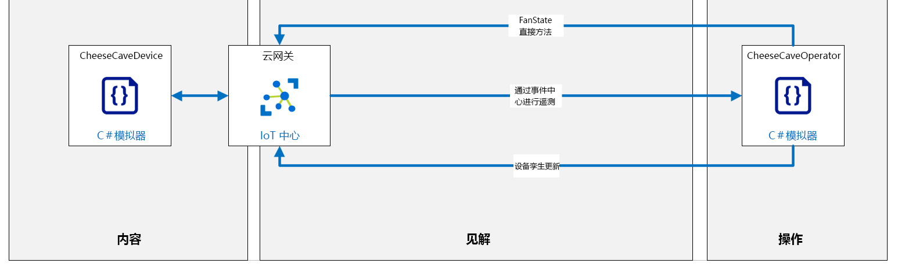

---
lab:
    title: '实验 15：使用 Azure IoT 中心远程监视和控制设备'
    module: '模块 8：设备管理'
---

# 使用 Azure IoT 中心远程监视和控制设备

## 实验室场景

Contoso 为其屡获殊荣的奶酪产品感到自豪，并在整个制造过程中都保持最佳的温度和湿度，但老化过程中的条件始终受到特别关注。

近年来，Contoso 使用环境传感器来记录其天然奶酪储藏室中发生老化的条件，并使用该数据来识别接近完美的环境。来自最成功（也称为获奖产品）位置的数据表明，老化奶酪的理想温度约为 50 华氏度 +/- 5 度（10 摄氏度 +/- 2.8 度）。以最大饱和度的百分比衡量的理想湿度值约为 85% +/- 10%。

这些理想的温度和湿度值适用于大多数类型的奶酪。但是，对于特别坚硬或特别软的奶酪，需要做出较小的调整。还必须在老化过程中的关键时间/阶段调整环境条件，以实现特定的结果，例如奶酪皮的理想条件。

Contoso 非常幸运，可以经营奶酪储藏室（在某些地理区域内），这些奶酪储藏室几乎全年都可以自然保持理想的条件。但是，即使在这些位置，老化过程中的环境管理也至关重要。同样，天然储藏室通常具有许多不同的洞室，每个洞室的环境可能略有不同。各种奶酪放置在符合其特定要求的洞室（区域）中。为了将环境条件保持在期望的限制内，Contoso 使用了同时控制温度和湿度的空气处理/调节系统。

当前，操作员监视储藏室设施每个区域内的环境条件，并在需要保持所需温度和湿度时调整空气处理系统设置。操作员能够每隔 4 小时访问每个区域并检查环境条件。在白天高温和夜间低温之间温度急剧变化的地方，条件可能会超出所需的限制。

Contoso 已责成你实现自动化系统，以使储藏室环境保持在控制范围内。

在本实验室中，你将为实现  IoT 设备的奶酪储藏室监控系统进行原型设计。每个设备都配备了温度和湿度传感器，并连接到空气处理系统，该系统控制设备所在区域的温度和湿度。

### 简化的实验室条件

遥测输出的频率是生产解决方案中的重要考虑因素。制冷单元中的温度传感器可能只需要每分钟报告一次，而飞机上的加速度传感器可能需要每秒报告十次。在某些情况下，必须发送遥测的频率取决于当前条件。例如，如果我们的奶酪储藏室环境温度总是在夜间快速下降，日落前两小时会开始更频繁地进行传感器读数。当然，更改遥测频率的要求不需要是可预测模式的一部分，让我们更改 IoT 设备设置的事件可能是不可预测的。

为了保持在本实验室的简单易行，我们将做出以下假设：

* 设备将每隔几秒向 IoT 中心发送遥测数据（温度和湿度值）。虽然这种频率对于奶酪储藏室来说是不现实的，但当我们需要经常看到变化时，而不是每 15 分钟一次，它对于实验室环境来说非常重要。
* 空气处理系统是一个风扇，可以处于以下三种状态之一：开、关或失败。
  * 风扇初始化为“关闭”状态。
  * 使用 IoT 设备上的直接方法来控制（打开/关闭）风扇的电源。
  * 设备孪生所需属性值用于设置风扇的所需状态。所需属性值将覆盖风扇/设备的任何默认设置。
  * 可以通过打开/关闭风扇来控制温度（打开风扇会降低温度）

本实验中的编码分为三个部分：发送和接收遥测，调用和运行直接方法，设置和读取设备孪生属性。

你将首先编写两个应用：一个用于发送遥测的设备，另一个用于后端服务（将在云中运行）以接收遥测。

将创建以下资源：



## 在该实验室中

在本实验室中，你将完成以下活动：

* 验证实验室先决条件
* 使用 IoT 中心门户创建自定义 Azure IoT 中心
* 使用 IoT 中心门户创建 IoT 中心设备 ID
* 创建一个应用以将设备遥测发送到自定义 IoT 中心
* 创建一个后端服务应用以监听遥测
* 实现直接方法，以将设置传达给远程设备
* 实现设备孪生，以维护远程设备属性

## 实验室说明

### 练习 1：验证实验室先决条件

本实验室假定以下 Azure 资源可用：

| 资源类型 | 资源名称 |
| :-- | :-- |
| 资源组 | AZ-220-RG |
| IoT 中心 | AZ-220-HUB-_{YOUR-ID}_ |
| IoT 设备 | CheeseCaveID |

如果这些资源不可用，则需要按照下面的说明运行 **lab15-setup.azcli** 脚本，然后再继续练习 2 。脚本文件包含在本地克隆作为开发环境配置（实验室 3）的 GitHub 存储库中。

**lab15-setup.azcli** 脚本编写为在 **bash** shell 环境中运行 - 执行此操作的最简单方法是在 Azure Cloud Shell 中运行。

>**注：** 你将需要 **CheeseCaveID** 设备的连接字符串。如果你已经在 Azure IoT 中心注册了此设备，则可以通过在 Azure Cloud Shell 中运行以下命令来获取连接字符串
>
> ```bash
> az iot hub device-identity show-connection-string --hub-name AZ-220-HUB-{YOUR-ID} --device-id CheeseCaveID -o tsv
> ```

1. 使用浏览器打开 [Azure Shell](https://shell.azure.com/)，并使用本课程所使用的 Azure 订阅登录。

    如果系统提示设置 Cloud Shell 的存储，请接受默认设置。

1. 验证 Azure Cloud Shell 是否正在使用 **Bash**。

    Azure Cloud Shell 页面左上角的下拉菜单用于选择环境。验证所选的下拉值是否为 **Bash**。

1. 在 Azure Shell 工具栏上，单击 **上传/下载文件** （从右数第四个按钮）。

1. 在下拉菜单中，单击 **“上传”**。

1. 在“文件选择”对话框中，导航到配置开发环境时下载的 GitHub 实验室文件的文件夹位置。

    在_实验室 3 中：设置开发环境_，你可以通过下载 ZIP 文件并从本地提取内容来克隆包含实验室资源的 GitHub 存储库。提取的文件夹结构包括以下文件夹路径：

    * Allfiles
      * 实验室
          * 15-使用 Azure IoT 中心远程监视和控制设备
            * 设置

    lab15-setup.azcli 脚本文件位于实验室 15 的设置文件夹中。

1. 选择 **“lab15-setup.azcli”** 文件，然后单击 **“打开”**。

    文件上传完成后，将显示一条通知。

1. 若要验证在 Azure Cloud Shell 中已上传了正确文件，请输入以下命令：

    ```bash
    ls
    ```

    使用 `ls` 命令列出当前目录的内容。你应该看到列出的 lab15-setup.azcli 文件。

1. 若要为此实验室创建一个包含安装脚本的目录，然后移至该目录，请输入以下 Bash 命令：

    ```bash
    mkdir lab15
    mv lab15-setup.azcli lab15
    cd lab15
    ```

1. 为了保证 **lab15-setup.azcli** 具有执行权限，请输入以下命令：

    ```bash
    chmod +x lab15-setup.azcli
    ```

1. 在“Cloud Shell”工具栏上，请单击 **“打开编辑器”** （右侧的第二个按钮 - **{ }**）编辑 lab15-setup.azcli 文件。

1. 在 **“文件”** 列表，展开 lab15 文件夹并打开脚本文件，单击 **“lab15”**，然后单击 **“lab15-setup.azcli”**。

    编辑器现在将显示 **lab15-setup.azcli** 文件的内容。

1. 在编辑器中，更新已分配的 `{YOUR-ID}` 和 `SETLOCATION` 值。

    以下面的示例为例，你需要将 `{YOUR-ID}` 设置为在本课程开始时创建的唯一 ID，即 **“CAH191211”**，然后将 `SETLOCATION` 设置为对你的资源有意义的位置。

    ```bash
    #!/bin/bash

    YourID="{YOUR-ID}"
    RGName="AZ-220-RG"
    IoTHubName="AZ-220-HUB-$YourID"
    DeviceID="CheeseCaveID"

    Location="SETLOCATION"
    ```

    > **注释**：  `Location` 变量应设置为位置的短名称。输入以下命令，可以看到可用位置及其短名称的列表（**“名称”** 列）：
    >
    > ```bash
    > az account list-locations -o Table
    > ```
    >
    > ```text
    > DisplayName           Latitude    Longitude    Name
    > --------------------  ----------  -----------  ------------------
    > 东亚            22.267      114.188      eastasia
    > 东南亚       1.283       103.833      southeastasia
    > 美国中部            41.5908     -93.6208     centralus
    > 美国东部               37.3719     -79.8164     eastus
    > East US 2             36.6681     -78.3889     eastus2
    > ```

1. 要保存对文件所做的更改并关闭编辑器，请单击编辑器窗口右上角的 **“...”**，然后单击 **“关闭编辑器”**。

    如果提示保存，请单击 **“保存”**，编辑器将会关闭。

    > **注释**：  可以使用 **CTRL+S** 随时保存，使用 **CTRL+Q** 关闭编辑器。

1. 要创建本实验室所需的资源，请输入以下命令：

    ```bash
    ./lab15-setup.azcli
    ```

    运行此脚本可能需要几分钟。每个步骤完成时，你将会看到 JSON 输出。

    该脚本将首先创建一个名为 **AZ-220-RG** 的资源组和一个名为 **AZ-220-HUB-{YourID}** 的 IoT 中心。如果它们已经存在，将显示相应的消息。然后，脚本会将 ID 为 **CheeseCaveID** 的设备添加到 IoT 中心，并显示设备连接字符串。

1. 请注意，脚本完成后，将显示与你的 IoT 中心和设备有关的信息。

    脚本将显示类似于以下内容的信息：

    ```text
    配置数据：
    ------------------------------------------------
    AZ-220-HUB-{YourID} 服务连接字符串：
    HostName=AZ-220-HUB-{YourID}.azure-devices.net;SharedAccessKeyName=iothubowner;SharedAccessKey=nV9WdF3Xk0jYY2Da/pz2i63/3lSeu9tkW831J4aKV2o=

    CheeseCaveID 设备连接字符串：
    HostName=AZ-220-HUB-{YourID}.azure-devices.net;DeviceId=CheeseCaveID;SharedAccessKey=TzAzgTYbEkLW4nWo51jtgvlKK7CUaAV+YBrc0qj9rD8=

    AZ-220-HUB-{YourID} eventhub 终结点：
    sb://iothub-ns-az-220-hub-2610348-5a463f1b56.servicebus.windows.net/

    AZ-220-HUB-{YourID} eventhub 路径：
    az-220-hub-{YourID}

    AZ-220-HUB-{YourID} eventhub SaS 主键：
    tGEwDqI+kWoZroH6lKuIFOI7XqyetQHf7xmoSf1t+zQ=
    ```

1. 将脚本显示的输出复制到文本文档中，以供本实验室稍后使用。

    将信息保存到可以轻松找到的位置后，就可以继续进行本实验。

### 练习 2：写入发送和接收遥测的代码

在本练习中，你将创建模拟设备应用（适用于 CheeseCaveID 设备），该应用将遥测发送到 IoT 中心。

#### 任务 1：在 Visual Studio Code 中创建控制台应用

1. 打开 Visual Studio Code。

1. 在 **“终端”** 菜单中，单击 **“新建终端”**。

1. 在终端命令提示符处，要创建一个名为 “cheesecavedevice” 的目录并将当前目录更改为该目录，请输入以下命令：

    ```bash
    mkdir cheesecavedevice
    cd cheesecavedevice
    ```

1. 要创建新的 .NET 控制台应用程序，请输入以下命令：

    ```bash
    dotnet new console
    ```

    此命令将在文件夹中创建一个 **Program.cs** 文件以及一个项目文件。

1. 要安装所需的库，请输入以下命令：

    ```bash
    dotnet add package Microsoft.Azure.Devices.Client
    dotnet add package Microsoft.Azure.Devices.Shared
    dotnet add package Newtonsoft.Json
    ```

1. 在 **“文件”** 菜单上，单击 **“打开文件夹”**

1. 在 **“打开文件夹”** 对话框中，导航到“终端”窗格中指定的文件夹位置，单击 **“奶酪储藏室装置”**，然后单击 **“选择文件夹”**

    应在 Visual Studio Code 中打开 EXPLORER 窗格，你应该会看到列出的 `Program.cs` 和 `cheesecadedevice.csproj` 文件。

1. 在 **“资源管理器”** 窗格中，单击 **“Program.cs”**。

1. 在“代码编辑器”窗格中，删除 Program.cs 文件的内容。

#### 任务 2：添加代码以模拟你的 CheeseCaveID IoT 设备

在此任务中，你将添加代码以从模拟设备发送遥测。该设备将发送温度（以华氏度为单位）和湿度（以百分比为单位），而不管任何后端应用是否在监听。

1. 确保 **Program.cs** 文件在 Visual Studio Code 中处于打开状态。

    “代码编辑器”窗格应该会显示一个空的代码文件。

1. 将以下代码复制并粘贴到“代码编辑器”窗格中：

    ```csharp
    // 版权所有 (c) Microsoft。版权所有。
    // 已获得 MIT License 颁发的许可证。有关完整的许可信息，请参阅项目根目录中的许可文件。

    using System;
    using Microsoft.Azure.Devices.Client;
    using Microsoft.Azure.Devices.Shared;
    using Newtonsoft.Json;
    using System.Text;
    using System.Threading.Tasks;
    using Newtonsoft.Json.Linq;

    namespace simulated_device
    {
        class SimulatedDevice
        {
        // 全局常数。
            const float ambientTemperature = 70;                    // Ambient temperature of a southern cave, in degrees F.
            const double ambientHumidity = 99;                      // Ambient humidity in relative percentage of air saturation.
            const double desiredTempLimit = 5;                      // 高于或低于所需温度的可接受范围，以华氏度为单位。
            const double desiredHumidityLimit = 10;                 // 高于或低于所需湿度的可接受范围，以百分比为单位。
            const int intervalInMilliseconds = 5000;                // 将遥测发送到云的时间间隔。

            // 全局变量。
            private static DeviceClient s_deviceClient;
            private static stateEnum fanState = stateEnum.off;                      // 风扇的初始设置。
            private static double desiredTemperature = ambientTemperature - 10;     // 初始所需温度，单位为华氏度。
            private static double desiredHumidity = ambientHumidity - 20;           // 初始期望湿度，以空气饱和度的相对百分比表示。

            // 枚举冷却/加热和加湿/除湿风扇的状态。
            枚举状态
            {
                off,
                on,
                failed
            }

            // 用于通过 IoT 中心对设备进行身份验证的设备连接字符串。
            private readonly static string s_deviceConnectionString = "<your device connection string>";

            private static void colorMessage(string text, ConsoleColor clr)
            {
                Console.ForegroundColor = clr;
                Console.WriteLine(text);
                Console.ResetColor();
            }
            private static void greenMessage(string text)
            {
                colorMessage(text, ConsoleColor.Green);
            }

            private static void redMessage(string text)
            {
                colorMessage(text, ConsoleColor.Red);
            }

            // 异步方法发送模拟遥测。
            private static async void SendDeviceToCloudMessagesAsync()
            {
                double currentTemperature = ambientTemperature;         // 温度的初始设置。
                double currentHumidity = ambientHumidity;               // 湿度的初始设置。

                Random rand = new Random();

                while (true)
                {
                    // 模拟遥测。
                    double deltaTemperature = Math.Sign(desiredTemperature - currentTemperature);
                    double deltaHumidity = Math.Sign(desiredHumidity - currentHumidity);

                    if (fanState == stateEnum.on)
                    {
                        // 如果风扇打开，温度和湿度将在大部分时间内减至所需值。
                        currentTemperature += (deltaTemperature * rand.NextDouble()) + rand.NextDouble() - 0.5;
                        currentHumidity += (deltaHumidity * rand.NextDouble()) + rand.NextDouble() - 0.5;

                        // 风扇随机故障。
                        if (rand.NextDouble() < 0.01)
                        {
                            fanState = stateEnum.failed;
                            redMessage("Fan has failed");
                        }
                    }
                    else
                    {
                        // 如果风扇关闭或出现故障，则温度和湿度将逐渐上升直至达到环境值，此后会随机波动。
                        if (currentTemperature < ambientTemperature - 1)
                        {
                            currentTemperature += rand.NextDouble() / 10;
                        }
                        else
                        {
                            currentTemperature += rand.NextDouble() - 0.5;
                        }
                        if (currentHumidity < ambientHumidity - 1)
                        {
                            currentHumidity += rand.NextDouble() / 10;
                        }
                        else
                        {
                            currentHumidity += rand.NextDouble() - 0.5;
                        }
                    }

                    // 检查：湿度不能超过 100％。
                    currentHumidity = Math.Min(100, currentHumidity);

                    // 创建 JSON 消息。
                    var telemetryDataPoint = new
                    {
                        temperature = Math.Round(currentTemperature, 2),
                        humidity = Math.Round(currentHumidity, 2)
                    };
                    var messageString = JsonConvert.SerializeObject(telemetryDataPoint);
                    var message = new Message(Encoding.ASCII.GetBytes(messageString));

                    // 将自定义应用程序属性添加到消息中。
                    message.Properties.Add("sensorID", "S1");
                    message.Properties.Add("fanAlert", (fanState == stateEnum.failed) ? "true" : "false");

                    // 仅在出现温度或湿度警报时才发送警报。
                    if ((currentTemperature > desiredTemperature + desiredTempLimit) || (currentTemperature < desiredTemperature - desiredTempLimit))
                    {
                        message.Properties.Add("temperatureAlert", "true");
                    }
                    if ((currentHumidity > desiredHumidity + desiredHumidityLimit) || (currentHumidity < desiredHumidity - desiredHumidityLimit))
                    {
                        message.Properties.Add("humidityAlert", "true");
                    }

                    Console.WriteLine("Message data: {0}", messageString);

                    // 发送遥测消息。
                    await s_deviceClient.SendEventAsync(message);
                    greenMessage("Message sent\n");

                    await Task.Delay(intervalInMilliseconds);
                }
            }
            private static void Main(string[] args)
            {
                colorMessage("Cheese Cave device app.\n", ConsoleColor.Yellow);

                // 使用 MQTT 协议连接到 IoT 中心。
                s_deviceClient = DeviceClient.CreateFromConnectionString(s_deviceConnectionString, TransportType.Mqtt);

                SendDeviceToCloudMessagesAsync();
                Console.ReadLine();
            }
        }
    }
    ```

1. 花几分钟时间查看代码。

    > **重要事项：** 通读代码中的注释，注意奶酪储藏室方案的温度和湿度设置是如何被写入代码中的。

1. 找到用于分配设备连接字符串的代码行

    ```csharp
    private readonly static string s_deviceConnectionString = "<your device connection string>";
    ```

1. 将 `<your device connection string>` 替换为你之前在本实验室保存的 CheeseCaveID 设备连接字符串。

    你应该已经保存了练习 1 期间 lab15-setup.azcli 设置脚本生成的输出。

    无需更改其他代码行。

1. 在 **“文件”** 菜单，将你的更改保存到 Program.cs 文件，单击 **“保存”**。

#### 任务 3：测试你的代码以发送遥测

1. 在 Visual Studio Code 中，确保你已打开“终端”。

1. 在终端命令提示符下，要运行模拟设备应用，请输入以下命令：

    ```bash
    dotnet run
    ```

   此命令将在当前文件夹中运行 **“Program.cs”** 文件。

1. 注意输出已发送到终端。

    你应该很快就能看到控制台输出，类似于：


    > **注释**：  绿色文本表示一切正常，红色文本表示存在异常。如果没有得到类似于此图片显示的屏幕，请先检查设备连接字符串。

1. 保持此应用持续运行。

    在本实验的后部分，你需要将遥测发送到 IoT 中心。

### 练习 3：创建第二个应用以接收遥测

现在，你已有（模拟） CheeseCaveID 设备将遥测发送到你的 IoT 中心，你需要创建一个后端应用，该应用可以连接到 IoT 中心并 “侦听”该遥测。最终，此后端应用将用于自动控制奶酪储藏室中的温度。

#### 任务 1：创建一个应用以接收遥测

1. 打开一个新的 Visual Studio Code 实例。

    由于模拟设备应用正在已打开的 Visual Studio Code 窗口中运行，因此你需要为后端应用提供一个新的 Visual Studio Code 实例。

1. 在 **“终端”** 菜单中，单击 **“新建终端”**。

1. 在终端命令提示符下，要创建一个名为 “cheesecaveoperator” 的目录并将当前目录更改为该目录，请输入以下命令：

   ```bash
   mkdir cheesecaveoperator
   cd cheesecaveoperator
   ```

1. 要创建新的 .NET 控制台应用程序，请输入以下命令：

    ```bash
    dotnet new console
    ```

    此命令将在文件夹中创建一个 **Program.cs** 文件以及一个项目文件。

1. 要安装所需的库，请输入以下命令：

    ```bash
    dotnet add package Microsoft.Azure.EventHubs
    dotnet add package Microsoft.Azure.Devices
    dotnet add package Newtonsoft.Json
    ```

1. 在 **“文件”** 菜单上，单击 **“打开文件夹”**

1. 在 **“打开文件夹”** 对话框中，导航到“终端”窗格中指定的文件夹位置，单击 **“cheesecaveoperator”**，然后单击 **“选择文件夹”**

    “资源管理器”窗格应该在 Visual Studio Code 中处于打开状态，并且你应该看到列出的 `Program.cs` 和 `cheesecaveoperator.csproj` 文件。

1. 在 **“资源管理器”** 窗格中，单击 **“Program.cs”**。

1. 在“代码编辑器”窗格中，删除 Program.cs 文件的内容。

#### 任务 2：添加代码以接收遥测

在此任务中，你将向后端应用添加代码，这些代码将用于从 IoT 中心事件中心终结点接收遥测。

1. 确保 **Program.cs** 文件在 Visual Studio Code 中处于打开状态。

    “代码编辑器”窗格应该会显示一个空的代码文件。

1. 将以下代码复制并粘贴到“代码编辑器”窗格中：

    ```csharp
    // 版权所有 (c) Microsoft。版权所有。
    // 已获得 MIT License 颁发的许可证。有关完整的许可信息，请参阅项目根目录中的许可文件。

    using System;
    using System.Threading.Tasks;
    using System.Text;
    using System.Collections.Generic;
    using System.Linq;

    using Microsoft.Azure.EventHubs;
    using Microsoft.Azure.Devices;
    using Newtonsoft.Json;

    namespace cheesecave_operator
    {
        class ReadDeviceToCloudMessages
        {
            // 全局变量。
            // 与事件中心兼容的终结点。
            private readonly static string s_eventHubsCompatibleEndpoint = "<your event hub endpoint>";

            // 与事件中心兼容的名称。
            private readonly static string s_eventHubsCompatiblePath = "<your event hub path>";
            private readonly static string s_iotHubSasKey = "<your event hub Sas key>";
            private readonly static string s_iotHubSasKeyName = "service";
            private static EventHubClient s_eventHubClient;

            // IoT 中心的连接字符串。
            private readonly static string s_serviceConnectionString = "<your service connection string>";

            // 异步为分区创建 PartitionReceiver，然后开始读取从模拟客户端发送的所有消息。
            private static async Task ReceiveMessagesFromDeviceAsync(string partition)
            {
                // 使用默认使用者组创建接收方。
                var eventHubReceiver = s_eventHubClient.CreateReceiver("$Default", partition, EventPosition.FromEnqueuedTime(DateTime.Now));
                Console.WriteLine("Created receiver on partition: " + partition);

                while (true)
                {
                    // 检查 EventData - 如果没有要检索的内容，此方法将超时。
                    var events = await eventHubReceiver.ReceiveAsync(100);

                    // 如果批处理中有数据，请对其进行处理。
                    if (events == null) continue;

                    foreach (EventData eventData in events)
                    {
                        string data = Encoding.UTF8.GetString(eventData.Body.Array);

                        greenMessage("Telemetry received: " + data);

                        foreach (var prop in eventData.Properties)
                        {
                            if (prop.Value.ToString() == "true")
                            {
                                redMessage(prop.Key);
                            }
                        }
                        Console.WriteLine();
                    }
                }
            }

            public static void Main(string[] args)
            {
                colorMessage("Cheese Cave Operator\n", ConsoleColor.Yellow);

                // 创建一个 EventHubClient 实例以连接到 IoT 中心与事件中心兼容的终结点。
                var connectionString = new EventHubsConnectionStringBuilder(new Uri(s_eventHubsCompatibleEndpoint), s_eventHubsCompatiblePath, s_iotHubSasKeyName, s_iotHubSasKey);
                s_eventHubClient = EventHubClient.CreateFromConnectionString(connectionString.ToString());

                // 为中心上的每个分区创建一个 PartitionReceiver。
                var runtimeInfo = s_eventHubClient.GetRuntimeInformationAsync().GetAwaiter().GetResult();
                var d2cPartitions = runtimeInfo.PartitionIds;

                // 创建接收方以侦听消息。
                var tasks = new List<Task>();
                foreach (string partition in d2cPartitions)
                {
                    asks.Add(ReceiveMessagesFromDeviceAsync(partition));
                }

                // 等待所有 PartitionReceivers 完成。
                Task.WaitAll(tasks.ToArray());
            }

            private static void colorMessage(string text, ConsoleColor clr)
            {
                Console.ForegroundColor = clr;
                Console.WriteLine(text);
                Console.ResetColor();
            }
            private static void greenMessage(string text)
            {
                colorMessage(text, ConsoleColor.Green);
            }

            private static void redMessage(string text)
            {
                colorMessage(text, ConsoleColor.Red);
            }
        }
    }
    ```

1. 花几分钟时间查看代码。

    > **重要事项：** 通读代码中的注释。我们的实现仅在启动后端应用后读取消息。在此之前发送的任何遥测都不会处理。

1. 找到用于分配服务连接字符串的代码行

    ```csharp
    private readonly static string s_serviceConnectionString = "<your service connection string>";
    ```

1. 将 `<your service connection string>` 替换为你之前在本实验室中保存的 IoT 中心 **iothubowner** 共享访问策略主要连接字符串。

    你应该已经保存了练习 1 期间 lab15-setup.azcli 设置脚本生成的输出。

    > **注释**：你可能会好奇为什么使用 **iothubowner** 共享策略而不是使用 **服务** 共享策略。答案与分配给每个策略的 IoT 中心权限有关。**服务**策略具有 **ServiceConnect** 权限，通常由后端云服务使用。它具有以下权利：
    >
    > * 授予对面向云服务的通信和监视终结点的访问权限。
    > * 授予接收设备到云消息、发送云到设备消息和检索相应传送确认的权限。
    > * 授予检索文件上传的传送确认的权限。
    > * 授予访问孪生以更新标记和所需属性、检索报告属性和运行查询的权限。
    >
    > 在实验室的第一部分中， **serviceoperator** 应用程序调用直接方法来切换风扇状态，**服务** 策略具有足够的权限。但在实验室的后半部分，将查询设备注册表。这是通过 `RegistryManager` 类实现的。为了使用 `RegistryManager` 类查询设备注册表，用于连接到 IoT 中心的共享访问策略必须具有**注册表读取**权限，并授予了以下权限：
    >
    > * 授予对标识注册表的读取访问权限。
    >
    > 由于 **iothubowner** 策略已被授予 **注册表写入** 权限，同时它还继承了 **注册表读取** 权限，因此它适合我们的需要。
    >
    > 在生产方案中，你可以考虑添加一个新的仅具有 **服务连接** 和 **注册读取** 权限的共享访问策略。

1. 将 `<your event hub endpoint>`、`<your event hub path>` 和 `<your event hub Sas key>` 替换为你更早时在本实验室保存的值。

1. 在 **“文件”** 菜单，将你的更改保存到 Program.cs 文件，单击 **“保存”**。

#### 任务 3：测试你的代码以接收遥测

此测试非常重要，请检查你的后端应用是否正在接收由模拟设备发出的遥测。记住你的设备应用仍在运行，并且正在发送遥测。

1. 要在终端中运行 `cheesecaveoperator` 后端应用，请打开“终端”窗格，然后输入以下命令：

    ```bash
    dotnet run
    ```

   此命令将在当前文件夹中运行 **“Program.cs”** 文件。

   > **注释**： 你可以忽略有关未使用的变量 `s_serviceConnectionString` 的警告 - 我们将很快使用该变量。

1. 花一分钟时间观察到终端的输出。

    你应该快速看到控制台输出，如果该应用成功连接到 IoT 中心，该应用将几乎立即显示遥测消息数据。

    如果不是，请仔细检查你的 IoT 中心服务连接字符串，注意该字符串应该是服务连接字符串，而不是其他任何字符串：


    > **注释**：  绿色文本表示一切正常，红色文本表示存在异常。如果没有得到类似于此图片显示的屏幕，请先检查设备连接字符串。

1. 让此应用运行更长的时间。

1. 在两个应用都运行的情况下，直观地比较正在发送的遥测与正在接收的遥测。

    * 是否有确切的数据匹配？
    * 从发送数据到接收数据之间是否有很大的延迟？

    如果满意，请停止正在运行的应用，然后在两个 VS Code 实例中关闭“终端”窗格。否，不要关闭 “Visual Studio Code” 窗口。

    你现在有一个应用从设备发送遥测数据，还有一个后端应用确认收到数据。本单元将介绍方案的监视部分。下一步是处理控制端 - 数据出现问题时该怎么办。显然有一些问题，我们将收到温度和湿度警报！

### 练习 4：编写代码以调用直接方法

在本练习中，将通过添加直接方法的代码来更新设备应用，该方法将模拟在奶酪储藏室中打开风扇。接下来，将代码添加到后端服务应用以调用此直接方法。

后端应用中调用直接方法的调用可以包含多个参数作为有效负载的一部分。直接方法通常用于打开和关闭设备的功能，或指定设备的设置。

#### 处理错误条件

当设备收到运行直接方法的指令时，需要检查几种错误情况。其中一种检查是在风扇处于故障状态时响应错误。另一个要报告的错误条件是接收到无效参数之时。考虑到设备的潜在远程性，清晰的错误报告至关重要。

#### 调用直接方法

直接方法要求后端应用准备参数，然后进行调用以指定单个设备来调用该方法。然后，后端应用将等待并报告响应。

设备应用包含直接方法的功能代码。函数名称已在设备的 IoT 客户端中注册。此过程可确保客户端从 IoT 中心调用时知道要运行的函数（可能有许多直接方法）。

#### 任务 1：添加代码以在设备应用中定义直接方法

1. 返回运行 **cheesecavedevice** 应用的 Visual Studio Code 实例。

    > **注释**：如果应用仍在运行，请将输入重点放在“终端”窗格中，然后按 **“CTRL+C”** 退出应用。

1. 确保 **Program.cs** 在代码编辑器中打开。

1. 在“代码编辑器”窗格中，找到 **“模拟设备”** 类别的底部。

1. 要定义直接方法，请在 **SimulatedDevice** 类的右大括号 (`}`) 中添加以下代码：

    ```csharp
    // 处理直接方法调用
    private static Task<MethodResponse> SetFanState(MethodRequest methodRequest, object userContext)
    {
        if (fanState == stateEnum.failed)
        {
            // 通过 400 错误消息确认直接方法调用结果。
            string result = "{\"result\":\"Fan failed\"}";
            redMessage("Direct method failed: " + result);
            return Task.FromResult(new MethodResponse(Encoding.UTF8.GetBytes(result), 400));
        }
        else
        {
            try
            {
                var data = Encoding.UTF8.GetString(methodRequest.Data);

                // 从数据中删除引号。
                data = data.Replace("\"", "");

                // Parse the payload, and trigger an exception if it's not valid.
                fanState = (stateEnum)Enum.Parse(typeof(stateEnum), data);
                greenMessage("Fan set to: " + data);

                // 通过 200 成功消息确认直接方法调用结果。
                string result = "{\"result\":\"Executed direct method: " + methodRequest.Name + "\"}";
                return Task.FromResult(new MethodResponse(Encoding.UTF8.GetBytes(result), 200));
            }
            catch
            {
                // 通过 400 错误消息确认直接方法调用结果。
                string result = "{\"result\":\"Invalid parameter\"}";
                redMessage("Direct method failed: " + result);
                return Task.FromResult(new MethodResponse(Encoding.UTF8.GetBytes(result), 400));
            }
        }
    }
    ```

    > **注释**：  该代码定义了直接方法的实现，并在调用直接方法时执行。风扇具有以下三种状态：*“开启”*、*“关闭”* 和 *“故障”*.以上方法将风扇设置为 *“开启”* 或 *“关闭”*。如果有效负载文本与这两个设置之一不匹配，或者风扇处于“故障”状态，则返回错误。

1. 在“代码编辑器”窗格中，稍微向上滚动以找到 **“主要”** 方法。

1. 在 **“主要”** 方法中，在创建设备客户端之后将光标定位在空白代码行上。

1. 要注册直接方法，请添加以下代码：

    ```csharp
    // 为直接方法调用创建处理程序
    s_deviceClient.SetMethodHandlerAsync("SetFanState", SetFanState, null).Wait();
    ```

    添加代码后，**Main** 方法应如下所示：

    ```csharp
    private static void Main(string[] args)
    {
        colorMessage("Cheese Cave device app.\n", ConsoleColor.Yellow);

        // 使用 MQTT 协议连接到 IoT 中心。
        s_deviceClient = DeviceClient.CreateFromConnectionString(s_deviceConnectionString, TransportType.Mqtt);

        // 为直接方法调用创建处理程序
        s_deviceClient.SetMethodHandlerAsync("SetFanState", SetFanState, null).Wait();

        SendDeviceToCloudMessagesAsync();
        Console.ReadLine();
    }
    ```

1. 在 **“文件”** 菜单中，单击 **“保存”**，保存 Program.cs 文件。

现在即已经完成了设备端所需的编码。接下来，需要将代码添加到将调用直接方法的后端服务中。

#### 任务 2：添加代码以调用直接方法

1. 返回到正在运行 **cheesecaveoperator** 应用的 Visual Studio Code 实例。

    > **注释**：如果应用仍在运行，请将输入重点放在“终端”窗格中，然后按 **“CTRL+C”** 退出应用。

1. 确保 **Program.cs** 在代码编辑器中打开。

1. 在 **ReadDeviceToCloudMessages** 类顶部，将以下代码添加到全局变量列表中：

    ```csharp
    private static ServiceClient s_serviceClient;
    ```

1. 向下滚动，找到 **Main** 方法。

1. 在 **Main** 方法下的空白代码行上，添加以下任务：

    ```csharp
    // 处理调用直接方法。
    private static async Task InvokeMethod()
    {
        try
        {
            var methodInvocation = new CloudToDeviceMethod("SetFanState") { ResponseTimeout = TimeSpan.FromSeconds(30) };
            string payload = JsonConvert.SerializeObject("on");

            methodInvocation.SetPayloadJson(payload);

            // 异步调用直接方法，并从模拟设备获取响应。
            var response = await s_serviceClient.InvokeDeviceMethodAsync("CheeseCaveID", methodInvocation);

            if (response.Status == 200)
            {
                greenMessage("Direct method invoked: " + response.GetPayloadAsJson());
            }
            else
            {
                redMessage("Direct method failed: " + response.GetPayloadAsJson());
            }
        }
        catch
        {
            redMessage("Direct method failed: timed-out");
        }
    }
    ```

    > **注释**：此代码用于调用设备应用上的 **SetFanState** 直接方法。

1. 在 **“主要”** 方法中，将光标放在 `创建接收方以侦听消息` 注释上方的空白代码行上。

1. 在用于创建接收方以侦听消息的代码之前，添加以下代码：

    ```csharp
    // 创建 ServiceClient 与中心上面向服务的终结点进行通信。
    s_serviceClient = ServiceClient.CreateFromConnectionString(s_serviceConnectionString);
    InvokeMethod().GetAwaiter().GetResult();
    ```

    > **注释**：此代码会创建用来连接到 IoT 中心的 ServiceClient 对象。与 IoT 中心的连接使我们能够在设备上调用直接方法。

1. 在 **“文件”** 菜单中，单击 **“保存”**，保存 Program.cs 文件。

现在已经完成了代码更改，以支持 **SetFanState** 直接方法。

#### 任务 3：测试直接方法

若要测试直接方法，需要以正确的顺序启动应用。你不能调用尚未注册的直接方法！

1. 启动 **“奶酪储藏室设备”** 设备应用。

    它将开始写入终端，并且将出现遥测数据。

1. 启动 **cheesecaveoperator** 后端应用。

    > **注释**：  如果看到 `Direct method failed: timed-out` 消息，请仔细检查是否已将更改保存在 **cheesecavedevice** 中并启动了该应用。

    cheesecaveoperator 后端应用将立即调用直接方法。

    注意输出类似于以下内容：


1. 现在检查 **cheesecavedevice** 设备应用的控制台输出，你会看到风扇已打开。


现在已成功监视和控制远程设备。已在设备上实现了可从云中调用的直接方法。在我们的方案中，直接方法用于打开风扇，这将使储藏室中的环境达到我们所需的设置。

如果希望远程指定奶酪储藏室环境的所需设置，该怎么办？也许你想在老化过程中的某个时刻为奶酪储藏室设置特定的目标温度。可以使用直接方法（这是一种有效方法）指定所需的设置，也可以使用 IoT 中心的另一个功能，称为设备孪生。在下一个练习中，你将在解决方案中实现设备孪生属性。

### 练习 5：为设备孪生写入代码

在本练习中，我们将向设备应用和后端服务应用添加一些代码，以显示运行中的设备孪生同步。

提醒一下，一对设备孪生包含四种类型的信息：

* **标签**：设备上不可见的设备信息。
* **所需属性**：后端应用指定的所需设置。
* **报告的属性**：设备上报告的设置值。
* **设备标识属性**：标识设备的只读信息。

通过 IoT 中心管理的设备孪生专为查询而设计，并且它们与真实的 IoT 设备同步。可以随时通过后端应用查询设备孪生。该查询可以返回设备的当前状态信息。获取此数据不涉及对设备的调用，因为设备和孪生将同步。设备孪生的许多功能由 Azure IoT 中心提供，因此无需编写太多代码即可使用它们。

孪生设备的功能和直接方法之间存在一些重叠。我们可以使用直接方法设置设备属性，这似乎是一种直观的处理方式。但是，如果需要访问直接设置，则使用直接方法将要求后端应用明确记录这些设置。使用设备孪生，默认情况下会存储和维护此信息。

#### 任务 1：添加代码以使用设备孪生同步设备属性

1. 返回到正在运行 **cheesecaveoperator** 后端应用的 Visual Studio Code 实例。

1. 如果应用仍在运行，请将输入焦点放在终端上，然后按 **Ctrl+C** 退出应用。

1. 确保 **Program.cs** 打开。

1. 在“代码编辑器”窗格中，定位到 **ReadDeviceToCloudMessages** 类的底部。

1. 在 **ReadDeviceToCloudMessages** 类的右大括号上方，添加以下代码：

    ```csharp
    // 设备孪生部分。
    private static RegistryManager registryManager;

    private static async Task SetTwinProperties()
    {
        var twin = await registryManager.GetTwinAsync("CheeseCaveID");
        var patch =
            @"{
                tags: {
                    customerID: 'Customer1',
                    cellar: 'Cellar1'
                },
                properties: {
                    desired: {
                        patchId: 'set values',
                        temperature: '50',
                        humidity: '85'
                    }
                }
        }";
        await registryManager.UpdateTwinAsync(twin.DeviceId, patch, twin.ETag);

        var query = registryManager.CreateQuery(
          "SELECT * FROM devices WHERE tags.cellar = 'Cellar1'", 100);
        var twinsInCellar1 = await query.GetNextAsTwinAsync();
        Console.WriteLine("Devices in Cellar1: {0}",
          string.Join(", ", twinsInCellar1.Select(t => t.DeviceId)));

    }
    ```

    > **注释**： **SetTwinProperties** 方法创建一段 JSON，用于定义将添加到设备孪生的标记和属性，然后更新孪生。该方法的下一部分演示如何执行查询以列出 **cellar** 标记设置为 “Cellar1” 的设备。此查询要求连接具有 **“注册表读取”** 权限。

1. 在“代码编辑器”窗格中，向上滚动以找到 **Main** 方法。

1. 在 **Main** 方法中，定位到创建服务客户端的代码行。

1. 在创建服务客户端的代码之前，添加以下代码：

    ```csharp
    // 注册表管理器用于访问数字孪生。
    registryManager = RegistryManager.CreateFromConnectionString(s_serviceConnectionString);
    SetTwinProperties().Wait();
    ```

    > **注释**：阅读 Main 方法中包含的注释。

1. 在 **“文件”** 菜单中，单击 **“保存”**，保存 Program.cs 文件。

#### 任务 2：添加代码以同步设备的设备孪生设置

1. 返回运行 **cheesecavedevice** 应用的 Visual Studio Code 实例。

1. 如果应用仍在运行，请将输入焦点放在终端上，然后按 **Ctrl+C** 退出应用。

1. 确保 **Program.cs** 文件在“代码编辑器”窗格中打开。

1. 在“代码编辑器”窗格中，向下滚动以定位到 **SimulatedDevice** 类的末尾。

1. 在 **SimulatedDevice** 类的右大括号内，添加以下代码：

    ```csharp
    private static async Task OnDesiredPropertyChanged(TwinCollection desiredProperties, object userContext)
    {
        try
        {
            desiredHumidity = desiredProperties["humidity"];
            desiredTemperature = desiredProperties["temperature"];
            greenMessage("Setting desired humidity to " + desiredProperties["humidity"]);
            greenMessage("Setting desired temperature to " + desiredProperties["temperature"]);

            // 将属性报告回 IoT 中心。
            var reportedProperties = new TwinCollection();
            reportedProperties["fanstate"] = fanState.ToString();
            reportedProperties["humidity"] = desiredHumidity;
            reportedProperties["temperature"] = desiredTemperature;
            await s_deviceClient.UpdateReportedPropertiesAsync(reportedProperties);

            greenMessage("\nTwin state reported: " + reportedProperties.ToJson());
        }
        catch
        {
            redMessage("Failed to update device twin");
        }
    }
    ```

    > **注释**：此代码定义在设备孪生中所需属性更改时调用的处理程序。请注意，然后将新值报告回 IoT 中心以确认更改。

1. 在“代码编辑器”窗格中，向上滚动到 **“主要”** 方法。

1. 在 **“主要”** 方法中，找到为直接方法创建处理程序的代码。

1. 将光标放在直接方法的处理程序下方的空白行上。

1. 要注册所需属性更改处理程序，请添加以下代码：

    ```csharp
    // Get the device twin to report the initial desired properties.
    Twin deviceTwin = s_deviceClient.GetTwinAsync().GetAwaiter().GetResult();
    greenMessage("Initial twin desired properties: " + deviceTwin.Properties.Desired.ToJson());

    // Set the device twin update callback.
    s_deviceClient.SetDesiredPropertyUpdateCallbackAsync(OnDesiredPropertyChanged, null).Wait();
    ```

1. 在 **“文件”** 菜单中，单击 **“保存”**，保存 Program.cs 文件。

    > **注释**：  现在，你已经在应用中添加了对设备孪生的支持，可以重新考虑使用显式变量，例如 **desiredHumidity**。你可以改用设备孪生对象中的变量。

#### 任务 3：测试设备孪生

要测试该方法，请以正确的顺序启动应用。

1. 启动 **“奶酪储藏室设备”** 设备应用。它将开始写入终端，并且将出现遥测数据。

1. 启动 **cheesecaveoperator** 后端应用。

1. 检查控制台输出中的 **“奶酪储藏室设备”** 设备应用，并确认设备孪生已正确同步。


    如果我们让风扇正常工作，我们最终应该消除那些红色警报！


1. 对于这两个 Visual Studio Code 实例，请停止应用，然后关闭 “Visual Studio Code” 窗口。

此模块中提供的代码不是工业质量。它确实显示了如何使用直接方法和设备孪生。但是，仅在首次运行后端服务应用时发送消息。通常，后端服务应用需要浏览器界面，以便操作员在需要时发送直接方法或设置设备孪生属性。
