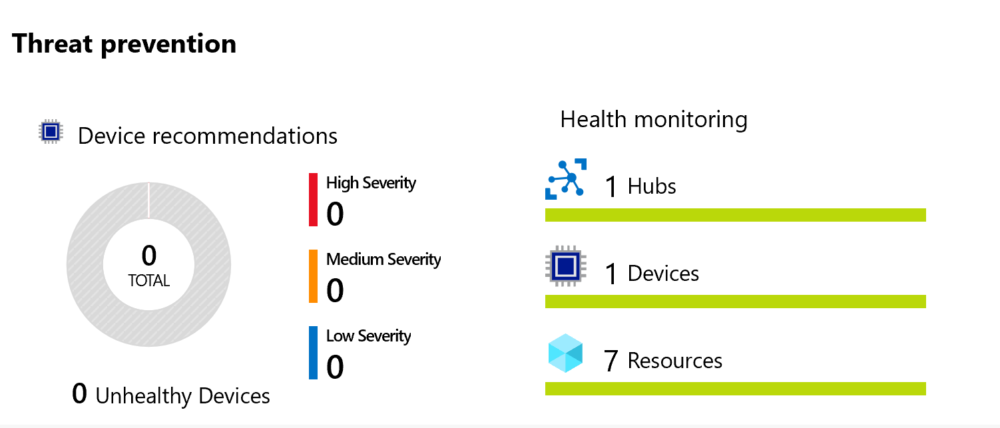

---
lab:
    title: '实验室 19：使用适用于 IoT 的 Azure 安全中心检测 IoT 设备是否被改动'
    module: '模块 10：Azure 安全中心和 IoT 安全'
---

# 使用适用于 IoT 的 Azure 安全中心检测设备篡改

## 实验室场景

Contoso 在构建所有解决方案时都考虑到了安全性。但是，他们希望了解如何更好地在其所有本地和云工作负载（包括其 Azure IoT 解决方案）中获得安全性的统一视图。另外，在加入新设备时，该公司希望跨工作负载（Leaf 设备、Microsoft Edge 设备、IoT 中心）应用安全策略，以确保符合安全标准并改善安全状况。

Contoso 正在增加一条配备了新 IoT 设备的全新装配线，以帮助解决增加新订单带来的运输和包装需求。你希望确保所有新设备都受到保护，并且还希望能够看到可帮助继续提高解决方案安全性的安全建议（考虑完整的端到端 IoT 解决方案）。你将开始针对解决方案使用 Azure IoT Center for IoT 进行调查。

Contoso 还正在安装新连接的恒温器，以提高对不同奶酪储藏室温度的监视和控制能力。作为 Contoso 安全要求的一部分，你将创建一个自定义警报，以监视恒温器是否超出了预期的遥测传输频率。

将创建以下资源：


## 本实验室概览

在本实验室中，你将完成以下活动：

* 验证实验室先决条件
* 新建 IoT 中心
* 启用适用于 IoT 的 Azure 安全中心
* 创建并注册新设备
* 创建一个安全模块孪生
* 在 Linux 设备上安装基于 C# 的安全代理
* 配置解决方案
* 配置自定义警报
* 创建控制台应用以触发警报
* 在 Azure 安全中心查看警报

## 实验室说明

### 练习 1：验证实验室先决条件

本实验室假定以下 Azure 资源可用：

| 资源类型 | 资源名称 |
| :-- | :-- |
| 资源组 | AZ-220-RG |
| IoT 中心 | AZ-220-HUB-{YOUR-ID} |

如果这些资源不可用，则需要按照以下说明运行 **lab19-setup.azcli** 脚本，然后再进行练习 2。脚本文件包含在本地克隆作为开发环境配置（实验室 3）的 GitHub 存储库中。

> **注释**：**lab19-setup.azcli** 脚本需要在 **Bash** shell 环境中运行，在 Azure Cloud Shell 中执行此操作最简单。

1. 使用浏览器，打开 [Azure Cloud Shell](https://shell.azure.com/)，并使用本课程使用的 Azure 订阅登录。

1. 如果系统提示设置 Cloud Shell 的存储，请接受默认设置。

1. 验证 Azure Shell 是否在使用 **Bash**。

    Azure Cloud Shell 页面左上角的下拉菜单用于选择环境。验证所选的下拉值是否为 **Bash**。

1. 在 Azure Shell 工具栏上，单击**上传/下载文件** （从右数第四个按钮）。

1. 在下拉菜单中，单击 **“上传”**。

1. 在“文件选择”对话框中，导航到配置开发环境时下载的 GitHub 实验室文件的文件夹位置。

    在本课程的实验室 3（“设置开发环境”）中，通过下载 ZIP 文件并在本地提取内容来克隆包含实验室资源的 GitHub 存储库。提取的文件夹结构包括以下文件夹路径：

    * Allfiles
      * 实验室
          * 19-适用于 IoT 的 Azure 安全中心检测 IoT 设备是否被篡改
            * 设置

    lab19-setup.azcli 脚本文件位于实验室 19 的 Setup 文件夹中。

1. 选择 **lab19-setup.azcli** 文件，然后单击 **“打开”**。

    文件上传完成后，将显示一条通知。

1. 要验证是否上传了正确的文件，请输入以下命令：

    ```bash
    ls
    ```

    使用 `ls` 命令列出当前目录的内容。你应该会看到列出的 lab19-setup.azcli 文件。

1. 若要为此实验室创建一个包含安装脚本的目录，然后移至该目录，请输入以下 Bash 命令：

    ```bash
    mkdir lab19
    mv lab19-setup.azcli lab19
    cd lab19
    ```

    这些命令将为此实验室创建一个目录，将 **lab19-setup.azcli** 文件放入该目录，然后将新目录更改为当前工作目录。

1. 为了确保 **lab19-setup.azcli** 具有执行权限，输入以下命令：

    ```bash
    chmod +x lab19-setup.azcli
    ```

1. 在“Cloud Shell”工具栏上，要编辑 **“lab19-setup.azcli”** 文件，请单击 **“打开编辑器”**（右边第二个按钮 - **{ }**）。

1. 在 **“文件”** 列表中，要展开“lab19”文件夹，请单击 **“lab19”**，然后单击 **“lab19-setup.azcli”**。

    编辑器现在将显示 **lab19-setup.azcli** 文件的内容。

1. 在编辑器中，更新 `{YOUR-ID}` 和 `{YOUR-LOCATION}` 变量的值。

    以下面的示例为例，需要将 `{YOUR-ID}` 设置为在本课程开始时创建的唯一 ID，即 **“CAH191211”**，然后将 `{YOUR-LOCATION}` 设置为与资源组匹配的位置。

    ```bash
    #!/bin/bash

    RGName="AZ-220-RG"
    IoTHubName="AZ-220-HUB-{YOUR-ID}"

    Location="{YOUR-LOCATION}"
    ```

    > **注释**：  应将 `{YOUR-LOCATION}` 变量设置为要部署所有资源的区域的短名称。输入以下命令，可以看到可用位置及其短名称的列表（**“名称”** 列）：
    >
    > ```bash
    > az account list-locations -o Table
    >
    > DisplayName           Latitude    Longitude    Name
    > --------------------  ----------  -----------  ------------------
    > 东亚            22.267      114.188      eastasia
    > 东南亚       1.283       103.833      southeastasia
    > 美国中部            41.5908     -93.6208     centralus
    > 美国东部               37.3719     -79.8164     eastus
    > East US 2             36.6681     -78.3889     eastus2
    > ```

1. 要保存对文件所做的更改并关闭编辑器，请单击编辑器窗口右上角的 **“...”**，然后单击 **“关闭编辑器”**。

    如果提示保存，请单击 **“保存”**，编辑器将会关闭。

    > **注释**：  可以使用 **CTRL+S** 随时保存，使用 **CTRL+Q** 关闭编辑器。

1. 要创建本实验室所需的资源，请输入以下命令：

    ```bash
    ./lab19-setup.azcli
    ```

    运行将花费几分钟时间。每个步骤完成时，你将会看到 JSON 输出。

### 练习 2：启用适用于 IoT 中心的 Azure 安全中心

借助适用于 IoT 的 Azure 安全中心，你能够统一安全管理，同时对混合云工作负载以及 Azure IoT 解决方案启用端到端的威胁检测和分析。

适用于 IoT 的 Azure 安全中心由以下组件构成：

* IoT 中心集成
* 设备代理（可选）
* 发送安全消息 SDK
* 分析管道

#### 任务 1：启用适用于 IoT 的 Azure 安全中心

在此任务中，你将为 IoT 中心启用**适用于 IoT 的 Azure 安全中心**。 

1. 如有必要，请使用 Azure 帐户凭据登录到 Azure 门户。

    如果有多个 Azure 帐户，请确保使用与该课程将使用的订阅绑定的帐户登录。

1. 在 Azure 仪表板上，单击 **AZ-220-HUB-{YOUR-ID**。

    你的仪表板应在 AZ-220-RG 资源组磁贴上具有指向 IoT 中心的链接。

1. 在左侧导航菜单中的 **“安全性”** 下，单击 **“总览”**。

    首次打开“安全性”窗格时，适用于 IoT 中心的 Azure 安全中心会加入进来。 
    
    * 系统可能会提示你单击 **“保护你的 IoT 解决方案”**。
    * 片刻之后，你可能会看到**成功载入此 IoT 中心，请刷新以使更改生效**的消息。

1. 花费片刻时间查看“安全概述”窗格上的内容。

#### 任务 2：Log Analytics 创建

当适用于 IoT 的 Azure 安全中心开启后，会创建一个默认的 Azure Log Analytics 工作区来存储原始安全事件、警报，以及对 IoT 设备、IoT Edge 和 IoT 中心的建议。

在此任务中，你将快速查看 Log Analytics 的工作区配置。

1. 如果需要，可打开 IoT 中心的“安全概览”窗格。

1. 在边栏选项卡顶部，要显示安全设置，请单击 **“设置”**。 

    **“设置”** 边栏选项卡现在应该会打开，并显示 **“数据收集”** 窗格。 

1. 花点时间查看显示的设置信息。

    注意已为 Log Analytics 工作区定义的 **“工作区配置”**。

默认情况下，打开“适用于 IoT 的 Azure 安全中心”解决方案会自动保护 Azure 订阅下的所有 IoT 中心。

### 练习 3：创建并注册新设备

在本练习中，你将设置一个之后用于模拟 IoT 设备的虚拟机。在本实验室后面的部分中，你将使用此设备测量传送带上的振动。

#### 任务 1：新建 IoT 设备

在此任务中，你将创建代表你的 IoT 设备的 VM。

1. 使用你的 Azure 帐户凭据登录到 [portal.azure.com](https://portal.azure.com)。

1. 在门户菜单上，单击 **“创建资源”**，然后在市场中搜索 **“Ubuntu Server 18.04 LTS”**

1. 在搜索结果中，单击 **“Ubuntu Server 18.04 LTS”**。

1. 在 **“Ubuntu Server 18.04 LTS”** 边栏选项卡中，单击 **“创建”**。

1. 在 **“创建虚拟机”** 边栏选项卡上的 **“订阅”** 下，请确保已选择本课程要使用的订阅。

1. 在 **“资源组”** 下拉列表中，选择 **“新建”**。

1. 在上下文菜单中的 **“名称”** 下，输入 **“AZ-220-SECVM-RG”**，然后单击 **“确定”**

    > **注释**：最佳做法是为 VM 创建资源组。这有助于跟踪为 VM 添加/创建的任何其他资源。对于本课程中的简单用例，主要优点在于易于清理，但稍后你会在本实验室中对该资源组进行更多操作。

1. 在 **“虚拟机名称”** 文本框，输入 **“vm-device01”**

1. 在 **“区域”** 下拉列表中，选择离你最近或已经预配 Azure IoT 中心的 Azure 区域。

1. 在 **“可用性选项”** 下拉列表中，确保选中 **“无需基础架构冗余”**。

    > **提示**：
    > Azure 提供了一系列用于管理应用程序可用性和复原能力的选项。设计用来在可用性区域或可用性集中使用复制 VM 的解决方案，从而保护应用和数据免受数据中心中断和维护事件的影响。在本实验室中，我们不需要任何高可用性功能。

1. 在 **“映像”** 下拉列表中，注意 **“Ubuntu Server 18.04 LTS”** 已被选中。

1. 对于 **“Azure Spot 实例”** 字段，确保选择 **“否”**。

    > **提示**：
    > 使用 Spot VM 可以使你利用 Azure 未使用的容量，从而节省大量成本。如果 Azure 需要收回容量，Azure 基础结构可以随时收回 Spot VM。因此，Spot VM 非常适合可以处理中断的工作负载，例如批处理作业、开发/测试环境、大型计算工作负载等。在本实验室中，我们将使用传统 VM。

1. 在 **“管理员帐户”** 下的 **“身份验证类型”** 右侧，单击 **“密码”**。

1. 在管理员 **“用户名”** 和 **“密码”** 字段，输入 VM 管理员帐户的值。

    > **重要事项**：记录 VM 管理员的用户名和密码。在生产环境中，你需要保持其安全性。在本实验室中，可以将值保存到文本文档，以便日后取用（以防忘记）。 

1. 在 **“入站端口规则”** 右边，注意 **“SSH (22)”** 已被选中。

    需要配置/管理 VM 时，将使用 SSH 远程访问 VM。

1. 在边栏选项卡底部，单击 **“查看 + 创建”**。

1. 当出现“验证通过”消息时，单击 **“创建”**。

    > **注释**：
    > 部署完成大约需要 5 分钟。你可以在部署时继续下一单元。

#### 任务 2：注册新设备

由于必须先将设备注册到 IoT 中心才能进行连接，我们来创建注册。

1. 在“Azure 门户中心”菜单上，单击 **“仪表板”**。

1. 在 AZ-220-RG 资源组磁贴上，单击 **“AZ-220-HUB-{YOUR-ID}”**。

    还有许多其他方法可以打开 IoT 中心边栏选项卡，可以使用你喜欢的任何方法。

1. 在左侧导航菜单中的 **“资源管理器”** 下，单击 **“IoT 设备”**。

1. 在 **“IoT 设备”** 窗格顶部，单击 **“新建”**

1. 在 **“设备 ID”** 下，输入 **“vm-device01”**

    是的，你要使用分配给 VM 的名称作为设备 ID。

    你将使用 **对称密钥** 进行身份验证，因此可以保留其他设置的默认值。

1. 在边栏选项卡顶部，单击 **“保存”**。

### 练习 4：创建一个安全模块孪生

适用于 IoT 的 Azure 安全中心提供与现有 IoT 设备管理平台的完全集成，使你能够管理设备安全状态并利用现有设备控制功能。

适用于 IoT 的 Azure 安全中心使用模块孪生机制，并为每个设备维护一个名为 azureiotsecurity 的安全模块孪生。安全模块孪生包含与每个设备的设备安全相关的所有信息。为了充分利用适用于 IoT 的 Azure 安全中心，你需要为新的 IoT Edge 设备创建、配置和使用这些安全模块孪生。

可以使用以下两种方法中的任意一种创建安全模块孪生 (**azureiotsecurity**)：

* 使用[模块批处理脚本](https://github.com/Azure/Azure-IoT-Security/tree/master/security_module_twin)。该脚本使用默认配置自动为新设备（或没有模块孪生的设备）创建模块孪生。
* 使用每个设备的特定配置分别手动编辑每个模块孪生。

在此任务中，你将手动创建一个安全模块孪生。

1. 在 Azure 门户中，如有必要，导航到 IoT 中心的 **“IoT 设备”** 窗格。

    要打开 IoT 中心边栏选项卡的 **“IoT 设备”** 窗格，在左侧导航菜单中的 **“资源管理器”** 下，单击 **“IoT 设备”**。

1. 在 **“设备 ID”** 下，单击 **“vm-device01”**。

1. 在 **“vm-device01”** 边栏选项卡顶部附近，单击 **“添加模块标识”**。

1. 在 **“添加模块标识”** 窗格的 **“模块标识名称”** 下，输入 **“azureiotsecurity”**

    由于我们将使用对称密钥进行身份验证，因此可以将所有字段保留为默认值。

1. 在窗格底部，单击 **“保存”**。

    在 **“模块标识”** 下，现在应该会看到列出的 **“azureiotsecurity”** 设备。连接状态为 **“已断开”**。

    > **重要事项**：模块标识名称必须是 **“azureiotsecurity”**，不能还是唯一名称。


1. 在 **“vm-device01”** 边栏选项卡，在 **“主键”** 右边，单击 **“复制”**。

    > **注释**：确保复制设备的 **“主键”** 而不是连接字符串。


1. 回到 IoT 中心边栏选项卡。

1. 在左侧导航菜单上，单击 **“总览”**。

1. 在边栏选项卡顶部附近的“概要”区域中， **“主机名”** 右边，单击 **“复制到剪贴板”**，然后保存该值以备后用。

    > **注释**：IoT 中心主机名类似于：AZ-220-HUB-CAH102119.azure-devices.net

### 练习 5：部署适用于 IoT 的 Azure 安全中心 C# 安全代理

适用于 IoT 的 Azure 安全中心为安全代理提供了参考体系结构，负责通过 IoT 中心记录、处理、聚合和发送安全数据。有基于 C 和 C# 的代理。对于具有更多受限或最少设备资源的设备，建议使用 C 代理。

安全代理支持以下功能：

* 从基础操作系统（Linux、Windows）收集原始安全事件。如需了解有关可用安全数据收集器的更多信息，请参阅《适用于 IoT 的 Azure 安全中心的代理配置》。
* 将原始安全事件聚合为通过 IoT 中心发送的消息。
* 使用现有设备标识或专用模块标识进行身份验证。要了解更多信息，请参阅《安全代理身份验证方法》。
* 通过使用 **azureiotsecurity** 模块孪生进行远程配置。如需了解更多信息，请参阅《配置适用于 IoT 的 Azure 安全中心的代理》。

在本练习中，你将添加用于 C# 的安全代理，并将其部署到模拟设备 (Linux VM)。 

#### 任务 1：登录 IoT 设备：Linux VM

1. 如有必要，请使用 Azure 帐户凭据登录到 Azure 门户。

    如果有多个 Azure 帐户，请确保使用与该课程将使用的订阅绑定的帐户登录。

1. 在 Azure 门户菜单中，单击 **“所有资源”**。

    请务必选择 **“所有资源”**，而非 **“所有服务”**。

1. 在 **“所有资源”** 边栏选项卡，在 **“按名称筛选”** 文本框，输入 **“vm-device01”**

1. 在 **“名称”** 下，单击 **“vm-device01”**。

    新创建虚拟机 (**vm-device01**) 的“概览”窗格现在应该已打开。

1. 在边栏选项卡顶部，单击 **“连接”**，然后单击 **“SSH”**。

1. 花点时间查看 **“连接”** 窗格的内容

    正如在本教程前面看到的，向你提供了用于打开 SSH 连接的示例命令。

    将示例命令复制到文本编辑器，然后从命令中删除 `-i <private key path> 。你应该会看到以下格式的命令：

    ```cmd\sh
    ssh <admin user>@<ip address>
    ```

    命令应该类似于：`ssh demouser@52.170.205.79`

1. 在 Azure 门户工具栏上，单击 **“Cloud Shell”**。

    确保在 Cloud Shell 中选择 **“Bash”** 环境。

1. 在 Cloud Shell 命令提示符后输入上面创建的 `ssh` 命令，然后按 **Enter**。

1. 当提示 **“你确定要继续连接吗？”** 时，键入 **“yes”**，然后按 **“Enter”**。

    此提示是安全性确认，因为用于保护与 VM 的连接的证书是自签名证书。后续连接将记住该提示的答案，并且仅在第一次连接时提示。

1. 当提示输入密码时，输入你为 VM 创建的管理员密码。

    请注意，连接后终端命令提示符将更改为显示 Linux VM 名称，类似于以下内容。

    ```cmd/sh
    demouser@vm-device01:~$
    ```

    这有助于你跟踪连接到哪个 VM 和跟踪当前用户。

#### 任务 3：将对称密钥添加到设备

你可以使用安全代理的 C# 版本连接到 IoT 中心。要实现连接，你将需要设备的对称密钥或证书信息。

在本实验室中，你将使用对称密钥作为身份验证，并需要将其存储在设备上的临时文本文档中。

1. 确认你是否拥有可用的 **vm-device01** 设备的 **主键** 的值。

    你之前在本实验室应已保存主键值。如果没有，请完成以下操作：

    1. 打开新的浏览器标签页，在该新标签页中导航到 Azure 门户。
    1. 在 Azure 门户菜单上，单击 **“仪表板”**，然后打开 IoT 中心。
    1. 在左侧导航菜单中的 **“资源管理器”** 下，单击 **“IoT 设备”**。
    1. 在 **“设备 ID”** 下，单击 **“vm-device01”**。
    1. 复制详细信息列表中的 **“主密钥”**。
    1. 返回 Azure Cloud Shell 浏览器选项卡 - 此时你应该仍与 **vm-device01** 虚拟机处于连接状态。

1. 在 Cloud Shell 命令提示符下，输入以下命令：

    ```cmd/sh
    echo "<primary_key>" > s.key
    ```

    此命令将使用 **vm-device01** 设备的 **主密钥** 创建设备身份验证类型文件。

    > [！注意]要检查是否向文件中添加了正确的主密钥，请使用 `nano s.key` 命令打开文件。检查设备的 **主密钥** 是否在文件中。要退出 nano 编辑器，请按住 `Ctrl` 和 `X`。按住 `shift` 和 `Y`保存文件。然后按 Enter。

#### 任务 4：安装安全代理

1. 确保 Cloud Shell 会话仍然通过 SSH 连接到你的 VM。

1. 在 Cloud Shell 命令提示符下，要将最新版本的 C# 安全代理下载到设备，请输入以下命令：

    ```bash
    wget https://github.com/Azure/Azure-IoT-Security-Agent-CS/releases/download/0.0.6/ubuntu-18.04-x64.tar.gz
    ```

1. 在 Cloud Shell 命令提示符下，要提取包内容并导航到 `/Install` 文件夹，请输入以下命令：

    ```bash
    tar -xzvf ubuntu-18.04-x64.tar.gz && cd Install
    ```

1. 在 Cloud Shell 命令提示符下，请输入以下命令将执行权限添加到 `InstallSecurityAgent` 脚本：

    ```bash
    chmod +x InstallSecurityAgent.sh
    ```

1. 在 Cloud Shell 命令提示符下，输入以下命令： 

    你需要将这些值替换为你的身份验证参数。

    ```bash
    sudo ./InstallSecurityAgent.sh -i -aui Device -aum SymmetricKey -f <Insert file location of your s.key file> -hn <Insert your full IoT Hub host name> -di vm-device01
    ```

    该命令应如下所示：

    `sudo ./InstallSecurityAgent.sh -i -aui Device -aum SymmetricKey -f ../s.key -hn AZ-220-HUB-AB20200213.azure-devices.net -di vm-device01`

    > **注释**：确保指定你的 IoT 中心主机名，而不是列出的那个主机名 
    
    > **重要事项**：
    > 确保为 `-hn` 切换值使用完整的 IoT 中心主机名，即 **“AZ-220-HUB-AB20200213.azure-devices.net”**。

    该脚本执行以下函数：

    * 安装必备组件。
    * 添加服务用户（禁用交互式登录）。
    * 将代理安装为守护程序，假定设备使用 **systemd** 用于服务管理。
    * 配置 **sudo 用户**以允许代理以 root 身份执行某些任务。
    * 使用提供的身份验证参数配置代理。

1. 通过查看 Cloud Shell 终端中的输出观察命令进度。

    请注意，需要重启才能完成代理安装。

1. 在 Cloud Shell 终端中，输入 **“y”** 开始重启

    设备重启后，SSH 会话将丢失。
 
1. 在 Cloud Shell 命令提示符下，请输入你先前使用的 SSH 命令重新连接到虚拟机。

    适用于 IoT 的 Azure 安全中心的代理现在应该处于活动状态并正在运行。

1. 在 Cloud Shell 命令提示符下，请输入以下命令检查适用于 IoT 的 Azure 安全中心的代理部署状态。 

    ```cmd/sh
    systemctl status ASCIoTAgent.service
    ```

    你应看到以下类似输出：

    ```log
    ● ASCIoTAgent.service - 适用于 IoT 的 Azure 安全中心代理
       Loaded: loaded (/etc/systemd/system/ASCIoTAgent.service; enabled; vendor preset: enabled)
       Active: active (running) since Wed 2020-01-15 19:08:15 UTC; 3min 3s ago
     Main PID: 1092 (ASCIoTAgent)
        Tasks: 7 (limit: 9513)
       CGroup: /system.slice/ASCIoTAgent.service
            └─1092 /var/ASCIoTAgent/ASCIoTAgent
    ```

    具体来说，你应该验证该服务是否是 **“Loaded: loaded”** 和 **“Active: active (running)”**。

    > **注释**：如果适用于 IoT 的 Azure 安全中心的代理未运行或未处于活动状态，请查看[《适用于 IoT 的 Azure 安全中心的基于 C# 的 Linux 安全代理部署指南》的疑难解答部分](https://docs.microsoft.com/zh-cn/azure/asc-for-iot/how-to-deploy-linux-cs)。常见问题是可能会造成服务 **Active: activating** 的键值错误或未指定完整的 IoT 中心主机名。

1. 在 Azure 门户中，回到“IoT 中心”边栏选项卡，然后打开 **“vm-device01”** 设备边栏选项卡。

    打开 IoT 中心边栏选项卡，在 **“资源管理器”** 下的导航菜单中，单击 **“IoT 设备”**，然后单击 **“vm-device01”**。

1. 在 **“模块标识”** 下，请注意 **“azureiotsecurity”** 模块的当前状态未 **“已连接”**。


现在，设备上已安装了适用于 IoT 的 Azure 安全中心设备代理，这些代理将能够从设备收集、聚合和分析原始安全事件。

### 练习 6：配置解决方案管理

适用于 IoT 的 Azure 安全中心为基于 Azure 的 IoT 解决方案提供了全面的端到端安全性。

通过适用于 IoT 的 Azure 安全中心，即可在一个仪表板上监视整个 IoT 解决方案，从而在 Azure 中显示所有 IoT 设备、IoT 平台和后端资源。

在 IoT 中心启用后，适用于 IoT 的 Azure 安全中心会自动识别其他 Azure 服务，这些服务也已连接到 IoT 中心并与 IoT 解决方案相关。

除了自动关系检测外，你还可以选择要标记为 IoT 解决方案一部分的其他 Azure 资源组。通过这些选择，你可以添加整个订阅、资源组或单个资源。

#### 任务 1：打开 IoT 中心

1. 在浏览器中，打开 Azure 门户并导航到 IoT 中心。

1. 在左侧导航菜单中的 **“安全性”** 下，单击 **“资源”**。

    请注意，资源列表已包括你的 IoT 中心、之前激活适用于 IoT 的 Azure 安全中心时创建的工作区以及当前订阅。

1. 在窗格顶部，单击 **“编辑”**。

    **“解决方案管理”** 窗格会打开，在其中可以通过选择其他 Azure 资源的所属资源组来将这些资源连接到安全解决方案。

1. 在 **“订阅”** 下，请确保已选择本课程要使用的订阅。

    > **注意：**
    > 你可以将多个订阅中的资源添加到安全解决方案中。

1. 在 **“资源组”** 下，为你的 VM 选择资源组 - **AZ-220-SECVM-RG**。

    现在，你应该选择两个资源组。请注意，“资源”列表已更新，以反映你刚刚添加的资源组中的其他资源。

1. 在 **“解决方案管理”** 窗格中，单击 **“应用”**。

    如果 **“应用”** 按钮不可用，不用担心，已经添加资源。

1. 关闭 **“解决方案管理”** 窗格。

定义所有资源关系后，适用于 IoT 的 Azure 安全中心利用 Azure 安全中心为你提供这些资源的安全建议和警报。

#### 任务 2：查看运行中的适用于 IoT 的 Azure 安全中心

现在，你已在设备上安装了安全代理，并配置了解决方案。现在非常适合检查适用于 IoT 的 Azure 安全中心的不同视图。

1. 在左侧导航菜单中的 **“安全性”** 下，单击 **“总览”**。 

    你将看到两个图表上显示的设备、中心和其他资源的运行状况概述。你可以看到在打开 Azure IoT 安全中心时立即启用的内置实时监视、建议和警报。



1. 在左侧导航菜单中的 **“安全性”** 下，单击 **“资源”**。

    通过此窗格，可以访问整个 IoT 解决方案中资源的运行状况。

    > **重要事项**：
    > IoT 资源安全性配置的评估过程可能需要多达 24 小时的时间，因此仪表板上显示的初始状态无法反映资源的实际状态。 

    下图显示了执行安全评估后的仪表板状态。


### 练习 7：引入自定义警报

自定义安全组和警报可用于在整个 IoT 解决方案中充分利用端到端安全信息和分类设备知识。这将帮助你为解决方案提供更好的安全性。 

#### 为何使用自定义警报？

你比开箱即用算法更了解你的 IoT 设备。

对于完全了解其预期设备行为的客户，适用于 IoT 的 Azure 安全中心使你能够将所了解的转化为设备行为策略，并对任何与预期正常行为的偏差发出警报。

#### 任务 1 - 自定义警报

如上所述，了解其解决方案的特定所需行为的客户可以配置自定义警报，这些警报将在超出所需行为时触发。在本练习中，你将创建一个自定义警报，用于监控通过 **MQTT** 协议发送的 **“设备到云”** 消息。

在正常情况下，Contoso 的奶酪储藏室监控系统不会以很高的速率发送 IoT 中心温度和湿度数据。你希望每台设备在五分钟的时间内发送一到五个设备到云的消息。此范围适用于傍晚时段，此时温度变化可能更快，并且可能需要更高频率的数据以确保各值不超出既定边界值。

在此任务中，你将创建一个自定义警报。

1. 在 Azure 门户中，导航到“IoT 中心”边栏选项卡。

1. 在左侧导航菜单中的 **“安全性”** 下，单击 **“自定义警报”**。

1. 花点时间检查一下 **“自定义提醒”** 窗格。

    该窗格乍看可能是空的，但 **“名称”** 下列出的项目实际上是为你自动创建的 **默认** 安全组。

    通过安全组，你可以定义设备逻辑组，并集中管理其安全状态。这些组可以代表具有特定硬件的设备、在特定位置部署的设备，或适合你特定需求的任何其他组。

1. 要将自定义警报添加到默认安全组，请单击 **“默认”**。

    **“设备安全组”** 边栏选项卡列出所有处于活动状态的自定义警报。由于这是你第一次访问边栏选项卡，因此它将是空的。

1. 在边栏选项卡顶部，单击 **“创建自定义警报规则”**。

    **“创建自定义警报规则”** 窗格将打开。请注意 **“设备安全组”** 字段中填充了 **“默认”** 组。

1. 在 **“自定义警报”** 下拉菜单中，单击 **“设备到云消息的数量（MQTT 协议）不在允许范围内”**。

    > **提示**：
    > 查看许多可用的自定义警报。考虑如何使用它们来保护你的解决方案。

    > **注释**：
    > **“描述”** 和 **“必需的属性”** 会根据所选的 **“自定义警报”** 而变化。

1. 在 **“必需的属性”** 下的 **“最小阈值”** 字段，输入 **“1”**。

    这满足了在 5 分钟内至少发送一条消息的期望。

1. 在 **“最大阈值”** 下，输入 **“5”**。

    这使得 5 分钟内的预期消息发送数量不超过五个。

1. 在 **“时间窗口大小”** 下拉列表中，单击 **“00:05:00”**。

    这符合已设定的五分钟时长。

    > **注释**：
    有 4 个可用时间窗口：
    > * 5 分钟
    > * 10 分钟
    > * 15 分钟
    > * 30 分钟

1. 在 **“创建自定义预警规则”** 窗格底部，单击 **“确定”**。

1. 在 **“默认”** （设备安全组）边栏选项卡顶部，单击 **“保存”**。

    如果不保存新警报，则下次关闭 IoT 中心时将删除警报。

    你将返回到自定义警报列表。下图显示了一些自定义警报：


### 练习 8：配置设备应用

在本练习中，你将创建一个 IoT 中心设备和一个 .Net Core 控制台应用程序 (C#)，它们将利用 **Microsoft.Azure.Devices.Client** nuget 包连接到 IoT 中心。控制台应用程序将每 10 秒钟发送一次遥测，其目的是超过自定义警报（你在上一个练习中创建的）中配置的“设备到云”消息阈值。

#### 任务 1：注册新的 IoT 设备

必须先将设备注册到 IoT 中心才能进行连接。

1. 在 Azure 门户菜单上，单击 **“仪表板”**，然后打开 IoT 中心。

1. 在左侧导航菜单中的 **“资源管理器”** 下，单击 **“IoT 设备”**。

1. 在 **“IoT 设备”** 窗格顶部，单击 **“新建”**

1. 在 **“创建设备”** 边栏选项卡的 **“设备 ID”** 下，输入 **“CheeseCave1-Sensor1”**

    你将使用 **“对称密钥”** 用于身份验证，因此将其他值保留为默认值。

1. 在边栏选项卡顶部，单击 **“保存”**。

1. 在 **“IoT 设备”** 窗格的 **“设备 ID”** 下，单击 **“CheeseCave1-Sensor1”**。

    你可能需要单击 **“加载更多”** 以访问 **“CheeseCave1-Sensor1”** 设备。

1. 在 **“主连接字符串”** 右侧，单击 **“复制”**，然后将值保存到文本文件。

    请务必注意，这是 CheeseCave1-Sensor1 设备的连接字符串。你将需要设备应用的连接字符串值。

#### 任务 2：创建控制台应用

1. 打开 Visual Studio Code。

1. 在 **“文件”** 菜单上，单击 **“打开文件夹”**。

1. 在 **“打开文件夹”** 对话框顶部，单击 **“新建文件夹”** ，键入 **“ThermostatDevice”**，然后按  **Enter** 键。

    你可以在“实验 19”文件夹或你选择的其他位置下创建“ThermostatDevice ”文件夹。

1. 请单击 **“温控器设备”**，然后单击 **“选择文件夹”**。

1. 在 **“文件”** 菜单，要确保启用文件自动保存功能，请单击 **“自动保存”**。

    你将在几个代码块中进行复制，这将确保你始终针对文件的最新编辑进行操作。

1. 要打开集成终端，在 **“视图”** 菜单上单击 **“终端”**。

1. 要创建新的控制台应用，在终端命令提示符下输入以下命令：

    ```bash
    dotnet new console
    ```

#### 任务 3：将应用连接到 IoT 中心

1. 在终端命令提示符下，要安装所需的 NuGet 软件包，请输入以下命令：

    ```bash
    dotnet add package Microsoft.Azure.Devices.Client
    ```

1. 在“EXPLORER”窗格中，单击 **“Program.cs”**。

1. 在“代码编辑器”中，删除所有现有代码。

1. 在“代码编辑器”中，要添加应用需要的 `using` 语句，请输入以下代码：

    ```csharp
    using System;
    using Microsoft.Azure.Devices.Client;
    using Newtonsoft.Json;
    using System.Text;
    using System.Threading.Tasks;
    ```

1. 在 `using` 语句下面，为应用程序创建一个命名空间，输入以下代码：

    ```csharp
    namespace ThermostatDevice
    {
        // 在此处添加类
    }
    ```

1. 在 `// add class below here` 注释下方的空白代码行上，要创建 **“ThermostatDevice”** 类，请输入以下代码：

    ```csharp
    class ThermostatDevice
    {
        // 在此处添加变量
    }
    ```

1. 在 `// add variables below here` 注释下方的空白代码行中，要定义设备连接字符串的变量，请输入以下代码：

    ```csharp
    private static DeviceClient s_deviceClient;
    private readonly static string s_connectionString = "<DEVICE-CONNECTION-STRING>";

    // 在此处添加 SendDeviceToCloudMessagesAsync 方法
    ```

    第一行提供了对 `DeviceClient` 的引用
    第二行提供一个设备连接字符串的变量（你先前已复制） 

    > **提示**：
    > 将 `<DEVICE-CONNECTION-STRING>` 替换为你之前从 Azure 门户中复制的设备主连接字符串。

1. 在 `// add SendDeviceToCloudMessagesAsync method below here` 注释下方的空白代码行上，要向 IoT 中心发送从设备到云的消息，请添加以下代码：

    ```csharp
    private static async void SendDeviceToCloudMessagesAsync()
    {
        // 初始遥测值
        double minTemperature = 20;
        double minHumidity = 60;
        Random rand = new Random();

        // 循环操作，直到用户按下“CTRL+C”
        while (true)
        {
            double currentTemperature = minTemperature + rand.NextDouble() * 15;
            double currentHumidity = minHumidity + rand.NextDouble() * 20;

            // 使用匿名类型创建 JSON 消息
            var telemetryDataPoint = new
            {
                temperature = currentTemperature,
                humidity = currentHumidity
            };
            var messageString = JsonConvert.SerializeObject(telemetryDataPoint);
            var message = new Message(Encoding.ASCII.GetBytes(messageString));

            // 将自定义应用程序属性添加到消息中。
            // IoT 中心可以在这些属性上进行筛选，而无需访问消息正文。
            message.Properties.Add("temperatureAlert", (currentTemperature > 30) ? "true" : "false");

            // 发送遥测消息
            await s_deviceClient.SendEventAsync(message);
            Console.WriteLine("{0} > Sending message: {1}", DateTime.Now, messageString);

            // 等待 10 秒，然后发送下一条消息
            await Task.Delay(10000);
        }
    }

    // 在此处添加主要方法
    ```

    请注意上面的 `await Task.Delay(10000);` 代码。这将导致时间延迟，以便每 10 秒发送一条消息，这将超过自定义警报的“5 分钟内不超过 5 条消息”阈值。

    > **提示**：
    > 阅读代码注释以了解该方法的工作原理。

1. 在 `// 在此处添加主要方法` 注释下方的空白代码行上，要为应用提供一个主要方法（入口点），请输入以下代码：

    ```csharp
    private static void Main(string[] args)
    {
        Console.WriteLine("IoT Hub C# Simulated Thermostat Device. CTRL+C to exit.\n");

        // 使用 MQTT 协议连接到 IoT 中心
        s_deviceClient = DeviceClient.CreateFromConnectionString(s_connectionString, TransportType.Mqtt);
        SendDeviceToCloudMessagesAsync();
        Console.ReadLine();
    }
    ```

    > **注释**：
    创建 `DeviceClient` 实例后，使用 `TransportType.Mqtt` 指定了 **“MQTT”** 协议 - 这可确保使用在创建的自定义警报中指定的协议发送“设备至云”消息。

1. 在终端命令提示符下，要生成和运行该应用程序，请输入以下命令：

    ```bash
    dotnet run
    ```

    输出将类似于以下内容：

    ```text
    IoT 中心 C# 模拟恒温器设备。按“CTRL+C”退出。

    2/28/2020 1:32:21 PM > 发送消息：{"temperature":25.7199231282435,"humidity":79.50078555359542}
    2/28/2020 1:32:31 PM > 发送消息：{"temperature":21.877205091005752,"humidity":61.30029373862794}
    2/28/2020 1:32:41 PM > 发送消息：{"temperature":21.245898961204055,"humidity":71.36471955634873}
    2/28/2020 1:32:51 PM > 发送消息：{"temperature":32.61750500072609,"humidity":66.07430422961447}
    2/28/2020 1:33:01 PM > 发送消息：{"temperature":31.100763578946125,"humidity":79.93955616836416}
    2/28/2020 1:33:11 PM > 发送消息：{"temperature":25.02041019034591,"humidity":70.50569472392355}
    ```

    你可以在本实验的其余部分中使该应用运行，以生成多个警报。

### 练习 9：查看安全中心警报

此时，你的控制台应用将发送足够的遥测数据，以触发先前创建的自定义警报。 

> **提示**：
> 警报设置为在 5 分钟内从设备发送到云的消息少于 1 条且多于 5 条时触发。

#### 任务 1：查看安全中心仪表板

1. 在 Azure 门户菜单上，单击 **“仪表板”** 然后打开你的 IoT 中心。

1. 在左侧导航菜单中的 **“安全性”** 下，单击 **“总览”** 。

    查看 **“威胁检测”** 部分。你应该看到一个或多个警报显示在 **“设备安全警报”** 图表中：


    你还应该在 **“警报最多的设备”** 磁贴中看到 **“CheeseCave1-Sensor1”** 设备的条目：


    > [!NOTE]
    > 可能需要 10 到 15 分钟仪表板才能显示警报。

1. 在 **“威胁检测”** 下，单击 **“警报最多的设备”** 磁贴。

    此操作将打开 **“警报”** 边栏选项卡，你也可以单击左侧导航菜单中 **“安全”** 下的 **“安全警报”** 打开相同的边栏选项卡。

    你将看到一个安全警报列表：


    最新警报将标有 **“新”** 标签。

1. 单击最新警报。

    将打开一个详细信息窗格。**“一般信息”** 提供有关警报的高级信息。在其下方， **“最近 10 个受影响的设备”** 应该列出 **“CheeseCave1-Sensor1”** 设备。


1. 返回到 Visual Studio Code 并退出设备应用。

    你可以将输入焦点放在“终端”窗口上并按 **CTRL+C** 来关闭应用。
